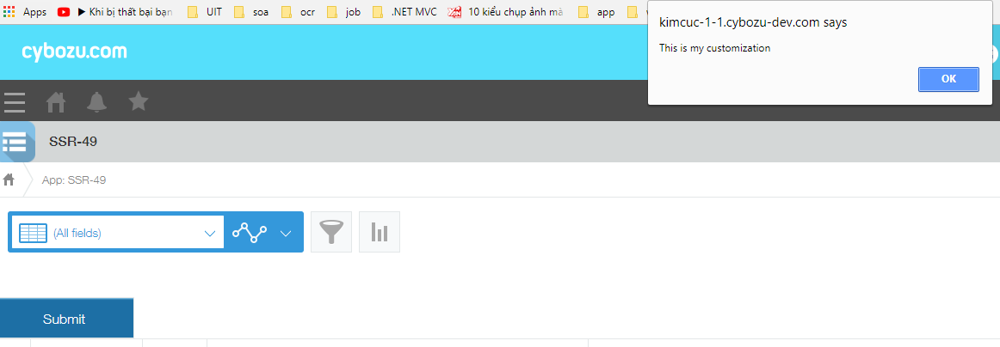

# QuickStart Javascript

## Create a customization

*  Attach 2 below files from './dist' folder in [kintoneUIComponent](https://github.dev.cybozu.co.jp/SC/kintone-ui-component/tree/master) into kintone app
```
 ./dist/kintone-ui-component.min.js
 ./dist/kintone-ui-component.min.css
```
* Create index.js file
```
(function () {
    kintone.events.on("app.record.detail.show", function (ev) {
      var kintoneSpaceElement = kintone.app.getHeaderSpaceElement();
      var button = new kintoneUIComponent.Button({ text: 'Submit' });
      kintoneSpaceElement.appendChild(button.render());
      button.on('click', function(){
        alert('This is my customization');
      })
    });
  });
```
* Attach index.js file into [kintone app setting](https://help.kintone.com/en/k/user/js_customize.html)


