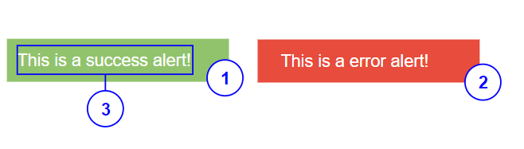

# Alert

## Overview


|Number|	Description|
| --- | --- |
|1|Success alert|	
|2|Error alert|
|3|Display text|


## Constructor
**Parameter**

| Name| Type| Required| Description |
| --- | --- | --- | --- |
|options|Object|No|The object contains parameter of the constructor.|
|options.text|String|No|The content of the alert.|
|options.type|String|No|The type of alert: <ul><li> 'error' </li><li> 'success' </li></ul> Default value is 'error'. |
|options.isDisabled|Boolean|No|The alert will be disabled. <br> Default value: 'false'|
|options.isVisible|Boolean|No|The alert will be visible. <br> Default value: 'true'|

<details class="tab-container" open>
<Summary>Sample</Summary>

**Javascript**
```javascript
var alert = new kintoneUIComponent.Alert({text: 'Network error', type: 'error'});
```

**React**
```javascript
import { Alert } from '@kintone/kintone-ui-component';
import React from 'react';
 
export default class Plugin extends React.Component {
    render() {
        return (
            <Alert text='Network error' type='error'/>
        );
    }
}
```
</details>

## Methods
### render()
Get dom element of the component.

**Parameter**

None

**Returns**

Dom element

<details class="tab-container" open>
<Summary>Sample</Summary>

**Javascript**
```javascript
(function(){
    var alert = new kintoneUIComponent.Alert({text: 'Network error', type: 'error'});
    var body = document.getElementsByTagName("BODY")[0];
    body.appendChild(alert.render());
})()
```

**React**
```javascript
import { Alert} from '@kintone/kintone-ui-component';
import React from 'react';
 
export default class Plugin extends React.Component {
    render() {
        return (
            <Alert text='Network error' type='error'/>
        );
    }
}
```
</details>

### setText(text)
Set the content of the alert.

**Parameter**

| Name| Type| Required| Description |
| --- | --- | --- | --- |
|text|	String|	Yes|The content of the alert. <br> If text is undefined, null or true, The alert will be displayed blank.|

**Returns**

None

<details class="tab-container" open>
<Summary>Sample</Summary>

**Javascript**
```javascript
(function(){
    var alert = new kintoneUIComponent.Alert({text: 'Network error', type: 'error'});
    var body = document.getElementsByTagName("BODY")[0];
    body.appendChild(alert.render());
    alert.setText('Network error');
})()
```

**React**
```javascript
import { Alert } from '@kintone/kintone-ui-component';
import React from 'react';
 
export default class Plugin extends React.Component {
    constructor(props){
        super(props);
        state = {
            text: "abc",
            type: "error",
            isDisabled:false
        };
    }

    setText = (text) => {
        this.setState({ text });
    };
    render() {      
        return (
        <div>
            <button onClick={()=>this.setText("790")}>Set Text</button>
            <Alert text={this.state.text} type={this.state.type}  />
        </div>
        );
    }
}
```
</details>

### setType(type)
Set the type of the alert.

**Parameter**

| Name| Type| Required| Description |
| --- | --- | --- | --- |
|type|	String|	Yes| The type of alert. <ul><li>"success": success alert.</li><li>"error": error alert </li></ul> Default value is "error".|

**Returns**

None

<details class="tab-container" open>
<Summary>Sample</Summary>

**Javascript**
```javascript
(function(){
    var alert = new kintoneUIComponent.Alert({text: 'Network error', type: 'error'});
    var body = document.getElementsByTagName("BODY")[0];
    body.appendChild(alert.render());
    alert.setType('success');
})()
```

**React**
```javascript
import { Alert } from '@kintone/kintone-ui-component';
import React from 'react';
 
export default class Plugin extends React.Component {
     constructor(props){
        super(props);
        state = {
            text: "abc",
            type: "error"
        };
    }

    setType = (type) => {
        this.setState({ type });
    };
    render() {
        return (
        <div>
            <button onClick={()=>this.setType("success")}>Set Type</button>
            <Alert text={this.state.text} type={this.state.type} />
        </div>
        );
    }
}
```
</details>

### on(eventName, callBack)
The callBack function will be executed after user click the alert.

**Parameter**

| Name| Type| Required| Description |
| --- | --- | --- | --- |
|eventName|	String|	Yes|Name of event: <ul><li>'click'</li></ul>|
|callback|function |Yes|callback|

**Returns**

None

<details class="tab-container" open>
<Summary>Sample</Summary>

**Javascript**
```javascript
(function(){
    var alert = new kintoneUIComponent.Alert({text: 'Network error', type: 'error'});
    var body = document.getElementsByTagName("BODY")[0];
    body.appendChild(alert.render());
    alert.on('click', function(event) {
        console.log('on click');
    }); 
})()
```

**React**
```javascript
import { Alert } from '@kintone/kintone-ui-component';
import React from 'react';
 
export default class Plugin extends React.Component {
    render() {
        return (
            <Alert text='Network error' type='error' onClick={this.handleClick}/>
        );
    }
   handleClick(){
        console.log('click');
   }
}
```
</details>

### show()
Display the Alert.

**Parameter**

None

**Returns**

None

<details class="tab-container" open>
<Summary>Sample</Summary>

**Javascript**
```javascript
(function(){
    var alert = new kintoneUIComponent.Alert({text: 'Network error', type: 'error'});
    var body = document.getElementsByTagName("BODY")[0];
    body.appendChild(alert.render());
    alert.show();
})()
```

**React**
```javascript
import { Alert } from '@kintone/kintone-ui-component';
import React from 'react';
 
export default class Plugin extends React.Component {
    constructor(props){
        super(props);
        state = {
            text: "abc",
            isVisible:false
        };
    
    }
    show = () => {
        this.setState({ isVisible:true });
    };

    render() {
        return (
        <div>
            <button onClick={()=>this.isVisible()}>Show</button>
            <Alert text={this.state.text} isVisible={this.state.isVisible} />
        </div>
        );
    }
}
```
</details>

### hide()
Hide the Alert.

**Parameter**

None

**Returns**

None

<details class="tab-container" open>
<Summary>Sample</Summary>

**Javascript**
```javascript
(function(){
    var alert = new kintoneUIComponent.Alert({text: 'Network error', type: 'error'});
    var body = document.getElementsByTagName("BODY")[0];
    body.appendChild(alert.render());
    alert.hide();
})()
```

**React**
```javascript
import { Alert } from '@kintone/kintone-ui-component';
import React from 'react';
 
export default class Plugin extends React.Component {
    constructor(props){
        super(props);
        state = {
            text: "abc",
            isVisible:true
        };
    }
    hide = () => {
        this.setState({ isVisible:false });
    };

    render() {
        return (
        <div>
            <button onClick={()=>this.hide()}>Hide</button>
            <Alert text={this.state.text} isVisible={this.state.isVisible} />
        </div>
        );
    }
}
```
</details>

### disable()
Disable the Alert.

**Parameter**

None

**Returns**

None

<details class="tab-container" open>
<Summary>Sample</Summary>

**Javascript**
```javascript
(function(){
    var alert = new kintoneUIComponent.Alert({text: 'Network error', type: 'error'});
    var body = document.getElementsByTagName("BODY")[0];
    body.appendChild(alert.render());
    alert.disable();
})()
```

**React**
```javascript
import { Alert } from '@kintone/kintone-ui-component';
import React from 'react';
 
export default class Plugin extends React.Component {
    constructor(props){
        super(props);
        state = {
            text: "abc",
            isDisabled:false
        };
    }
    disable = () => {
        this.setState({ isDisabled:true });
    };
    render() {
        console.log(this.state.isDisabled);
        
        return (
        <div>
            <button onClick={()=>this.disable()}>disable</button>
            <Alert text={this.state.text} isDisabled={this.state.isDisabled} />
        </div>
        );
    }
}
```
</details>

### enable()
Enable the Alert.

**Parameter**

None

**Returns**

None

<details class="tab-container" open>
<Summary>Sample</Summary>

**Javascript**
```javascript
(function(){
    var alert = new kintoneUIComponent.Alert({text: 'Network error', type: 'error'});
    var body = document.getElementsByTagName("BODY")[0];
    body.appendChild(alert.render());
    alert.enable();
})()
```

**React**
```javascript
import { Alert } from '@kintone/kintone-ui-component';
import React from 'react';
 
export default class Plugin extends React.Component {
    constructor(props){
        super(props);
        state = {
            text: "abc",
            isDisabled:true
        };
    }
    enable = () => {
        this.setState({ isDisabled:false });
    };

    render() {
        console.log(this.state.isDisabled);
        return (
        <div>
            <button onClick={()=>this.enable()}>enable</button>
            <Alert text={this.state.text} isDisabled={this.state.isDisabled} />
        </div>
        );
    }
}
```
</details>