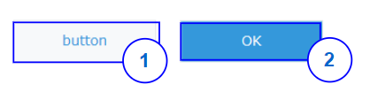

# Button

## Overview


|Number|	Description|
| --- | --- |
|1|	Normal button|	
|2|Submit button|

## Constructor
**Parameter**

| Name| Type| Required| Description |
| --- | --- | --- | --- |
|options|Object|No|The object contains params of constructor.|
|options.text|String|No|Text will be displayed in button.|
|options.type|String|No|Style of the button: <ul><li> 'normal' </li><li> 'submit' </li></ul> Default value: 'normal'|
|options.isDisabled|Boolean|No|The button will be disabled. <br> Default value: 'false'|
|options.isVisible|Boolean|No|The button will be visible. <br>  Default value: 'true'|

<details class="tab-container" markdown="1" open>
<Summary>Sample</Summary>

**Javascript**
```javascript
var button = new kintoneUIComponent.Button({
    text: 'Submit',
    type: 'submit'
});
```
**React**
```javascript
import { Button } from '@kintone/kintone-ui-component';
import React from 'react';
 
export default class Plugin extends React.Component {
    render() {
        return (
            <Button text='Submit' type='submit' isDisabled={false} isVisible={true} />
        );
    }
}
```
</details>

## Methods
### render()
Get dom element of component.

**Parameter**

None

**Returns**

Dom element

<details class="tab-container" markdown="1" open>
<Summary>Sample</Summary>

**Javascript**
```javascript
var button = new kintoneUIComponent.Button({text: 'button'});
var body = document.getElementsByTagName("BODY")[0];
body.appendChild(button.render());
```

**React**
```javascript
import { Button } from '@kintone/kintone-ui-component';
import React from 'react';
import Reactdom from "react-dom";
 
export default class Plugin extends React.Component {
    render() {
        return (
            <Button text='Submit' type='submit' isDisabled={false} isVisible={true} />
        );
    }
}
Reactdom.render(<Plugin />, document.getElementById("root"));

```
</details>

### setText(text)
Set displayed text in button.

**Parameter**

| Name| Type| Required| Description |
| --- | --- | --- | --- |
|text|	String|	Yes|Display text in button|

**Returns**

None

<details class="tab-container" markdown="1" open>
<Summary>Sample</Summary>

**Javascript**
```javascript
var button = new kintoneUIComponent.Button({text: 'button'});
var body = document.getElementsByTagName("BODY")[0];
body.appendChild(button.render());
button.setText('submit');
```

**React**
```javascript
import { Button } from '@kintone/kintone-ui-component';
import React from 'react';
import Reactdom from "react-dom";
 
export default class Plugin extends React.Component {
    constructor(props) {
     super(props);
     this.state={
        text:"Submit"
    }
   }
    setText=(text)=>{
        this.setState({text})
    }

    render() {
        return (
           <div>
                <Button text={this.state.text} type='normal' />
                <button onClick={()=>this.setText("New Button")}>setText</button>
           </div>
        );
    }
}
Reactdom.render(<Plugin />, document.getElementById("root"));
```
</details>

### setType(type)
Set the displayed type for button.

**Parameter**

| Name| Type| Required| Description |
| --- | --- | --- | --- |
|type|String|Yes|Style of the button:<ul><li> 'normal' </li><li> 'submit' </li></ul> Default value: 'normal'|

**Returns**

None

<details class="tab-container" markdown="1" open>
<Summary>Sample</Summary>

**Javascript**
```javascript
var button = new kintoneUIComponent.Button({text: 'button'});
var body = document.getElementsByTagName("BODY")[0];
body.appendChild(button.render());
button.setType('normal');
```

**React**
```javascript
import { Button } from '@kintone/kintone-ui-component';
import React from 'react';
import Reactdom from "react-dom";
 
export default class Plugin extends React.Component {
    constructor(props) {
        super(props);
        this.state={
            type:"Submit",
            text:"text"
        }
   }
    setType=(type)=>{
        this.setState({type})
    }

    render() {
        return (
           <div>
                <Button text={this.state.text} type={this.state.type} />
                <button onClick={()=>this.setType("submit")}>Set Type</button>
           </div>
        );
    }
}
Reactdom.render(<Plugin />, document.getElementById("root"));
```
</details>

### on(eventName, callback)
Register callback for click event

**Parameter**

| Name| Type| Required| Description |
| --- | --- | --- | --- |
|eventName|	String|	Yes|Name of event: <ul><li>'click'</li></ul>|
|callback|function |Yes|callback|

**Returns**

None

<details class="tab-container" markdown="1" open>
<Summary>Sample</Summary>

**Javascript**
```javascript
var button = new kintoneUIComponent.Button({text: 'button'});
var body = document.getElementsByTagName("BODY")[0];
body.appendChild(button.render());
button.on('click', function(event) {
    console.log('on click');
});
```

**React**
```javascript
import { Button } from '@kintone/kintone-ui-component';
import React from 'react';
import Reactdom from "react-dom";
 
export default class Plugin extends React.Component {
    render() {
        return (
            <Button onClick={this.handleButtonClick} />
        );
    }
 
    handleButtonClick = (event) => {
        console.log('on click');
    }
}
Reactdom.render(<Plugin />, document.getElementById("root"));
```
</details>

### show()
Display button.

**Parameter**

None

**Returns**

None

<details class="tab-container" markdown="1" open>
<Summary>Sample</Summary>

**Javascript**
```javascript
var button = new kintoneUIComponent.Button({text: 'button'});
var body = document.getElementsByTagName("BODY")[0];
body.appendChild(button.render());
button.show();
```

**React**
```javascript
import { Button } from '@kintone/kintone-ui-component';
import React from 'react';
import Reactdom from "react-dom";
 
export default class Plugin extends React.Component {
   constructor(props) {
     super(props);
     this.state={
        isVisible:false,
        text:"avc"
    }
   }

    show=()=>{
        this.setState({isVisible:true})
    }

    render() {
        return (
           <div>
                <Button text={this.state.text} isVisible={this.state.isVisible} />
                <button onClick={()=>this.show()}>show</button>
           </div>
        );
    }
}
Reactdom.render(<Plugin />, document.getElementById("root"));
```
</details>

### hide()
Hide button.

**Parameter**

None

**Returns**

None

<details class="tab-container" markdown="1" open>
<Summary>Sample</Summary>

**Javascript**
```javascript
var button = new kintoneUIComponent.Button({text: 'button'});
var body = document.getElementsByTagName("BODY")[0];
body.appendChild(button.render());
button.hide();
```

**React**
```javascript
import { Button } from '@kintone/kintone-ui-component';
import React from 'react';
import Reactdom from "react-dom";
 
export default class Plugin extends React.Component {
    constructor(props) {
     super(props);
     this.state={
        isVisible:true,
        text:"avc"
    }
   }

    hide=()=>{
        this.setState({isVisible:false})
    }

    render() {
        return (
           <div>
                <Button text={this.state.text} isVisible={this.state.isVisible} />
                <button onClick={()=>this.hide()}>hide</button>
           </div>
        );
    }
}
Reactdom.render(<Plugin />, document.getElementById("root"));
```
</details>

### disable()
Disable button.

**Parameter**

None

**Returns**

None

<details class="tab-container" markdown="1" open>
<Summary>Sample</Summary>

**Javascript**
```javascript
var button = new kintoneUIComponent.Button({text: 'button'});
var body = document.getElementsByTagName("BODY")[0];
body.appendChild(button.render());
button.disable();
```

**React**
```javascript
import { Button } from '@kintone/kintone-ui-component';
import React from 'react';
import Reactdom from "react-dom";
 
export default class Plugin extends React.Component {
  constructor(props) {
    super(props);
    this.state = {
      isDisabled: false,
      text: "avc"
    };
  }
  disable = () => {
    this.setState({ isDisabled: true });
  };

  render() {
    return (
      <div>
        <Button text={this.state.text} isDisabled={this.state.isDisabled} />
        <button onClick={() => this.disable()}>disable</button>
      </div>
    );
  }
}
Reactdom.render(<Plugin />, document.getElementById("root"));
```
</details>

### enable()
Enable button.

**Parameter**

None

**Returns**

None

<details class="tab-container" markdown="1" open>
<Summary>Sample</Summary>

**Javascript**
```javascript
var button = new kintoneUIComponent.Button({text: 'button'});
var body = document.getElementsByTagName("BODY")[0];
body.appendChild(button.render());
button.enable();
```

**React**
```javascript
import { Button } from '@kintone/kintone-ui-component';
import React from 'react';
import Reactdom from "react-dom";
 
export default class Plugin extends React.Component {
  constructor(props) {
    super(props);
    this.state = {
        isDisabled: true,
        text: "avc"
    };
  }
  enable = () => {
    this.setState({ isDisabled: false });
  };

  render() {
    return (
      <div>
        <Button text={this.state.text} isDisabled={this.state.isDisabled} />
        <button onClick={() => this.enable()}>enable</button>
      </div>
    );
  }
}
Reactdom.render(<Plugin />, document.getElementById("root"));
```
</details>