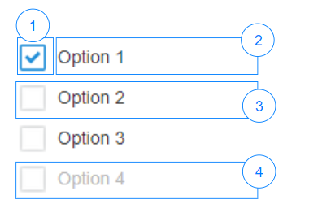

# CheckBox

## Overview


|Number|	Description|
| --- | --- |
|1|	Icon when the item is selected|	
|2|	Label of an item|
|3|Not selected item|	
|4|Disabled item|

## Constructor

**Parameter**

| Name| Type| Required| Description |
| --- | --- | --- | --- |
|options|Object|No|The object contains params of constructor.|
|options.items|Array&lt;Object&gt;|No|List of items which will be displayed on checkbox.|
|options.items[x].value|String|Conditional|String value of item. This is required if <b>options.items[x]</b> is specified.<br>If the value is duplicate, the error message will be displayed|
|options.items[x].label|String|No|	String label of item|
|options.items[x].isDisabled|Boolean|No|Indicate item will be disabled when display. Default value is false.|
|options.value|Array<String>|No|List of checked item.|
|options.isDisabled|Boolean|No|The checkBox will be disabled. <br> Default value: 'false'|
|options.isVisible|Boolean|No|The checkBox will be visible. <br> Default value: 'true'|

<details class="tab-container" markdown="1" open>
<Summary>Sample</Summary>

**Javascript**
```javascript
var checkbox = new kintoneUIComponent.CheckBox ({
       items: [
            {
                label: 'Orange',
                value: 'Orange',
                isDisabled: false
            },
            {
                label: 'Banana',
                value: 'Banana',
                isDisabled: true
            },
            {
                label: 'Lemon',
                value: 'Lemon',
                isDisabled: true
            },
     ],
     value: ['Orange', 'Banana']
});
```

**React**
```javascript
import { CheckBox } from '@kintone/kintone-ui-component';
import React from 'react';

export default class Plugin extends React.Component {
    constructor(props) {
        super(props);
        const items = [
            {
                label: 'Orange',
                value: 'Orange',
                isDisabled: false
            },
            {
                label: 'Banana',
                value: 'Banana',
                isDisabled: true
            },
            {
                label: 'Lemon',
                value: 'Lemon',
                isDisabled: true
            },
        ];
        this.state = {items: items, value: ['Orange']};
    }

    render() {
        return (
            <CheckBox items={this.state.items} value={this.state.value} onChange={(value) => {this.setState({value})}} />
        );
    }
}
```
</details>

## Methods
### render()
Get dom element of component.

**Parameter**

None

**Returns**

Dom element

<details class="tab-container" markdown="1" open>
<Summary>Sample</Summary>

**Javascript**
```javascript
var checkbox = new kintoneUIComponent.CheckBox ({
       items: [
            {
                label: 'Orange',
                value: 'Orange',
                isDisabled: false
            },
            {
                label: 'Banana',
                value: 'Banana',
                isDisabled: true
            },
            {
                label: 'Lemon',
                value: 'Lemon',
                isDisabled: true
            },
     ],
     value: ['Orange', 'Banana']
});

var body = document.getElementsByTagName('BODY')[0];
body.appendChild(checkbox.render());
```

**React**
```javascript
import { CheckBox } from '@kintone/kintone-ui-component';
import React from 'react';

export default class Plugin extends React.Component {
    constructor(props) {
        super(props);
        const items = [
            {
                label: 'Orange',
                value: 'Orange',
                isDisabled: false
            },
            {
                label: 'Banana',
                value: 'Banana',
                isDisabled: true
            },
            {
                label: 'Lemon',
                value: 'Lemon',
                isDisabled: true
            },
        ];
        this.state = {items: items, value: ['Orange']};
    }

    render() {
        return (
            <CheckBox items={this.state.items} value={this.state.value} onChange={(value) => {this.setState({value})}} />
        );
    }
}
```
</details>

### addItem(item)
Add an item to the end of checkbox list.

**Parameter**

| Name| Type| Required| Description |
| --- | --- | --- | --- |
|item|Object|Yes|The item will be added to checkbox list.|
|item.value|String|Yes|The value of an item.|
|item.label|String|No|Display string.|
|item.isDisabled|Boolean|No|Indicate item will be disabled when display. <br> Default value: 'false'|

**Returns**

None

<details class="tab-container" markdown="1" open>
<Summary>Sample</Summary>

**Javascript**
```javascript
var checkbox = new kintoneUIComponent.CheckBox ({
       items: [
            {
                label: 'Orange',
                value: 'Orange',
                isDisabled: false
            },
            {
                label: 'Banana',
                value: 'Banana',
                isDisabled: true
            },
            {
                label: 'Lemon',
                value: 'Lemon',
                isDisabled: true
            },
     ],
     value: ['Orange', 'Banana']
});

var body = document.getElementsByTagName('BODY')[0];
body.appendChild(checkbox.render());

checkbox.addItem({
    label: 'Grape',
    value: 'grape',
    isDisabled: false
});
```

**React**
```javascript
import { CheckBox } from '@kintone/kintone-ui-component';
import React from 'react';

export default class Plugin extends React.Component {
    constructor(props) {
        super(props);
        this.state = {
            items: []
        }
    }

    render() {
        return (
        <div>
          <CheckBox items={this.state.items} value={this.state.value} onChange={(value) => {this.setState({value})}} />
          <button onClick={this.handleClick}>Add Item</button>
        </div>
      );
    }
 
    handleClick = () => {
      const item = {
        label: 'Lemon',
        value: 'Lemon',
        isDisabled: false
      };
      this.setState(prevState => ({
        items: prevState.items ? prevState.items.concat([item]) : [item]
      }))
    }
}
```
</details>

### getItem(index)
Get the value of specific position in checkbox list.

**Parameter**

| Name| Type| Required| Description |
| --- | --- | --- | --- |
|index|	Integer|Yes|The position of retrieved item.|

**Returns**

The item at given position.

| Name| Type| Description |
| --- | --- | --- |
|item|	Object|the item of the checkbox|
|item.value|String|The value of an item.|
|item.label|String|Display string.|
|item.isDisabled|Boolean|Indicate item will be disabled when display.|

<details class="tab-container" markdown="1" open>
<Summary>Sample</Summary>

**Javascript**
```javascript
var checkbox = new kintoneUIComponent.CheckBox ({
       items: [
            {
                label: 'Orange',
                value: 'Orange',
                isDisabled: false
            },
            {
                label: 'Banana',
                value: 'Banana',
                isDisabled: true
            },
            {
                label: 'Lemon',
                value: 'Lemon',
                isDisabled: true
            },
     ],
     value: ['Orange', 'Banana']
});

var body = document.getElementsByTagName('BODY')[0];
body.appendChild(checkbox.render());

var firstItem = checkbox.getItem(0);
console.log(firstItem);
```

**React**
```javascript
import { CheckBox } from '@kintone/kintone-ui-component';
import React from 'react';

export default class Plugin extends React.Component {
    constructor(props) {
        super(props);
        this.state = {
            items: [
                {
                    label: 'Orange',
                    value: 'Orange',
                    isDisabled: false
                },
                {
                    label: 'Banana',
                    value: 'Banana',
                    isDisabled: true
                },
                {
                    label: 'Lemon',
                    value: 'Lemon',
                    isDisabled: true
                }
            ]
        };
    }

    render() {
        return (
        <div>
          <CheckBox items={this.state.items} value={this.state.value} onChange={(value) => {this.setState({value})}} />
          <button onClick={this.handleClick}>Get Item</button>
        </div>
      );
    }
 
    handleClick = () => {
        console.log(this.state.items[0])
    }
}
```
</details>

### removeItem(index)
Remove the specific item from checkbox list.

**Parameter**

| Name| Type| Required| Description |
| --- | --- | --- | --- |
|index|	Integer|Yes|The position of retrieved item.|

**Returns**

None

<details class="tab-container" markdown="1" open>
<Summary>Sample</Summary>

**Javascript**
```javascript
var checkbox = new kintoneUIComponent.CheckBox ({
       items: [
            {
                label: 'Orange',
                value: 'Orange',
                isDisabled: false
            },
            {
                label: 'Banana',
                value: 'Banana',
                isDisabled: true
            },
            {
                label: 'Lemon',
                value: 'Lemon',
                isDisabled: true
            },
     ],
     value: ['Orange', 'Banana']
});

var body = document.getElementsByTagName('BODY')[0];
body.appendChild(checkbox.render());

checkbox.removeItem(0);
```

**React**
```javascript
import { CheckBox } from '@kintone/kintone-ui-component';
import React from 'react';

export default class Plugin extends React.Component {
    constructor(props) {
        super(props);
        this.state = {
            items: [
                {
                    label: 'Orange',
                    value: 'Orange',
                    isDisabled: false
                },
                {
                    label: 'Banana',
                    value: 'Banana',
                    isDisabled: true
                },
                {
                    label: 'Lemon',
                    value: 'Lemon',
                    isDisabled: true
                }
            ]
        };
    }

    render() {
        return (
        <div>
          <CheckBox items={this.state.items} value={this.state.value} onChange={(value) => {this.setState({value})}} />
          <button onClick={this.handleClick}>Remove Item</button>
        </div>
      );
    }
 
    handleClick = () => {
      this.setState(prevState => {
        if (prevState.items[0]) {
              if (this.state.value ) {
                  prevState.value = prevState.value.filter(value => value !== prevState.items[0].value)
              }
              prevState.items.splice(0, 1)
             return prevState;
            }
            return prevState;
      });
    };
}
```
</details>

### getItems()
Get all items from the checkbox.

**Parameter**

None

**Returns**

The list contains all items of the dropdown.

| Name| Type| Description |
| --- | --- | --- |
|items|	Array&lt;Object&gt;|List items of the checkbox|
|items[].value|String|The value of an item.|
|items[].label|String|Display string.|
|items[].isDisabled|Boolean|Indicate item will be disabled when display.|

<details class="tab-container" markdown="1" open>
<Summary>Sample</Summary>

**Javascript**
```javascript
var checkbox = new kintoneUIComponent.CheckBox ({
       items: [
            {
                label: 'Orange',
                value: 'Orange',
                isDisabled: false
            },
            {
                label: 'Banana',
                value: 'Banana',
                isDisabled: true
            },
            {
                label: 'Lemon',
                value: 'Lemon',
                isDisabled: true
            },
     ],
     value: ['Orange', 'Banana']
});

var body = document.getElementsByTagName('BODY')[0];
body.appendChild(checkbox.render());

var items = checkbox.getItems();
items.forEach(function(item) {
    console.log(item.value + ':' + item.isDisabled);
});
```

**React**
```javascript
import { CheckBox } from '@kintone/kintone-ui-component';
import React from 'react';

export default class Plugin extends React.Component {
    constructor(props) {
        super(props);
        const items = [
            {
                label: 'Orange',
                value: 'Orange',
                isDisabled: false
            },
            {
                label: 'Banana',
                value: 'Banana',
                isDisabled: true
            },
            {
                label: 'Lemon',
                value: 'Lemon',
                isDisabled: true
            },
        ];
        this.state = {items: items};
    }

    render() {
        return (
        <div>
          <CheckBox items={this.state.items} value={this.state.value} onChange={(value) => {this.setState({value})}} />
          <button onClick={this.handleClick}>Get Items</button>
        </div>
      );
    }
 
    handleClick = () => {
        this.state.items.forEach(item => {
            console.log(item);
        });
    }
}
```
</details>

### getValue()
Get the checked values of the checkbox.

**Parameter**

None

**Returns**

List of checked items.

| Name| Type| Description |
| --- | --- | --- |
|value |List&lt;String&gt; |The value of selected items.|

<details class="tab-container" markdown="1" open>
<Summary>Sample</Summary>

**Javascript**
```javascript
var checkbox = new kintoneUIComponent.CheckBox ({
       items: [
            {
                label: 'Orange',
                value: 'Orange',
                isDisabled: false
            },
            {
                label: 'Banana',
                value: 'Banana',
                isDisabled: true
            },
            {
                label: 'Lemon',
                value: 'Lemon',
                isDisabled: true
            },
     ],
     value: ['Orange', 'Banana']
});

var body = document.getElementsByTagName('BODY')[0];
body.appendChild(checkbox.render());

var value = checkbox.getValue();
value.forEach(function(item) {
    console.log(item);
});
```

**React**
```javascript
import { CheckBox } from '@kintone/kintone-ui-component';
import React from 'react';

export default class Plugin extends React.Component {
    constructor(props) {
        super(props);
        const items = [
            {
                label: 'Orange',
                value: 'Orange',
                isDisabled: false
            },
            {
                label: 'Banana',
                value: 'Banana',
                isDisabled: true
            },
            {
                label: 'Lemon',
                value: 'Lemon',
                isDisabled: true
            },
        ];
        this.state = {items: items};
    }

    render() {
        return (
        <div>
          <CheckBox items={this.state.items} value={this.state.value} onChange={(value) => {this.setState({value})}} />
          <button onClick={this.handleClick}>Get Values</button>
        </div>
      );
    }
 
    handleClick = () => {
       console.log(this.state.value);
    }
}
```
</details>

### setValue(value)
Set the checked value of checkbox.

**Parameter**

|Name|	Type|	Required|	Description|
| --- | --- | --- |---|
|value|	Array&lt;String&gt; |	Yes|The array contains checked value in list.<br> If the 'value[]' is nonexistent value, the error will be displayed|

**Returns**

None

<details class="tab-container" markdown="1" open>
<Summary>Sample</Summary>

**Javascript**
```javascript
var checkbox = new kintoneUIComponent.CheckBox ({
       items: [
            {
                label: 'Orange',
                value: 'Orange',
                isDisabled: false
            },
            {
                label: 'Banana',
                value: 'Banana',
                isDisabled: true
            },
            {
                label: 'Lemon',
                value: 'Lemon',
                isDisabled: true
            },
     ],
     value: ['Orange', 'Banana']
});

var body = document.getElementsByTagName('BODY')[0];
body.appendChild(checkbox.render());

checkbox.setValue(['Lemon']);
```

**React**
```javascript
import { CheckBox } from '@kintone/kintone-ui-component';
import React from 'react';

export default class Plugin extends React.Component {
    constructor(props) {
        super(props);
        const items = [
            {
                label: 'Orange',
                value: 'Orange',
                isDisabled: false
            },
            {
                label: 'Banana',
                value: 'Banana',
                isDisabled: true
            },
            {
                label: 'Lemon',
                value: 'Lemon',
                isDisabled: true
            },
        ];
        this.state = {items: items, value: []};
    }

    render() {
        return (
        <div>
          <CheckBox items={this.state.items} value={this.state.value} onChange={(value) => {this.setState({value})}} />
          <button onClick={this.handleClick}>Set Value</button>
        </div>
      );
    }
 
    handleClick = () => {
        this.setState({
            value: this.state.value.concat(['Lemon'])
        });
    }
}
```
</details>

### disableItem(value)
Set the disabled item of checkbox.

**Parameter**

|Name|	Type|	Required|	Description|
| --- | --- | --- |---|
|value|	String |	Yes|The array contains checked value in list.|


**Returns**

None

<details class="tab-container" markdown="1" open>
<Summary>Sample</Summary>

**Javascript**
```javascript
var checkbox = new kintoneUIComponent.CheckBox ({
       items: [
            {
                label: 'Orange',
                value: 'Orange',
                isDisabled: false
            },
            {
                label: 'Banana',
                value: 'Banana',
                isDisabled: true
            },
            {
                label: 'Lemon',
                value: 'Lemon',
                isDisabled: true
            },
     ],
     value: ['Orange', 'Banana']
});

var body = document.getElementsByTagName('BODY')[0];
body.appendChild(checkbox.render());

checkbox.disableItem('Orange');
```

**React**
```javascript
import { CheckBox } from '@kintone/kintone-ui-component';
import React from 'react';

export default class Plugin extends React.Component {
    constructor(props) {
        super(props);
        const items = [
            {
                label: 'Orange',
                value: 'Orange',
                isDisabled: false
            },
            {
                label: 'Banana',
                value: 'Banana',
                isDisabled: true
            },
            {
                label: 'Lemon',
                value: 'Lemon',
                isDisabled: true
            },
        ];
        this.state = {items: items};
    }

    render() {
        return (
        <div>
          <CheckBox items={this.state.items} value={this.state.value} onChange={(value) => {this.setState({value})}} />
          <button onClick={this.handleClick}>Disable item</button>
        </div>
      );
    }
 
    handleClick = () => {
        const items = [...this.state.items];
 
        items[0].isDisabled = true;
        this.setState({ items: items });
    }
}
```
</details>

### enableItem(value)
Set the enable item of checkbox.

**Parameter**

|Name|	Type|	Required|	Description|
| --- | --- | --- |---|
|value|	String |	Yes|The array contains checked value in list.|

**Returns**

None

<details class="tab-container" markdown="1" open>
<Summary>Sample</Summary>

**Javascript**
```javascript
var checkbox = new kintoneUIComponent.CheckBox ({
       items: [
            {
                label: 'Orange',
                value: 'Orange',
                isDisabled: false
            },
            {
                label: 'Banana',
                value: 'Banana',
                isDisabled: true
            },
            {
                label: 'Lemon',
                value: 'Lemon',
                isDisabled: true
            },
     ],
     value: ['Orange', 'Banana']
});

var body = document.getElementsByTagName('BODY')[0];
body.appendChild(checkbox.render());

checkbox.enableItem('Banana');
```

**React**
```javascript
import { CheckBox } from '@kintone/kintone-ui-component';
import React from 'react';

export default class Plugin extends React.Component {
    constructor(props) {
        super(props);
        const items = [
            {
                label: 'Orange',
                value: 'Orange',
                isDisabled: false
            },
            {
                label: 'Banana',
                value: 'Banana',
                isDisabled: true
            },
            {
                label: 'Lemon',
                value: 'Lemon',
                isDisabled: true
            },
        ];
        this.state = {items: items};
    }

    render() {
        return (
        <div>
          <CheckBox items={this.state.items} value={this.state.value} onChange={(value) => {this.setState({value})}} />
          <button onClick={this.handleClick}>Click</button>
        </div>
        );
      }
 
    handleClick = () => {
        const items = [...this.state.items];
 
        items[1].isDisabled = false;
        this.setState({ items: items });
    }
}
```
</details>

### on(eventName, callBack)
Register callback for change event

**Parameter**

| Name| Type| Required| Description |
| --- | --- | --- | --- |
|eventName|	String|	Yes|Name of event: <ul><li>'change'</li></ul>|
|callback|function |Yes|callback|

**Returns**

None

<details class="tab-container" markdown="1" open>
<Summary>Sample</Summary>

**Javascript**
```javascript
var checkbox = new kintoneUIComponent.CheckBox ({
       items: [
            {
                label: 'Orange',
                value: 'Orange',
                isDisabled: false
            },
            {
                label: 'Banana',
                value: 'Banana',
                isDisabled: true
            },
            {
                label: 'Lemon',
                value: 'Lemon',
                isDisabled: true
            },
     ],
     value: ['Orange', 'Banana']
});

var body = document.getElementsByTagName('BODY')[0];
body.appendChild(checkbox.render());

checkbox.on('change', function(value) {
    console.log('on change');
});
```

**React**
```javascript
import { CheckBox } from '@kintone/kintone-ui-component';
import React from 'react';

export default class Plugin extends React.Component {
    constructor(props) {
        super(props);
        const items = [
            {
                label: 'Orange',
                value: 'Orange',
                isDisabled: false
            },
            {
                label: 'Banana',
                value: 'Banana',
                isDisabled: true
            },
            {
                label: 'Lemon',
                value: 'Lemon',
                isDisabled: true
            },
        ];
        const value= ['Orange', 'Banana']
        this.state = {items: items,value};
    }

    render() {
        return (
            <CheckBox value={this.state.value} items={this.state.items} onChange={this.handleChange} />
        );
    }

    handleChange= (value) => {
        this.setState({value})
        console.log("onChange",value);
        
    }
}
```
</details>

### show()
Display the checkbox.

**Parameter**

None

**Returns**

None

<details class="tab-container" markdown="1" open>
<Summary>Sample</Summary>

**Javascript**
```javascript
var checkbox = new kintoneUIComponent.CheckBox ({
       items: [
            {
                label: 'Orange',
                value: 'Orange',
                isDisabled: false
            },
            {
                label: 'Banana',
                value: 'Banana',
                isDisabled: true
            },
            {
                label: 'Lemon',
                value: 'Lemon',
                isDisabled: true
            },
     ],
     value: ['Orange', 'Banana']
});

var body = document.getElementsByTagName('BODY')[0];
body.appendChild(checkbox.render());

checkbox.show();
```

**React**
```javascript
import { CheckBox } from '@kintone/kintone-ui-component';
import React from 'react';

export default class Plugin extends React.Component {
   constructor(props) {
    super(props);
    const items = [
      {
        label: "Orange",
        value: "Orange",
        isDisabled: false
      },
      {
        label: "Banana",
        value: "Banana",
        isDisabled: true
      },
      {
        label: "Lemon",
        value: "Lemon",
        isDisabled: true
      }
    ];
    this.state = { items: items, isVisible: false };
  }

  render() {
    return (
      <div>
        <CheckBox
          value={this.state.value}
          isVisible={this.state.isVisible}
          items={this.state.items}
          onChange={value => {
            this.setState({ value });
          }}
        />
        <button onClick={() => this.setState({ isVisible: true })}>Show</button>
      </div>
    );
  }
}
```
</details>

### hide()
Hide the checkbox.

**Parameter**

None

**Returns**

None

<details class="tab-container" markdown="1" open>
<Summary>Sample</Summary>

**Javascript**
```javascript
var checkbox = new kintoneUIComponent.CheckBox ({
       items: [
            {
                label: 'Orange',
                value: 'Orange',
                isDisabled: false
            },
            {
                label: 'Banana',
                value: 'Banana',
                isDisabled: true
            },
            {
                label: 'Lemon',
                value: 'Lemon',
                isDisabled: true
            },
     ],
     value: ['Orange', 'Banana']
});

var body = document.getElementsByTagName('BODY')[0];
body.appendChild(checkbox.render());

checkbox.hide();
```

**React**
```javascript
import { CheckBox } from '@kintone/kintone-ui-component';
import React from 'react';

export default class Plugin extends React.Component {
    constructor(props) {
    super(props);
    const items = [
      {
        label: "Orange",
        value: "Orange",
        isDisabled: false
      },
      {
        label: "Banana",
        value: "Banana",
        isDisabled: true
      },
      {
        label: "Lemon",
        value: "Lemon",
        isDisabled: true
      }
    ];
    this.state = { items: items, isVisible: true };
  }

  render() {
    return (
      <div>
        <CheckBox
          value={this.state.value}
          isVisible={this.state.isVisible}
          items={this.state.items}
          onChange={value => {
            this.setState({ value });
          }}
        />
        <button onClick={() => this.setState({ isVisible: false })}>Hide</button>
      </div>
    );
  }
}
```
</details>

### disable()
Disabled the checkbox.

**Parameter**

None

**Returns**

None

<details class="tab-container" markdown="1" open>
<Summary>Sample</Summary>

**Javascript**
```javascript
var checkbox = new kintoneUIComponent.CheckBox ({
       items: [
            {
                label: 'Orange',
                value: 'Orange',
                isDisabled: false
            },
            {
                label: 'Banana',
                value: 'Banana',
                isDisabled: true
            },
            {
                label: 'Lemon',
                value: 'Lemon',
                isDisabled: true
            },
     ],
     value: ['Orange', 'Banana']
});

var body = document.getElementsByTagName('BODY')[0];
body.appendChild(checkbox.render());

checkbox.disable();
```

**React**
```javascript
import { CheckBox } from '@kintone/kintone-ui-component';
import React from 'react';

export default class Plugin extends React.Component {
    constructor(props) {
    super(props);
    const items = [
      {
        label: "Orange",
        value: "Orange",
        isDisabled: false
      },
      {
        label: "Banana",
        value: "Banana",
        isDisabled: true
      },
      {
        label: "Lemon",
        value: "Lemon",
        isDisabled: true
      }
    ];
    this.state = { items: items, isDisabled: false };
  }

  render() {
    return (
      <div>
        <CheckBox
          value={this.state.value}
          isDisabled={this.state.isDisabled}
          items={this.state.items}
          onChange={value => {
            this.setState({ value });
          }}
        />
        <button onClick={() => this.setState({ isDisabled: true })}>Disable</button>
      </div>
    );
  }
}
```
</details>

### enable()
Enabled the checkbox.

**Parameter**

None

**Returns**

None

<details class="tab-container" markdown="1" open>
<Summary>Sample</Summary>

**Javascript**
```javascript
var checkbox = new kintoneUIComponent.CheckBox ({
       items: [
            {
                label: 'Orange',
                value: 'Orange',
                isDisabled: false
            },
            {
                label: 'Banana',
                value: 'Banana',
                isDisabled: true
            },
            {
                label: 'Lemon',
                value: 'Lemon',
                isDisabled: true
            },
     ],
     value: ['Orange', 'Banana']
});

var body = document.getElementsByTagName('BODY')[0];
body.appendChild(checkbox.render());

checkbox.enable();
```

**React**
```javascript
import { CheckBox } from '@kintone/kintone-ui-component';
import React from 'react';

export default class Plugin extends React.Component {
     constructor(props) {
    super(props);
    const items = [
      {
        label: "Orange",
        value: "Orange",
        isDisabled: false
      },
      {
        label: "Banana",
        value: "Banana",
        isDisabled: true
      },
      {
        label: "Lemon",
        value: "Lemon",
        isDisabled: true
      }
    ];
    this.state = { items: items, isDisabled: true };
  }

  render() {
    return (
      <div>
        <CheckBox
          value={this.state.value}
          isDisabled={this.state.isDisabled}
          items={this.state.items}
          onChange={value => {
            this.setState({ value });
          }}
        />
        <button onClick={() => this.setState({ isDisabled: false })}>Enable</button>
      </div>
    );
  }
}
```
</details>
