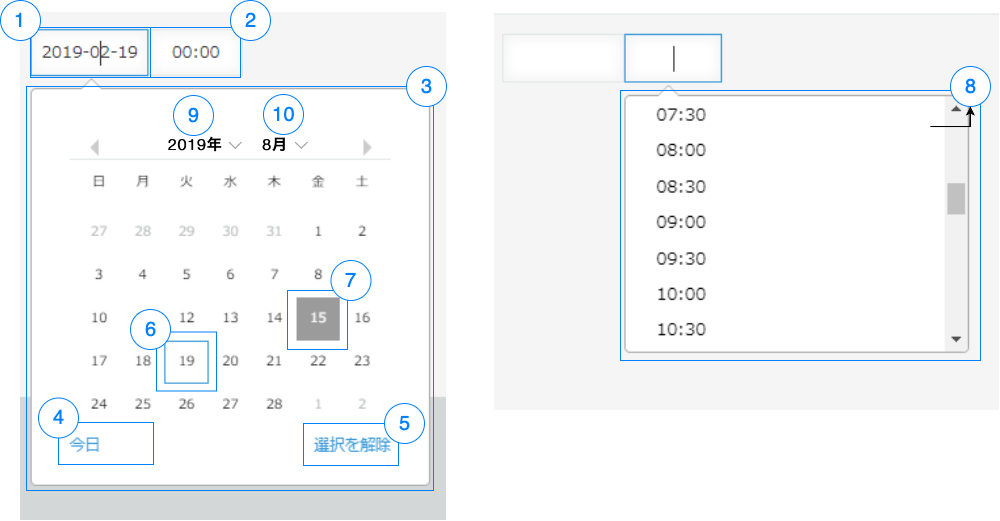

# DateTime

## Overview


|Number|	Description|
| --- | --- |
|1|date form|	
|2|time form|
|3|date picker|	
|4|select today button|
|5|clear button|
|6|selected item pointer|
|7|today pointer|
|8|time picker|
|9|year selection dropdown|
|10|month selection dropdown|

## Constructor

**Parameter**

| Name| Type| Required| Description |
| --- | - | --- | ----- |
|options|Object|No|An object contains params of constructor.|
|options.value|Date|No|	The Default DateTime Value.|
|options.type|String|No|The component type <br> <ul><li>date</li><li>time</li><li>datetime</li></ul>Default value: 'datetime'|
|options.locale|String|No|The setting of language <br> <ul><li>ja</li><li>en</li><li>zh</li></ul>Default value: 'ja'|
|options.dateFormat|String|No|The date format showed on date picker.<br>Supported format:<br>Seperator: "/", "-", " ", ":" <br>Day of week:<br><ul><li>E (Week Day Short): Su, Mo...</li><li>EE (Week Day Medium): Sun, Mon...</li><li>EEE (Week Day): Sunday, Monday...</li></ul><br>Date:<br><ul><li>d (Date Short): 1,2 ...</li><li>dd (Date Full): 01, 02...</li></ul><br>Month:<br><ul><li>MM (Month Number): 01, 02 ...</li><li>MMM (Month Text Short): Jan, Feb...</li><li>MMMM (Month Text Long): January, February...</li></ul><br>Year:<br><ul><li>YYYY (Year): 2019, 2020...</li></ul><br>Default format: MM/dd/YYYY|
|options.isVisible|Boolean|No|The DatePicker will be visible.<br>Default value: 'true'|
|options.isDisabled|Boolean|No|The DateTime field will be disabled. <br>Default value: 'false'|

<details class="tab-container" markdown="1" open>
<Summary>Sample</Summary>

**Javascript**
```javascript
var dateTime = new kintoneUIComponent.DateTime({value: new Date(), type: 'datetime', locale: 'en'});
```

**React**
```javascript
import { DateTime } from '@kintone/kintone-ui-component';
import React from 'react';
import ReactDOM from 'react-dom';
class DateTimeComponent extends React.Component {
    constructor(props){
        super(props);
        this.state = {date: new Date()};
    }
    render() {
        return (
            <DateTime
                value={this.state.date}
                type='datetime'
                locale='en'
            />
        );
    }
}
```

</details>

## Methods
### render()
Get dom element of component.

**Parameter**

None

**Returns**

Dom element

<details class="tab-container" markdown="1" open>
<Summary>Sample</Summary>

**Javascript**
```javascript
var dateTime = new kintoneUIComponent.DateTime({value: new Date(), type: 'datetime', locale: 'en'});
var body = document.getElementsByTagName("BODY")[0];
body.appendChild(dateTime.render());
```

**React**
```javascript
import { DateTime } from '@kintone/kintone-ui-component';
import React from 'react';
import ReactDOM from 'react-dom';
class DateTimeComponent extends React.Component {
    constructor(props){
        super(props);
        this.state = {date: new Date()};
    }
    render() {
        return (
            <DateTime
                value={this.state.date}
                type='datetime'
                locale='en'
            />
        );
    }
}
```

</details>

### getValue()
Get the value of datetime field.

**Parameter**

None

**Returns**

| Name| Type| Description |
| --- | --- | --- |
|value|	Date|The value of datetime field.|

<details class="tab-container" markdown="1" open>
<Summary>Sample</Summary>

**Javascript**
```javascript
var dateTime = new kintoneUIComponent.DateTime({value: new Date(), type: 'datetime', locale: 'en'});
console.log(dateTime.getValue());
var body = document.getElementsByTagName("BODY")[0];
body.appendChild(dateTime.render());
```

**React**
```javascript
import { DateTime } from '@kintone/kintone-ui-component';
import React from 'react';
import ReactDOM from 'react-dom';
class DateTimeComponent extends React.Component {
    constructor(props){
        super(props);
        this.state = {value: new Date()};
    }
    render() {
        return (
            <div>
                <DateTime value={this.state.value} onChange={(value) => {this.setState({value})}}/>
                <button onClick={this.handleClick}>Get Value </button>
            </div>
        );
    }
    handleClick= () => {
        console.log(this.state.value);
    };
}
```

</details>

### setValue(value)
Set the value of datetime field.

**Parameter**

| Name| Type| Required | Description |
| --- | --- | --- | --- |
|value|	Date| Yes | The value of datetime field.|

**Returns**

None

<details class="tab-container" markdown="1" open>
<Summary>Sample</Summary>

**Javascript**
```javascript
var dateTime = new kintoneUIComponent.DateTime({value: new Date(), type: 'datetime', locale: 'en'});
var body = document.getElementsByTagName("BODY")[0];
body.appendChild(dateTime.render());
dateTime.setValue(new Date());
```

**React**
```javascript
import { DateTime } from '@kintone/kintone-ui-component';
import React from 'react';
import ReactDOM from 'react-dom';
class DateTimeComponent extends React.Component {
    constructor(props){
        super(props);
        this.state = {value: new Date()};
    }
    render() {
        return (
            <div>
                <DateTime value={this.state.value} onChange={(value) => {this.setState({value})}}/>
                <button onClick={this.handleClick}>Set Value </button>
            </div>
        );
    }
    handleClick= () => {
        this.setState({value: new Date('1995-12-17T03:24:00')})
    };
}
```

</details>

### getLocale()
Get the setting of language.

**Parameter**

None

**Returns**

| Name| Type | Description |
| --- | --- | --- |
|locale| String |The setting of language.<br><ul><li>ja</li><li>en</li><li>zh</li></ul>|

<details class="tab-container" markdown="1" open>
<Summary>Sample</Summary>

**Javascript**
```javascript
var dateTime = new kintoneUIComponent.DateTime({ value: new Date(), type: "datetime", locale: "en" });
var body = document.getElementsByTagName("BODY")[0];
body.appendChild(dateTime.render());
console.log(dateTime.getLocale());
```

**React**
```javascript
import { DateTime } from '@kintone/kintone-ui-component';
import React from 'react';
import ReactDOM from 'react-dom';
class DateTimeComponent extends React.Component {
    constructor(props){
        super(props);
        this.state = {locale: 'ja'};
    }
    render() {
        return (
            <div>
                <DateTime locale={this.state.locale} onChange={(value) => {this.setState({value})}}/>
                <button onClick={this.handleClick}>Get Locale </button>
            </div>
        );
    }
    handleClick= () => {
        console.log(this.state.locale);
    };
}
```

</details>

### setLocale(locale)
Set the language setting.

**Parameters**

| Name| Type | Required | Description |
| --- | --- | --- | --- |
|locale| String | Yes | The setting of language.<br><ul><li>ja</li><li>en</li><li>zh</li></ul>|

**Returns**

None

<details class="tab-container" markdown="1" open>
<Summary>Sample</Summary>

**Javascript**
```javascript
var dateTime = new kintoneUIComponent.DateTime({ value: new Date(), type: "datetime", locale: "en" });
var body = document.getElementsByTagName("BODY")[0];
body.appendChild(dateTime.render());
dateTime.setLocale('en');
```

**React**
```javascript
import { DateTime } from '@kintone/kintone-ui-component';
import React from 'react';
import ReactDOM from 'react-dom';
class DateTimeComponent extends React.Component {
    constructor(props){
        super(props);
        this.state = {locale: 'en'};
    }
    render() {
        return (
            <div>
                <DateTime locale={this.state.locale} onChange={(value) => {this.setState({value})}}/>
                <button onClick={this.handleClick}>Set Locale </button>
            </div>
        );
    }
    handleClick= () => {
        this.setState({locale: 'ja'})
    };
}
```

</details>

### show()
Display DateTime.

**Parameter**

None

**Returns**

None

<details class="tab-container" markdown="1" open>
<Summary>Sample</Summary>

**Javascript**
```javascript
var dateTime = new kintoneUIComponent.DateTime({ value: new Date(), type: "datetime", locale: "en" });
var body = document.getElementsByTagName("BODY")[0];
body.appendChild(dateTime.render());
dateTime.show();
```

**React**
```javascript
import { DateTime } from '@kintone/kintone-ui-component';
import React from 'react';
import ReactDOM from 'react-dom';
 
class DateTimeComponent extends React.Component {
    constructor(props){
        super(props);
        this.state = {date: new Date(),isVisible:false};

    }
    handleShow=()=>{
        this.setState({isVisible:true})
    }
    render() {
        return (
           <div>
               <button onClick={this.handleShow}>Show</button>
               <DateTime
                value={this.state.date}
                type='datetime'
                locale='en'
                isVisible={this.state.isVisible}
            />
           </div>
        );
    }
}
```
</details>

### hide()
Hide DateTime.

**Parameter**

None

**Returns**

None

<details class="tab-container" markdown="1" open>
<Summary>Sample</Summary>

**Javascript**
```javascript
var myDateTime = new kintoneUIComponent.DateTime({value: new Date()});

kintone.events.on('app.record.index.show', function(event) {
var dateTime = new kintoneUIComponent.DateTime({ value: new Date(), type: "datetime", locale: "en" });
var body = document.getElementsByTagName("BODY")[0];
body.appendChild(dateTime.render());
dateTime.hide();
});
```

**React**
```javascript
import { DateTime } from '@kintone/kintone-ui-component';
import React from 'react';
import ReactDOM from 'react-dom';
 
class DateTimeComponent extends React.Component {
   constructor(props){
        super(props);
        this.state = {date: new Date(),isVisible:true};

    }
    handleShow=()=>{
        this.setState({isVisible:false})
    }
    render() {
        return (
           <div>
               <button onClick={this.handleShow}>Hide</button>
               <DateTime
                value={this.state.date}
                type='datetime'
                locale='en'
                isVisible={this.state.isVisible}
            />
           </div>
        );
    }
}
```
</details>

### disable()
Disable DateTime.

**Parameter**

None

**Returns**

None

<details class="tab-container" markdown="1" open>
<Summary>Sample</Summary>

**Javascript**
```javascript
var dateTime = new kintoneUIComponent.DateTime({ value: new Date(), type: "datetime", locale: "en" });
var body = document.getElementsByTagName("BODY")[0];
body.appendChild(dateTime.render());
dateTime.disable();
```

**React**
```javascript
import { DateTime } from '@kintone/kintone-ui-component';
import React from 'react';
import ReactDOM from 'react-dom';
 
class DateTimeComponent extends React.Component {
     constructor(props){
        super(props);
        this.state = {date: new Date(),isDisabled:false};

    }
    handleDisable=()=>{
        this.setState({isDisabled:true})
    }
    render() {
        return (
           <div>
               <button onClick={this.handleDisable}>Disable</button>
               <DateTime
                value={this.state.date}
                type='datetime'
                locale='en'
                isDisabled={this.state.isDisabled}
            />
           </div>
        );
    }
}
```
</details>

### enable()
Enable DateTime.

**Parameter**

None

**Returns**

None

<details class="tab-container" markdown="1" open>
<Summary>Sample</Summary>

**Javascript**
```javascript
var dateTime = new kintoneUIComponent.DateTime({ value: new Date(), type: "datetime", locale: "en" });
var body = document.getElementsByTagName("BODY")[0];
body.appendChild(dateTime.render());
dateTime.enable();
});
```

**React**
```javascript
import { DateTime } from '@kintone/kintone-ui-component';
import React from 'react';
import ReactDOM from 'react-dom';
 
class DateTimeComponent extends React.Component {
    constructor(props){
        super(props);
        this.state = {date: new Date(),isDisabled:true};

    }
    handleEnable=()=>{
        this.setState({isDisabled:false})
    }
    render() {
        return (
           <div>
               <button onClick={this.handleEnable}>Enable</button>
               <DateTime
                value={this.state.date}
                type='datetime'
                locale='en'
                isDisabled={this.state.isDisabled}
            />
           </div>
        );
    }
}

```
</details>