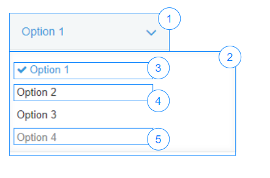

# Dropdown

## Overview


|Number|	Description|
| --- | --- |
|1|	Main area|
|2|	Content area|
|3|Selected item|
|4|Not selected item|
|5|Disabled item|

## Constructor

**Parameter**

| Name| Type| Required| Description |
| --- | --- | --- | --- |
|options|Object|No|The object contains params of constructor.|
|options.items|Array&lt;Object&gt;|No|List of items will be displayed on dropdown.|
|options.items[].value|String|Yes|The value of an item.<br>If the value is duplicate, the error will be displayed|
|options.items[].label|String|No|List of items will be displayed on dropdown.|
|options.items[].isDisabled|Boolean|No|Indicate item will be disabled when display. Default value is false.|
|options.value|String|No|Default selected value. <br> If the 'options.value' is nonexistent value, the error will be displayed|
|options.isDisabled|Boolean|No|The dropdown will be disabled. <br> Default value: 'false'|
|options.isVisible|Boolean|No|The dropdown will be visible. <br> Default value: 'true'|


<details class="tab-container" open>
<Summary>Sample</Summary>

**React**
```
import { DropDown } from 'kintone-ui-component';
import React from 'react';

export default class Plugin extends React.Component {
    render() {
        var items = [
            {
                label: 'Orange',
                value: 'Orange',
                isDisabled: false
            },
            {
                label: 'Banana',
                value: 'Banana',
                isDisabled: true
            },
            {
                label: 'Lemon',
                value: 'Lemon',
                isDisabled: true
            },
        ];
        this.state = {items: items, value: 'Orange'};

        return (
            <Dropdown items={this.state.items} value={this.state.value} onChange={(value) => {this.setState({value})}} />
        );
    }
}
```
**Javascript**
```
var dropdown = new kintoneUIComponent.Dropdown({
    items: [
        {
            label: 'Orange',
            value: 'Orange',
            isDisabled: true
        },
        {
            label: 'Banana',
            value: 'Banana',
            isDisabled: false
        }
    ],
    value: 'Banana'
});
```
</details>

## Methods
### render()
Get dom element of component.

**Parameter**

None

**Returns**

Dom element

<details class="tab-container" open>
<Summary>Sample</Summary>

**React**
```
import { DropDown } from 'kintone-ui-component';
import React from 'react';

export default class Plugin extends React.Component {
    render() {
        var items = [
            {
                label: 'Orange',
                value: 'Orange',
                isDisabled: false
            },
            {
                label: 'Banana',
                value: 'Banana',
                isDisabled: true
            },
            {
                label: 'Lemon',
                value: 'Lemon',
                isDisabled: true
            },
        ];
        this.state = {items: items, value: 'Orange'};

        return (
            <Dropdown items={this.state.items} value={this.state.value} onChange={(value) => {this.setState({value})}} />
        );
    }
}
```
**Javascript**
```
var dropdown = new kintoneUIComponent.Dropdown({
    items: [
        {
            label: 'Orange',
            value: 'Orange',
            isDisabled: true
        },
        {
            label: 'Banana',
            value: 'Banana',
            isDisabled: false
        }
    ],
    value: 'Banana'
});

var body = document.getElementsByTagName("BODY")[0];
    body.appendChild(dropdown.render());

```
</details>


### addItem(item)
Add an item to dropdown list.

**Parameter**

| Name| Type| Required| Description |
| --- | --- | --- | --- |
|item|	Object|	Yes|The item will be added to dropdown list.|
|item.value|String|Yes|The value of an item.|
|item.label|String|Yes|Display string.|
|item.isDisabled|Boolean|Yes|Indicate item will be disabled when display. <br>Default value: 'false' |

**Returns**

None

<details class="tab-container" open>
<Summary>Sample</Summary>

**React**
```
import { DropDown } from 'kintone-ui-component';
import React from 'react';

export default class Plugin extends React.Component {
    constructor(opts) {
        super(opts);
        this.state = {
            items: [],
            value: undefined
        }
    }

    render() {
        return (
         <div>
          <Dropdown items={this.state.items} value={this.state.value} onChange={(value) => {this.setState({value})}} />
          <button onClick={this.handleClick}>Add Item</button>
         </div>
        );
    }

    handleClick= () => {
      const item = {
        label: 'Lemon',
        value: 'Lemon',
        isDisabled: false
      };
      this.setState(prevState => ({
        items: prevState.items ? prevState.items.concat([item]) : [item]
      }))
    };
}

```
**Javascript**
```
var dropdown = new kintoneUIComponent.Dropdown({
    items: [
        {
            label: 'Orange',
            value: 'Orange',
            isDisabled: true
        },
        {
            label: 'Banana',
            value: 'Banana',
            isDisabled: false
        }
    ],
    value: 'Banana'
});

var body = document.getElementsByTagName("BODY")[0];
    body.appendChild(dropdown.render();

dropdown.addItem({label: 'Lemon', value: 'Lemon', isDisabled: true});
```
</details>


### removeItem(index)
Remove an item at specific position in dropdown's list.

**Parameter**

| Name| Type| Required| Description |
| --- | --- | --- | --- |
|index|Integer|	Yes|The index of remove item.|

**Returns**

None

<details class="tab-container" open>
<Summary>Sample</Summary>

**React**
```
import { DropDown } from 'kintone-ui-component';
import React from 'react';

export default class Plugin extends React.Component {
    constructor(opts) {
        super(opts);
        this.state = {
            items: []
        }
    }

    render() {
        return (
         <div>
          <Dropdown items={this.state.items} value={this.state.value} onChange={(value) => {this.setState({value})}} />
          <button onClick={this.handleClick}>Remove Item</button>
         </div>
        );
    }

    handleClick= () => {
      this.setState(prevState => {
        if (prevState.items) {
            return prevState.items.splice(0, 1);
        }
        return prevState;
      });
    };
}

```
**Javascript**
```
var dropdown = new kintoneUIComponent.Dropdown({
    items: [
        {
            label: 'Orange',
            value: 'Orange',
            isDisabled: true
        },
        {
            label: 'Banana',
            value: 'Banana',
            isDisabled: false
        }
    ],
    value: 'Banana'
});

var body = document.getElementsByTagName("BODY")[0];
    body.appendChild(dropdown.render();

dropdown.removeItem(0);
console.log(firstItem);
```
</details>


### getItems()
Get all items of the dropdown.

**Parameter**

None

**Returns**

The list contains all items of dropdown.

| Name| Type| Description |
| --- | --- | --- |
|items|List&lt;Object&gt;|List of items objects in dropdown.|
|items[].label|String|Display string.|
|items[].value|String|The value of an item.|
|items[].isDisabled|Boolean|Indicate item was disabled.|

<details class="tab-container" open>
<Summary>Sample</Summary>

**React**
```
import { DropDown } from 'kintone-ui-component';
import React from 'react';

export default class Plugin extends React.Component {
    constructor(opts) {
        super(opts);
        var items = [
            {
                label: 'Orange',
                value: 'Orange',
                isDisabled: false
            },
            {
                label: 'Banana',
                value: 'Banana',
                isDisabled: true
            },
            {
                label: 'Lemon',
                value: 'Lemon',
                isDisabled: true
            },
        ];
        this.state = {items: items};
    }

    render() {
        return (
         <div>
          <Dropdown items={this.state.items} value={this.state.value} onChange={(value) => {this.setState({value})}} />
          <button onClick={this.handleClick}>Get Items</button>
         </div>
        );
    }

    handleClick = () => {
        this.state.items.forEach(item => {
            console.log(item);
        });
    }
}

```
**Javascript**
```
var dropdown = new kintoneUIComponent.Dropdown({
    items: [
        {
            label: 'Orange',
            value: 'Orange',
            isDisabled: true
        },
        {
            label: 'Banana',
            value: 'Banana',
            isDisabled: false
        }
    ],
    value: 'Banana'
});

var body = document.getElementsByTagName("BODY")[0];
    body.appendChild(dropdown.render();

var list = dropdown.getItems();
list.forEach(function(item) {
    console.log(item);
});
```
</details>


### getValue()
Get value of the selected item

**Parameter**

None

**Returns**

|Name|Type|Description|
|---|---|---|
|value	|String	|The value of the selected item|

<details class="tab-container" open>
<Summary>Sample</Summary>

**React**
```
import { DropDown } from 'kintone-ui-component';
import React from 'react';

export default class Plugin extends React.Component {
    constructor(opts) {
        super(opts);
        var items = [
            {
                label: 'Orange',
                value: 'Orange',
                isDisabled: false
            },
            {
                label: 'Banana',
                value: 'Banana',
                isDisabled: true
            },
            {
                label: 'Lemon',
                value: 'Lemon',
                isDisabled: true
            },
        ];
        this.state = {
            items: items,
            value: 'Banana'
        };
    }

    render() {
        return (
         <div>
          <Dropdown items={this.state.items} value={this.state.value} onChange={(value) => {this.setState({value})}} />
          <button onClick={this.handleClick}>Get Value</button>
         </div>
        );
    }

    handleClick = () => {
        console.log(this.state.value);
    }
}

```
**Javascript**
```
var dropdown = new kintoneUIComponent.Dropdown({
    items: [
        {
            label: 'Orange',
            value: 'Orange',
            isDisabled: true
        },
        {
            label: 'Banana',
            value: 'Banana',
            isDisabled: false
        }
    ],
    value: 'Banana'
});

var body = document.getElementsByTagName("BODY")[0];
    body.appendChild(dropdown.render();

var selectedItem = dropdown.getValue();
console.log(selectedItem);
```
</details>


### setValue(value)
Set the selected value for dropdown.

**Parameter**

| Name| Type| Required| Description |
| --- | --- | --- | --- |
|value|String|	Yes|The value of an Item in dropdown. <br> If the 'value' is nonexistent value, the error will be displayed|

**Returns**

None

<details class="tab-container" open>
<Summary>Sample</Summary>

**React**
```
import { DropDown } from 'kintone-ui-component';
import React from 'react';

export default class Plugin extends React.Component {
    constructor(opts) {
        super(opts);
        var items = [
            {
                label: 'Orange',
                value: 'Orange',
                isDisabled: false
            },
            {
                label: 'Banana',
                value: 'Banana',
                isDisabled: true
            },
            {
                label: 'Lemon',
                value: 'Lemon',
                isDisabled: true
            },
        ];
        this.state = {
            items: items,
            value: 'Banana'
        };
    }

    render() {
        return (
         <div>
          <Dropdown items={this.state.items} value={this.state.value} onChange={(value) => {this.setState({value})}} />
          <button onClick={this.handleClick}>Set Value</button>
         </div>
        );
    }

    handleClick = () => {
        this.setState({value: 'Orange'});
    }
}

```
**Javascript**
```
var dropdown = new kintoneUIComponent.Dropdown({
    items: [
        {
            label: 'Orange',
            value: 'Orange',
            isDisabled: true
        },
        {
            label: 'Banana',
            value: 'Banana',
            isDisabled: false
        }
    ],
    value: 'Banana'
});

var body = document.getElementsByTagName("BODY")[0];
    body.appendChild(dropdown.render();

dropdown.setValue('Orange');
```
</details>


### disableItem(value)
Set the disabled item for dropdown.

**Parameter**

| Name| Type| Required| Description |
| --- | --- | --- | --- |
|value|String|	Yes|The value of an Item in dropdown.|

**Returns**

None

<details class="tab-container" open>
<Summary>Sample</Summary>

**React**
```
import { DropDown } from 'kintone-ui-component';
import React from 'react';

export default class Plugin extends React.Component {
    constructor(opts) {
        super(opts);
        var items = [
            {
                label: 'Orange',
                value: 'Orange',
                isDisabled: false
            },
            {
                label: 'Banana',
                value: 'Banana',
                isDisabled: true
            },
            {
                label: 'Lemon',
                value: 'Lemon',
                isDisabled: true
            },
        ];
        this.state = {
            items: items,
            value: 'Banana'
        };
    }

   render() {
        return (
         <div>
          <Dropdown items={this.state.items} value={this.state.value} onChange={(value) => {this.setState({value})}} />
          <button onClick={this.handleClick}>Disabled Item</button>
         </div>
        );
    }

    handleClick = () => {
        const items = [...this.state.items];
        items[0].isDisabled = true;

        this.setState({ items: items });
    }
}

```
**Javascript**
```
var dropdown = new kintoneUIComponent.Dropdown({
    items: [
        {
            label: 'Orange',
            value: 'Orange',
            isDisabled: true
        },
        {
            label: 'Banana',
            value: 'Banana',
            isDisabled: false
        }
    ],
    value: 'Banana'
});

var body = document.getElementsByTagName("BODY")[0];
    body.appendChild(dropdown.render();

dropdown.disableItem('Orange');
```
</details>


### enableItem(value)
Set the enabled item for dropdown.

**Parameter**

| Name| Type| Required| Description |
| --- | --- | --- | --- |
|value|String|	Yes|The value of an Item in dropdown.|

**Returns**

None

<details class="tab-container" open>
<Summary>Sample</Summary>

**React**
```
import { DropDown } from 'kintone-ui-component';
import React from 'react';

export default class Plugin extends React.Component {
    constructor(opts) {
        super(opts);
        var items = [
            {
                label: 'Orange',
                value: 'Orange',
                isDisabled: false
            },
            {
                label: 'Banana',
                value: 'Banana',
                isDisabled: true
            },
            {
                label: 'Lemon',
                value: 'Lemon',
                isDisabled: true
            },
        ];
        this.state = {
            items: items,
            value: 'Banana'
        };
    }

   render() {
        return (
         <div>
          <Dropdown items={this.state.items} value={this.state.value} onChange={(value) => {this.setState({value})}} />
          <button onClick={this.handleClick}>Disabled Item</button>
         </div>
        );
    }

    handleClick = () => {
        const items = [...this.state.items];
        items[1].isDisabled = false;

        this.setState({ items: items });
    }
}

```
**Javascript**
```
var dropdown = new kintoneUIComponent.Dropdown({
    items: [
        {
            label: 'Orange',
            value: 'Orange',
            isDisabled: true
        },
        {
            label: 'Banana',
            value: 'Banana',
            isDisabled: false
        }
    ],
    value: 'Banana'
});

var body = document.getElementsByTagName("BODY")[0];
    body.appendChild(dropdown.render();

dropdown.enableItem('Banana');
```
</details>


### on(eventName, callBack)
Register callback for change event

**Parameter**

| Name| Type| Required| Description |
| --- | --- | --- | --- |
|eventName|	String|	Yes|Name of event: <ul><li>'change'</li></ul>|
|callback|function |Yes|callback|

**Returns**

None

<details class="tab-container" open>
<Summary>Sample</Summary>

**React**
```
import { DropDown } from 'kintone-ui-component';
import React from 'react';

export default class Plugin extends React.Component {
    constructor(opts) {
        super(opts);
        var items = [
            {
                label: 'Orange',
                value: 'Orange',
                isDisabled: false
            },
            {
                label: 'Banana',
                value: 'Banana',
                isDisabled: true
            },
            {
                label: 'Lemon',
                value: 'Lemon',
                isDisabled: true
            },
        ];
        this.state = {
            items: items,
            value: 'Banana'
        };
    }

   render() {
        return (
            <DropDown items={this.state.items}  value={this.state.value} onChange={this.handleChange } />
        );
    }
        handleChange = (value) => {
            this.setState({value});
            console.log('value: ' + value);
        }
    }
}

```
**Javascript**
```
var dropdown = new kintoneUIComponent.Dropdown({
    items: [
        {
            label: 'Orange',
            value: 'Orange',
            isDisabled: true
        },
        {
            label: 'Banana',
            value: 'Banana',
            isDisabled: false
        }
    ],
    value: 'Banana'
});

var body = document.getElementsByTagName("BODY")[0];
    body.appendChild(dropdown.render();

dropdown.on('change', function(value) {
    console.log('on change');
});
```
</details>


### show()
Display the dropdown.

**Parameter**

None

**Returns**

None

<details class="tab-container" open>
<Summary>Sample</Summary>

**React**
```
import { DropDown } from 'kintone-ui-component';
import React from 'react';

export default class Plugin extends React.Component {
    constructor(opts) {
        super(opts);
        var items = [
            {
                label: 'Orange',
                value: 'Orange',
                isDisabled: false
            },
            {
                label: 'Banana',
                value: 'Banana',
                isDisabled: true
            },
            {
                label: 'Lemon',
                value: 'Lemon',
                isDisabled: true
            },
        ];
        this.state = {
            items: items,
            value: 'Banana'
        };
    }

   render() {
        return (
            <DropDown items={this.state.items}  value={this.state.value} onChange={this.handleChange}  isVisible={true} />
        );
    }

    handleChange = (value) => {
        this.setState({value});
    }
}

```
**Javascript**
```
var dropdown = new kintoneUIComponent.Dropdown({
    items: [
        {
            label: 'Orange',
            value: 'Orange',
            isDisabled: true
        },
        {
            label: 'Banana',
            value: 'Banana',
            isDisabled: false
        }
    ],
    value: 'Banana'
});

var body = document.getElementsByTagName("BODY")[0];
    body.appendChild(dropdown.render();

dropdown.show();
```
</details>


### hide()
Hide the dropdown.

**Parameter**

None

**Returns**

None

<details class="tab-container" open>
<Summary>Sample</Summary>

**React**
```
import { DropDown } from 'kintone-ui-component';
import React from 'react';

export default class Plugin extends React.Component {
    constructor(opts) {
        super(opts);
        var items = [
            {
                label: 'Orange',
                value: 'Orange',
                isDisabled: false
            },
            {
                label: 'Banana',
                value: 'Banana',
                isDisabled: true
            },
            {
                label: 'Lemon',
                value: 'Lemon',
                isDisabled: true
            },
        ];
        this.state = {
            items: items,
            value: 'Banana'
        };
    }

   render() {
        return (
            <DropDown items={this.state.items}  value={this.state.value} onChange={this.handleChange}  isVisible={false} />
        );

    }

    handleChange = (value) => {
            this.setState({value});
    }
}

```
**Javascript**
```
var dropdown = new kintoneUIComponent.Dropdown({
    items: [
        {
            label: 'Orange',
            value: 'Orange',
            isDisabled: true
        },
        {
            label: 'Banana',
            value: 'Banana',
            isDisabled: false
        }
    ],
    value: 'Banana'
});

var body = document.getElementsByTagName("BODY")[0];
    body.appendChild(dropdown.render();

dropdown.hide();
```
</details>


### disable()
Disabled the dropdown.

**Parameter**

None

**Returns**

None

<details class="tab-container" open>
<Summary>Sample</Summary>

**React**
```
import { DropDown } from 'kintone-ui-component';
import React from 'react';

export default class Plugin extends React.Component {
    constructor(opts) {
        super(opts);
        var items = [
            {
                label: 'Orange',
                value: 'Orange',
                isDisabled: false
            },
            {
                label: 'Banana',
                value: 'Banana',
                isDisabled: true
            },
            {
                label: 'Lemon',
                value: 'Lemon',
                isDisabled: true
            },
        ];
        this.state = {
            items: items,
            value: 'Banana'
        };
    }

   render() {
        return (
            <DropDown items={this.state.items}  value={this.state.value} onChange={this.handleChange}  isDisable={true} />
        );
    }
    handleChange = (value) => {
         this.setState({value});
    }
}

```
**Javascript**
```
var dropdown = new kintoneUIComponent.Dropdown({
    items: [
        {
            label: 'Orange',
            value: 'Orange',
            isDisabled: true
        },
        {
            label: 'Banana',
            value: 'Banana',
            isDisabled: false
        }
    ],
    value: 'Banana'
});

var body = document.getElementsByTagName("BODY")[0];
    body.appendChild(dropdown.render();

dropdown.disable();
```
</details>

### enable()
Enabled the dropdown.

**Parameter**

None

**Returns**

None

<details class="tab-container" open>
<Summary>Sample</Summary>

**React**
```
import { DropDown } from 'kintone-ui-component';
import React from 'react';

export default class Plugin extends React.Component {
    constructor(opts) {
        super(opts);
        var items = [
            {
                label: 'Orange',
                value: 'Orange',
                isDisabled: false
            },
            {
                label: 'Banana',
                value: 'Banana',
                isDisabled: true
            },
            {
                label: 'Lemon',
                value: 'Lemon',
                isDisabled: true
            },
        ];
        this.state = {
            items: items,
            value: 'Banana'
        };
    }

   render() {
        return (
            <DropDown items={this.state.items}  value={this.state.value} onChange={this.handleChange}  isDisable={false} />
        );

    }

    handleChange = (value) => {
        this.setState({value});
    }
}

```
**Javascript**
```
var dropdown = new kintoneUIComponent.Dropdown({
    items: [
        {
            label: 'Orange',
            value: 'Orange',
            isDisabled: true
        },
        {
            label: 'Banana',
            value: 'Banana',
            isDisabled: false
        }
    ],
    value: 'Banana'
});

var body = document.getElementsByTagName("BODY")[0];
    body.appendChild(dropdown.render();

dropdown.enable();
```
</details>
