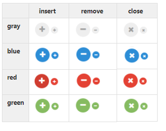

# IconButton

## Overview


## Constructor

**Parameter**

| Name| Type| Required| Description |
| --- | --- | --- | --- |
|options|Object|No|The object contains params of constructor.|
|options.type|String|No|The type of of button. The value is one of: <ul><li> 'insert'</li><li> 'remove'</li><li> 'close'</li></ul> Default value is 'insert'.|
|options.size|String|No|Size of icon button:<ul><li> 'large'</li><li> 'small'</li></ul> Default value is 'large'.|
|options.color|String|No |Color of icon button:<ul><li>  'gray'</li><li>'blue'</li><li>'red'</li><li>'green'</li></ul>Default value is 'gray'.|
|options.isDisabled|Boolean|No|The icon button will be disabled. <br> Default value: 'false'|
|options.isVisible|Boolean|No|The icon button will be visible. <br> Default value: 'true'|

<details class="tab-container" open>
<Summary>Sample</Summary>

**React**
```
import { IconButton } from 'kintone-ui-component';
import React from 'react';
 
export default class Plugin extends React.Component {
    render() {
        return (
            <IconButton text='insert' size='small' color='blue' />
        );
    }
}
```
**Javascript**
```
var insertBtn = new kintoneUIComponent.IconButton({type: 'insert',color='blue', size: 'small'});
```
</details>

## Methods
### render()

**Parameter**

None

**Returns**

Get dom element of component.

<details class="tab-container" open>
<Summary>Sample</Summary>


**React**
```
import { IconButton } from 'kintone-ui-component';
import React from 'react';
 
export default class Plugin extends React.Component {
    render() {
        return (
            <IconButton text='insert' size='small' color='blue' />
        );
    }
}
```
**Javascript**
```
var iconBtn = new kintoneUIComponent.IconButton({type: 'insert'});
var body = document.getElementsByTagName("BODY")[0];
body.appendChild(iconBtn.render());
```
</details>

### setType(type)
Set the type of the button.

**Parameter**

| Name| Type| Required| Description |
| --- | --- | --- | --- |
|type|String|No|The type of of button. The value is one of: <ul><li> 'insert'</li><li> 'remove'</li><li>'close'</li></ul> Default value is 'insert'.|

**Returns**

None

<details class="tab-container" open>
<Summary>Sample</Summary>


**React**
```
import { IconButton } from 'kintone-ui-component';
import React from 'react';
 
export default class Plugin extends React.Component {
    render() {
        return (
            <IconButton text='insert' size='small' type='remove'/>
        );
    }
}

```
**Javascript**
```
var iconBtn = new kintoneUIComponent.IconButton({type: 'insert'});
var body = document.getElementsByTagName("BODY")[0];
body.appendChild(iconBtn.render());

iconBtn.setType('remove');
```
</details>

### setSize(size)
Change size of icon button.

**Parameter**

| Name| Type| Required| Description |
| --- | --- | --- | --- |
|size|String|No|The size of of button. The value is one of: <ul><li>  'normall'</li><li> 'small'</li></ul> Default value is 'normal'.|

**Returns**

None

<details class="tab-container" open>
<Summary>Sample</Summary>


**React**
```
import { IconButton } from 'kintone-ui-component';
import React from 'react';
 
export default class Plugin extends React.Component {
    render() {
        return (
            <IconButton text='insert' size='small' />
        );
    }
}
```
**Javascript**
```
var iconBtn = new kintoneUIComponent.IconButton({type: 'insert'});
var body = document.getElementsByTagName("BODY")[0];
body.appendChild(iconBtn.render());

iconBtn.setSize('small');
```
</details>

### on(eventName, callback)
Register callback for click event

**Parameter**

| Name| Type| Required| Description |
| --- | --- | --- | --- |
|eventName|	String|	Yes|Name of event: <ul><li>'click'</li></ul>|
|callback|function |Yes|callback|

**Returns**

None

<details class="tab-container" open>
<Summary>Sample</Summary>


**React**
```
import { IconButton } from 'kintone-ui-component';
import React from 'react';
 
export default class Plugin extends React.Component {
    render() {
        return (
            <IconButton text='insert' size='small' color='blue' onClick={this.handleClick} />
        );
    }
    handleClick() {
        console.log('on click');
    }
}

```
**Javascript**
```
var iconBtn = new kintoneUIComponent.IconButton({type: 'insert'});
var body = document.getElementsByTagName("BODY")[0];
body.appendChild(iconBtn.render());

iconBtn.on('click', function(event) {
    console.log('on click');
});
```
</details>

### show()

Display the icon button.

**Parameter**

None

**Returns**

None

<details class="tab-container" open>
<Summary>Sample</Summary>


**React**
```
import { IconButton } from 'kintone-ui-component';
import React from 'react';
 
export default class Plugin extends React.Component {
    render() {
        return (
            <IconButton text='insert' size='small' color='blue' isVisible={true} />
        );
    }
}

```
**Javascript**
```
var iconBtn = new kintoneUIComponent.IconButton({type: 'insert'});
var body = document.getElementsByTagName("BODY")[0];
body.appendChild(iconBtn.render());

iconBtn.show();
```
</details>

### hide()
Hide the icon button.

**Parameter**

None

**Returns**

None

<details class="tab-container" open>
<Summary>Sample</Summary>


**React**
```
import { IconButton } from 'kintone-ui-component';
import React from 'react';
 
export default class Plugin extends React.Component {
    render() {
        return (
            <IconButton text='insert' size='small' color='blue' isVisible={false} />
        );
    }
}

```
**Javascript**
```
var iconBtn = new kintoneUIComponent.IconButton({type: 'insert'});
var body = document.getElementsByTagName("BODY")[0];
body.appendChild(iconBtn.render());

iconBtn.hide();
```
</details>

### disble()
Disbled the icon button.

**Parameter**

None

**Returns**

None

<details class="tab-container" open>
<Summary>Sample</Summary>


**React**
```
import { IconButton } from 'kintone-ui-component';
import React from 'react';
 
export default class Plugin extends React.Component {
    render() {
        return (
            <IconButton text='insert' size='small' color='blue' isDisabled={true} />
        );
    }
}

```
**Javascript**
```
var iconBtn = new kintoneUIComponent.IconButton({type: 'insert'});
var body = document.getElementsByTagName("BODY")[0];
body.appendChild(iconBtn.render());

iconBtn.disble();
```
</details>

### enable()
Enabled the icon button.

**Parameter**

None

**Returns**

None

<details class="tab-container" open>
<Summary>Sample</Summary>


**React**
```
import { IconButton } from 'kintone-ui-component';
import React from 'react';
 
export default class Plugin extends React.Component {
    render() {
        return (
            <IconButton text='insert' size='small' color='blue' isDisabled={false} />
        );
    }
}

```
**Javascript**
```
var iconBtn = new kintoneUIComponent.IconButton({type: 'insert'});
var body = document.getElementsByTagName("BODY")[0];
body.appendChild(iconBtn.render());

iconBtn.enable();
```
</details>
