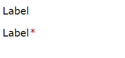

# Label

## Overview


## Constructor

**Parameter**

| Name| Type| Required| Description |
| --- | --- | --- | --- |
|options|Object|No|The object contains parameters of constructor.|
|options.text|String|No|Caption of label.|
|options.isRequired|Boolean|No|Display **'*'** character at the end of caption. <br> Default value is **false**.|
|options.textColor|String|No|Color of caption. <br> Can set using the following formats: <ul><li>**Color Names**: red, yellow, black, etc.</li><li>**HEX:** #e74c3c, #0000ff, etc.</li><li>**RGBA:** rgba(0, 0, 0, 1), rgba(255, 99, 71, 1), etc</li></ul>|
|options.backgroundColor|String|No|Color of background. <br> Can set using the following formats: <ul><li>**Color Names**: red, yellow, black, etc.</li><li>**HEX:** #e74c3c, #0000ff, etc.</li><li>**RGBA:** rgba(0, 0, 0, 1), rgba(255, 99, 71, 1), etc</li></ul>|
|options.isDisabled|Boolean|No|The label will be disabled. <br> Default value: **false**|
|options.isVisible|Boolean|No|The label will be visible. <br> Default value: **true**|

<details class="tab-container" open>
<Summary>Sample</Summary>

**Javascript**
```javascript
var label = new kintoneUIComponent.Label({ text: 'This is Label' });
```

**React**
```javascript
import { Label } from '@kintone/kintone-ui-component';
import React from 'react';

export default class Plugin extends React.Component {
    render() {
        return (
            <Label text='This is Label' />
        );
    };
};
```
</details>


## Methods
### render()
Get DOM element of Label component.

**Parameter**

None

**Returns**

DOM element

<details class="tab-container" open>
<Summary>Sample</Summary>

**Javascript**
```javascript
var label = new kintoneUIComponent.Label({text: 'This is Label'});
var body = document.getElementsByTagName("BODY")[0];
body.appendChild(label.render());
```

**React**
```javascript
import { Label } from '@kintone/kintone-ui-component';
import React from 'react';
import ReactDOM from 'react-dom';

export default class Plugin extends React.Component {
    render() {
        return (
            <Label text='This is Label' />
        );
    };
};
ReactDOM.render(<Plugin />, document.getElementById('root'));
```
</details>

### setText(text)
Setting text of Label component.

**Parameter**

| Name| Type| Required| Description |
| --- | --- | --- | --- |
|text|	String|	Yes|Caption of label. <br> If text is undefined, null or true, The label will be displayed blank|

**Returns**

None

<details class="tab-container" open>
<Summary>Sample</Summary>

**Javascript**	
```javascript
var label = new kintoneUIComponent.Label({text: 'This is Label'});
var btn = document.createElement('button'); 
btn.textContent = 'Set text of Label';
btn.onclick = function() {
    label.setText('Set text')
};
var body = document.getElementsByTagName("BODY")[0];
body.appendChild(label.render());
body.appendChild(btn);
```

**React**
```javascript
import {Label} from '@kintone/kintone-ui-component';
import React from 'react';
import ReactDOM from 'react-dom';

export default class Plugin extends React.Component {
    constructor(props) {
        super(props);
        this.state = { text: 'This is Label' };
    };

    setText = () => {
        this.setState({ text: 'Set text' });
    };
    
    render() {
        return (
            <div>
                <Label text={this.state.text} />
                <button onClick={this.setText}>Set text</button>
            </div>
        );
    };
};
ReactDOM.render(<Plugin />, document.getElementById('root'));
```
</details>

### setTextColor(color)
Setting color of caption.

**Parameter**

| Name| Type| Required| Description |
| --- | --- | --- | --- |
|color|String|Yes|Color of caption.|

**Returns**

None

<details class="tab-container" open>
<Summary>Sample</Summary>

**Javascript**
```javascript
var label = new kintoneUIComponent.Label({text: 'This is Label'});
var btn = document.createElement('button'); 
btn.textContent = 'Set color of Label';
btn.onclick = function() {
    label.setTextColor('#e74c3c');
};
var body = document.getElementsByTagName("BODY")[0];
body.appendChild(label.render());
body.appendChild(btn);
```

**React**
```javascript
import {Label} from '@kintone/kintone-ui-component';
import React from 'react';
import ReactDOM from 'react-dom';

export default class Plugin extends React.Component {
    constructor(props) {
        super(props);
        this.state = { textColor: 'black' };
    };

    setTextColor = () => {
        this.setState({ textColor: 'red' });
    };

    render() {
        return (
            <div>
                <Label text='This is Label' textColor={this.state.textColor} />
                <button onClick={this.setTextColor}>Set color of Label</button>
            </div>
        );
    };
};
ReactDOM.render(<Plugin />, document.getElementById('root'));
```
</details>

### setBackgroundColor(color)
Setting color of background of Label component.

**Parameter**

| Name| Type| Required| Description |
| --- | --- | --- | --- |
|color|String|Yes|Color of background.|

**Returns**

None

<details class="tab-container" open>
<Summary>Sample</Summary>

**Javascript**
```javascript
var label = new kintoneUIComponent.Label({text: 'This is Label'});
var btn = document.createElement('button'); 
btn.textContent = 'Set background color of Label';
btn.onclick = function() {
    label.setBackgroundColor('#e74c3c');
});
var body = document.getElementsByTagName("BODY")[0];
body.appendChild(label.render());
body.appendChild(btn);
```

**React**
```javascript
import {Label} from '@kintone/kintone-ui-component';
import React from 'react';
import ReactDOM from 'react-dom';

export default class Plugin extends React.Component {
    constructor(props) {
        super(props);
        this.state = { backgroundColor: 'white' };
    };

    setBackgroundColor = () => {
        this.setState({ backgroundColor: 'red' });
    };

    render() {
        return (
            <div>
                <Label text='This is Label' backgroundColor={this.state.backgroundColor} />
                <button onClick={this.setBackgroundColor}>Set background color of Label</button>
            </div>
        );
    };
};
ReactDOM.render(<Plugin />, document.getElementById('root'));
```
</details>

### setRequired(required)
Setting the required for Label component.

**Parameter**

| Name| Type| Required| Description |
| --- | --- | --- | --- |
|required|Boolean|Yes|Required options:<ul><li>**true**: The * character will be displayed at the end of the caption. </li><li>**false**: The * character will be hidden</ul></li>|

**Returns**

None

<details class="tab-container" open>
<Summary>Sample</Summary>

**Javascript**
```javascript	
var label = new kintoneUIComponent.Label({text: 'This is Label'});
var btn = document.createElement('button'); 
btn.textContent = 'Set required';
btn.onclick = function() {
    label.setRequired(true);
};
var body = document.getElementsByTagName("BODY")[0];
body.appendChild(label.render());
body.appendChild(btn);
```

**React**
```javascript
import {Label} from '@kintone/kintone-ui-component';
import React from 'react';
import ReactDOM from 'react-dom';

export default class Plugin extends React.Component {
    constructor(props) {
        super(props);
        this.state = { isRequired: false };
    };

    setRequired = () => {
        this.setState({ isRequired: true });
    };

    render() {
        return (
            <div>
                <Label text='This is Label' isRequired={this.state.isRequired} />
                <button onClick={this.setRequired}>Set required</button>
            </div>
        );
    };
};
ReactDOM.render(<Plugin />, document.getElementById('root'));
```
</details>

### on(eventName, callBack)
Register callback for an event of Label component.

**Parameter**

| Name| Type| Required| Description |
| --- | --- | --- | --- |
|eventName|	String|	Yes|Name of event: <ul><li>'click'</li></ul>|
|callback|function |Yes|The callback function call when the event occurs|

**Returns**

None

<details class="tab-container" open>
<Summary>Sample</Summary>

**Javascript**
```javascript
var label = new kintoneUIComponent.Label({text: 'This is Label'});
label.on('click', function () {
    console.log('Label onClick');
});

var body = document.getElementsByTagName("BODY")[0];
body.appendChild(label.render());
```

**React**
```javascript
import { Label } from '@kintone/kintone-ui-component';
import React from 'react';
import ReactDOM from 'react-dom';

export default class Plugin extends React.Component {
    constructor(props) {
        super(props);
        this.state = { isRequired: false };
    };
    onClick = () => {
        console.log('Label onClick');
    };
    render() {
        return (
            <Label text='This is Label' onClick={this.onClick} />
        );
    };
};
ReactDOM.render(<Plugin />, document.getElementById('root'));
```
</details>

### show()
Display Label component.

**Parameter**

None

**Returns**

None

<details class="tab-container" open>
<Summary>Sample</Summary>

**Javascript**
```javascript
var label = new kintoneUIComponent.Label({text: 'This is Label', isVisible: false});
var btn = document.createElement('button'); 
btn.textContent = 'Show label';
btn.onclick = function() {
    label.show()
};
var body = document.getElementsByTagName("BODY")[0];
body.appendChild(label.render());
body.appendChild(btn);
```

**React**
```javascript
import {Label} from '@kintone/kintone-ui-component';
import React from 'react';
import ReactDOM from 'react-dom';
 
export default class Plugin extends React.Component {
    constructor(props) {
        super(props);
        this.state = { isVisible: false };
    };

    show = () => {
        this.setState({ isVisible: true });
    };

    render() {
        return (
            <div>
                <Label text='This is Label' isVisible={this.state.isVisible} />
                <button onClick={this.show}>Show label</button>
            </div>
        );
    };
};
ReactDOM.render(<Plugin />, document.getElementById('root'));
```
</details>

### hide()
Hide Label component.

**Parameter**

None

**Returns**

None

<details class="tab-container" open>
<Summary>Sample</Summary>

**Javascript**
```javascript
var label = new kintoneUIComponent.Label({text: 'This is Label'});
var btn = document.createElement('button'); 
btn.textContent = 'Hide label';
btn.onclick = function() {
    label.hide()
};
var body = document.getElementsByTagName("BODY")[0];
body.appendChild(label.render());
body.appendChild(btn);
```

**React**
```javascript
import {Label} from '@kintone/kintone-ui-component';
import React from 'react';
import ReactDOM from 'react-dom';
 
export default class Plugin extends React.Component {
    constructor(props) {
        super(props);
        this.state = { isVisible: true };
    };

    hide = () => {
        this.setState({ isVisible: false });
    };

    render() {
        return (
            <div>
                <Label text='This is Label' isVisible={this.state.isVisible} />
                <button onClick={this.hide}>Hide label</button>
            </div>
        );
    };
};
ReactDOM.render(<Plugin />, document.getElementById('root'));
```
</details>

### disable()
Disabled Label component.

**Parameter**

None

**Returns**

None

<details class="tab-container" open>
<Summary>Sample</Summary>

**Javascript**
```javascript
var label = new kintoneUIComponent.Label({text: 'This is Label'});
label.on('click', function () {
   console.log('Label onClick');
});
var btn = document.createElement('button'); 
btn.textContent = 'Disable label';
btn.onclick = function() {
    label.disable()
};
var body = document.getElementsByTagName("BODY")[0];
body.appendChild(label.render());
body.appendChild(btn);
```

**React**
```javascript
import {Label} from '@kintone/kintone-ui-component';
import React from 'react';
import ReactDOM from 'react-dom';
 
export default class Plugin extends React.Component {
    constructor(props) {
        super(props);
        this.state = { isDisabled: false };
    };

    disable = () => {
        this.setState({ isDisabled: true });
    };

    onClick = () => {
        console.log('Label onClick');
    };

    render() {
        return (
            <div>
                <Label text='This is Label' isDisabled={this.state.isDisabled} onClick={this.onClick} />
                <button onClick={this.disable}>Disable label</button>
            </div>
        );
    };
};
ReactDOM.render(<Plugin />, document.getElementById('root'));
```
</details>

### enable()
Enabled Label component.

**Parameter**

None

**Returns**

None

<details class="tab-container" open>
<Summary>Sample</Summary>

**Javascript**
```javascript
var label = new kintoneUIComponent.Label({text: 'This is Label', isDisabled: true});
label.on('click', function () {
   console.log('Label onClick');
});
var btn = document.createElement('button'); 
btn.textContent = 'Enable label';
btn.onclick = function() {
    label.enable()
};
var body = document.getElementsByTagName("BODY")[0];
body.appendChild(label.render());
body.appendChild(btn);
```

**React**
```javascript
import { Label } from '@kintone/kintone-ui-component';
import React from 'react';
import ReactDOM from 'react-dom';
 
export default class Plugin extends React.Component {
    constructor(props) {
        super(props);
        this.state = { isDisabled: true };
    };

    enable = () => {
        this.setState({ isDisabled: false });
    };

    onClick = () => {
        console.log('Label onClick');
    };

    render() {
        return (
            <div>
                <Label text='This is Label' isDisabled={this.state.isDisabled} onClick={this.onClick} />
                <button onClick={this.enable}>Enable label</button>
            </div>
        );
    };
};
ReactDOM.render(<Plugin />, document.getElementById('root'));
```
</details>
