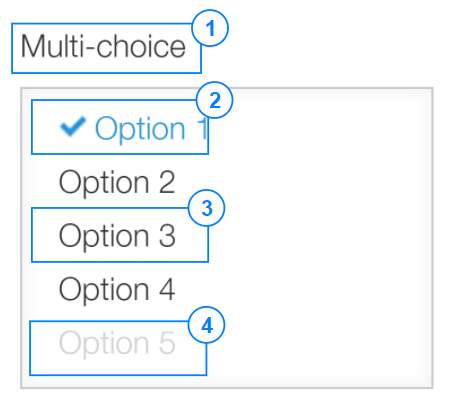

# MultipleChoice

## Overview


|Number|	Description|
| --- | --- |
|1|	Title|	
|2|	Selected item|
|3|Not selected item|	
|4|Disabled item|
|5|Hover item|

## Constructor

**Parameter**

| Name| Type| Required| Description |
| --- | --- | --- | --- |
|options|Object|No|The object contains params of constructor.|
|options.items|Array&lt;Object&gt;|No|List of items which will be displayed on multiple choices.|
|options.items[].value|String|Yes|String value of item <br> If the value is duplicate, the error message will be displayed|
|options.items[].label|String|No|	String label of item|
|options.items[].isDisabled|Boolean|No|Indicate item will be disabled when display. Default value: 'false'.|
|options.value|Array<String>|No|List of checked item.<br> If the 'options.value[]' is nonexistent value, the error will be displayed|
|options.isDisabled|Boolean|No|The multiple choices will be disabled. <br> Default value: 'false'|
|options.isVisible|Boolean|No|The multiple choices will be visible. <br> Default value: 'true'|

<details class="tab-container" open>
<Summary>Sample</Summary>

**Javascript**
```javascript
var mulChoice = new kintoneUIComponent.MultipleChoice({
       items: [
            {
                label: 'Orange',
                value: 'Orange',
                isDisabled: false
            },
            {
                label: 'Banana',
                value: 'Banana',
                isDisabled: true
            },
            {
                label: 'Lemon',
                value: 'Lemon',
                isDisabled: true
            },
     ],
     value: ['Orange', 'Banana']
});
```
**React**
```javascript
import { MultipleChoice } from '@kintone/kintone-ui-component';
import React from 'react';
  
export default class Plugin extends React.Component {
    constructor(props) {
        super(props);
        const items = [
            {
                label: 'Orange',
                value: 'Orange',
                isDisabled: false
            },
            {
                label: 'Banana',
                value: 'Banana',
                isDisabled: true
            },
            {
                label: 'Lemon',
                value: 'Lemon',
                isDisabled: true
            },
        ];
        this.state = { items: items, value: ['Orange'] };
    }
    render() {
        return (
            <MultipleChoice items={this.state.items} value={this.state.value} onChange={(value) => {this.setState({value})}} />
        );
    }
}
```
</details>

## Methods
### render()
Get dom element of component.

**Parameter**

None

**Returns**

Dom element

<details class="tab-container" open>
<Summary>Sample</Summary>

**Javascript**
```javascript
var mulChoice = new kintoneUIComponent.MultipleChoice({
       items: [
            {
                label: 'Orange',
                value: 'Orange',
                isDisabled: false
            },
            {
                label: 'Banana',
                value: 'Banana',
                isDisabled: true
            },
            {
                label: 'Lemon',
                value: 'Lemon',
                isDisabled: true
            },
     ],
     value: ['Orange', 'Banana']
});

var body = document.getElementsByTagName("BODY")[0];
body.appendChild(mulChoice.render());

```
**React**
```javascript
import { MultipleChoice } from '@kintone/kintone-ui-component';
import React from 'react';
  
export default class Plugin extends React.Component {
    constructor(props) {
        super(props);
        const items = [
            {
                label: 'Orange',
                value: 'Orange',
                isDisabled: false
            },
            {
                label: 'Banana',
                value: 'Banana',
                isDisabled: true
            },
            {
                label: 'Lemon',
                value: 'Lemon',
                isDisabled: true
            },
        ];
        this.state = { items: items, value: ['Orange'] };
    }
    render() {
        return (
            <MultipleChoice items={this.state.items} value={this.state.value} onChange={(value) => {this.setState({value})}} />
        );
    }
}
```
</details>

### addItem(item)

Add an item to the end of multile choices list.

**Parameter**

| Name| Type| Required| Description |
| --- | --- | --- | --- |
|item|	Object|	Yes|The item will be added to multile choices list.|
|item.value|String|Yes|The value of an item.|
|item.label|String|No|Display string.|
|item.isDisabled|Boolean|No|Indicate item will be disabled when display. <br> Default value: 'false'|

**Returns**

None

<details class="tab-container" open>
<Summary>Sample</Summary>

**Javascript**
```javascript
var mulChoice = new kintoneUIComponent.MultipleChoice({
       items: [
            {
                label: 'Orange',
                value: 'Orange',
                isDisabled: false
            },
            {
                label: 'Banana',
                value: 'Banana',
                isDisabled: true
            },
            {
                label: 'Lemon',
                value: 'Lemon',
                isDisabled: true
            },
     ],
     value: ['Orange', 'Banana']
});
  
var body = document.getElementsByTagName("BODY")[0];
body.appendChild(mulChoice.render());


mulChoice.addItem({
    label: 'Grape',
    value: 'Grape',
    isDisabled: false
});
```
**React**
```javascript
import { MultipleChoice } from '@kintone/kintone-ui-component';
import React from 'react';
  
export default class Plugin extends React.Component {
    constructor(props) {
        super(props);
        this.state = {
            items: []
        }
    }
  
    render() {
        return (
        <div>
          <MultipleChoice items={this.state.items} value={this.state.value} onChange={(value) => {this.setState({value})}} />
          <button onClick={this.handleClick}>Add item</button>
        </div>
      );
    }
  
    handleClick = () => {
      const item = {
        label: 'Lemon',
        value: 'Lemon',
        isDisabled: false
      };
      this.setState(prevState => ({
        items: prevState.items ? prevState.items.concat([item]) : [item]
      }))
    }
}
```
</details>

### getItem(index)
Get the item of specific position in multiple choices list.

**Parameter**

| Name| Type| Required| Description |
| --- | --- | --- | --- |
|index|	Integer|Yes|The position of retrieved item.|

**Returns**

The item at given position.

| Name| Type| Description |
| --- | --- | --- |
|item|	Object |The item of specific position in multiple choices list.|
|item.value|String|The value of an item.|
|item.label|String|Display string.|
|item.isDisabled|Boolean|Indicate item will be disabled when display.|

<details class="tab-container" open>
<Summary>Sample</Summary>

**Javascript**
```javascript
var mulChoice = new kintoneUIComponent.MultipleChoice({
       items: [
            {
                label: 'Orange',
                value: 'Orange',
                isDisabled: false
            },
            {
                label: 'Banana',
                value: 'Banana',
                isDisabled: true
            },
            {
                label: 'Lemon',
                value: 'Lemon',
                isDisabled: true
            },
     ],
     value: ['Orange', 'Banana']
});

var body = document.getElementsByTagName("BODY")[0];
body.appendChild(mulChoice.render());

var firstItem = mulChoice.getItem(0);
console.log(firstItem);
```
**React**
```javascript
import { MultipleChoice } from '@kintone/kintone-ui-component';
import React from 'react';
  
export default class Plugin extends React.Component {
    constructor(props) {
        super(props);
        const items= [
            {
                label: 'Orange',
                value: 'Orange',
                isDisabled: false
            },
            {
                label: 'Banana',
                value: 'Banana',
                isDisabled: true
            },
            {
                label: 'Lemon',
                value: 'Lemon',
                isDisabled: true
            },
        ];
        this.state = {items: items};
    }
  
    render() {
        return (
        <div>
          <MultipleChoice items={this.state.items} value={this.state.value} onChange={(value) => {this.setState({value})}} />
          <button onClick={this.handleClick}>Get Item</button>
        </div>
      );
    }
  
    handleClick = () => {
        console.log(this.state.items[0]);
    }
}
```
</details>

### removeItem(index)
Remove the specific item from multiple choice list.

**Parameter**

| Name| Type| Required| Description |
| --- | --- | --- | --- |
|index|	Integer|Yes|The position of retrieved item.|

**Returns**

None

<details class="tab-container" open>
<Summary>Sample</Summary>

**Javascript**
```javascript
var mulChoice = new kintoneUIComponent.MultipleChoice({
       items: [
            {
                label: 'Orange',
                value: 'Orange',
                isDisabled: false
            },
            {
                label: 'Banana',
                value: 'Banana',
                isDisabled: true
            },
            {
                label: 'Lemon',
                value: 'Lemon',
                isDisabled: true
            },
     ],
     value: ['Orange', 'Banana']
});

var body = document.getElementsByTagName("BODY")[0];
body.appendChild(mulChoice.render());


mulChoice.removeItem(0);
```
**React**
```javascript
import { MultipleChoice } from '@kintone/kintone-ui-component';
import React from 'react';
 
export default class Plugin extends React.Component {
    constructor(props) {
        super(props);
        this.state = {
            items: [
                {
                    label: 'Orange',
                    value: 'Orange',
                    isDisabled: false
                },
                {
                    label: 'Banana',
                    value: 'Banana',
                    isDisabled: true
                },
                {
                    label: 'Lemon',
                    value: 'Lemon',
                    isDisabled: true
                }
            ]
        }
    }
 
    render() {
        return (
        <div>
          <MultipleChoice items={this.state.items} value={this.state.value} onChange={(value) => {this.setState({value})}} />
          <button onClick={this.handleClick}>Remove Item</button>
        </div>
      );
    }
  
    handleClick = () => {
   this.setState(prevState => {
       if (prevState.items[0]) {
         if (this.state.value ) {
             prevState.value = prevState.value.filter(value => value !== prevState.items[0].value)
         }
         prevState.items.splice(0, 1)
        return prevState;
       }
       return prevState;
   });
 };
}
```
</details>

### getItems()
Get all items of the multiple choice.

**Parameter**

None

**Returns**

Multiple choice list item.

| Name| Type| Description |
| --- | --- | --- |
|items|	Array&lt;Object&gt;|List items of the multiple choice|
|items[].value|String|The value of an item.|
|items[].label|String|Display string.|
|items[].isDisabled|Boolean|Indicate item will be disabled when display.|

<details class="tab-container" open>
<Summary>Sample</Summary>

**Javascript**
```javascript
var mulChoice = new kintoneUIComponent.MultipleChoice({
       items: [
            {
                label: 'Orange',
                value: 'Orange',
                isDisabled: false
            },
            {
                label: 'Banana',
                value: 'Banana',
                isDisabled: true
            },
            {
                label: 'Lemon',
                value: 'Lemon',
                isDisabled: true
            },
     ],
     value: ['Orange', 'Banana']
});

var body = document.getElementsByTagName("BODY")[0];
body.appendChild(mulChoice.render());

var items = mulChoice.getItems();
items.forEach(function(item) {
    console.log(item.value + ':' + item.isDisabled);
});
```
**React**
```javascript
import { MultipleChoice } from '@kintone/kintone-ui-component';
import React from 'react';
 
export default class Plugin extends React.Component {
    constructor(props) {
        super(props);
        const items = [
            {
                label: 'Orange',
                value: 'Orange',
                isDisabled: false
            },
            {
                label: 'Banana',
                value: 'Banana',
                isDisabled: true
            },
            {
                label: 'Lemon',
                value: 'Lemon',
                isDisabled: true
            },
        ];
        this.state = {items: items};
    }
 
    render() {
        return (
        <div>
          <MultipleChoice items={this.state.items} value={this.state.value} onChange={(value) => {this.setState({value})}} />
          <button onClick={this.handleClick}>Get Items</button>
        </div>
      );
    }
  
    handleClick = () => {
        this.state.items.forEach(item => {
            console.log(item);
        });
    }
}
```
</details>

### getValue()
Get the checked values of multiple choice.

**Parameter**

None

**Returns**

List of checked items.

| Name| Type| Description |
| --- | --- | --- |
|value|	Array&lt;String&gt;|List selected values of the multiple choice.|

<details class="tab-container" open>
<Summary>Sample</Summary>

**Javascript**
```javascript
var mulChoice = new kintoneUIComponent.MultipleChoice({
       items: [
            {
                label: 'Orange',
                value: 'Orange',
                isDisabled: false
            },
            {
                label: 'Banana',
                value: 'Banana',
                isDisabled: true
            },
            {
                label: 'Lemon',
                value: 'Lemon',
                isDisabled: true
            },
     ],
     value: ['Orange', 'Banana']
});

var body = document.getElementsByTagName("BODY")[0];
body.appendChild(mulChoice.render());

var selectedItems = mulChoice.getValue();
selectedItems.forEach(function(item) {
    console.log(item);
});
```
**React**
```javascript
import { MultipleChoice } from '@kintone/kintone-ui-component';
import React from 'react';
 
export default class Plugin extends React.Component {
    constructor(props) {
        super(props);
        const items = [
            {
                label: 'Orange',
                value: 'Orange',
                isDisabled: false
            },
            {
                label: 'Banana',
                value: 'Banana',
                isDisabled: true
            },
            {
                label: 'Lemon',
                value: 'Lemon',
                isDisabled: true
            },
        ];
        this.state = {items: items};
    }
 
    render() {
        return (
        <div>
          <MultipleChoice items={this.state.items} value={this.state.value} onChange={(value) => {this.setState({value})}} />
          <button onClick={this.handleClick}>Get Value</button>
        </div>
      );
    }
  
    handleClick = () => {
       console.log(this.state.value);
    }
}
```
</details>

### setValue(value)
Set the checked value of multiple choice.

**Parameter**

|Name	|Type|	Required |	Description|
|---|---|---|---|
|value|	Array&lt;String&gt;|	yes|The value of an item.<br> If the 'value[]' is nonexistent value, the error will be displayed|

**Returns**

None

<details class="tab-container" open>
<Summary>Sample</Summary>

**Javascript**
```javascript
var mulChoice = new kintoneUIComponent.MultipleChoice({
       items: [
            {
                label: 'Orange',
                value: 'Orange',
                isDisabled: false
            },
            {
                label: 'Banana',
                value: 'Banana',
                isDisabled: true
            },
            {
                label: 'Lemon',
                value: 'Lemon',
                isDisabled: true
            },
     ],
     value: ['Orange', 'Banana']
});

var body = document.getElementsByTagName("BODY")[0];
body.appendChild(mulChoice.render());

mulChoice.setValue(['Lemon']);
```
**React**
```javascript

import { MultipleChoice } from '@kintone/kintone-ui-component';
import React from 'react';
 
export default class Plugin extends React.Component {
    constructor(props) {
        super(props);
        const items = [
            {
                label: 'Orange',
                value: 'Orange',
                isDisabled: false
            },
            {
                label: 'Banana',
                value: 'Banana',
                isDisabled: true
            },
            {
                label: 'Lemon',
                value: 'Lemon',
                isDisabled: true
            },
        ];
        this.state = {items: items};
    }
 
    render() {
        return (
        <div>
          <MultipleChoice items={this.state.items} value={this.state.value} onChange={(value) => {this.setState({value})}} />
          <button onClick={this.handleClick}>Set Value</button>
        </div>
      );
    }
  
    handleClick = () => {
        this.setState({
            value: ['Lemon']
        });
    }
}
```
</details>

### disableItem(value)
Set the disabled items of multiple choice.

**Parameter**

|Name	|Type|	Required |	Description|
|---|---|---|---|
|value|	String|	yes|The value of an item|

**Returns**

None

<details class="tab-container" open>
<Summary>Sample</Summary>

**Javascript**
```javascript
var mulChoice = new kintoneUIComponent.MultipleChoice({
       items: [
            {
                label: 'Orange',
                value: 'Orange',
                isDisabled: false
            },
            {
                label: 'Banana',
                value: 'Banana',
                isDisabled: true
            },
            {
                label: 'Lemon',
                value: 'Lemon',
                isDisabled: true
            },
     ],
     value: ['Orange', 'Banana']
});

var body = document.getElementsByTagName("BODY")[0];
body.appendChild(mulChoice.render());


mulChoice.disableItem('Orange');
```
**React**
```javascript
import { MultipleChoice } from '@kintone/kintone-ui-component';
import React from 'react';
 
export default class Plugin extends React.Component {
    constructor(props) {
        super(props);
        const items = [
            {
                label: 'Orange',
                value: 'Orange',
                isDisabled: false
            },
            {
                label: 'Banana',
                value: 'Banana',
                isDisabled: true
            },
            {
                label: 'Lemon',
                value: 'Lemon',
                isDisabled: true
            },
        ];
        this.state = {items: items};
    }
 
    render() {
        return (
        <div>
          <MultipleChoice items={this.state.items} value={this.state.value} onChange={(value) => {this.setState({value})}} />
          <button onClick={this.handleClick}>Disabled Item</button>
        </div>
      );
    }
  
    handleClick = () => {
        const items = [...this.state.items];
 
        items[0].isDisabled = true;
        this.setState({ items: items });
    }
}
```
</details>

### enableItem(value)
Set the enable items of multiple choice.

**Parameter**

|Name	|Type|	Required |	Description|
|---|---|---|---|
|value|	String|	yes|The value of an item|

**Returns**

None

<details class="tab-container" open>
<Summary>Sample</Summary>

**Javascript**
```javascript
var mulChoice = new kintoneUIComponent.MultipleChoice({
       items: [
            {
                label: 'Orange',
                value: 'Orange',
                isDisabled: false
            },
            {
                label: 'Banana',
                value: 'Banana',
                isDisabled: true
            },
            {
                label: 'Lemon',
                value: 'Lemon',
                isDisabled: true
            },
     ],
     value: ['Orange', 'Banana']
});

var body = document.getElementsByTagName("BODY")[0];
body.appendChild(mulChoice.render());

mulChoice.enableItem('Banana');
```
**React**
```javascript
import { MultipleChoice } from '@kintone/kintone-ui-component';
import React from 'react';
 
export default class Plugin extends React.Component {
    constructor(props) {
        super(props);
        const items = [
            {
                label: 'Orange',
                value: 'Orange',
                isDisabled: false
            },
            {
                label: 'Banana',
                value: 'Banana',
                isDisabled: true
            },
            {
                label: 'Lemon',
                value: 'Lemon',
                isDisabled: true
            },
        ];
        this.state = {items: items};
    }
 
    render() {
        return (
        <div>
          <MultipleChoice items={this.state.items} value={this.state.value} onChange={(value) => {this.setState({value})}} />
          <button onClick={this.handleClick}>Enabled Item</button>
        </div>
      );
    }
  
    handleClick = () => {
        const items = [...this.state.items];
 
        items[1].isDisabled = false;
        this.setState({ items: items });
    }
}
```
</details>

### on(eventName, callBack)
Register callback for change event

**Parameter**

| Name| Type| Required| Description |
| --- | --- | --- | --- |
|eventName|	String|	Yes|Name of event: <ul><li>'change'</li></ul>|
|callback|function |Yes|callback|

**Returns**

None

<details class="tab-container" open>
<Summary>Sample</Summary>

**Javascript**
```javascript
var mulChoice = new kintoneUIComponent.MultipleChoice({
       items: [
            {
                label: 'Orange',
                value: 'Orange',
                isDisabled: false
            },
            {
                label: 'Banana',
                value: 'Banana',
                isDisabled: true
            },
            {
                label: 'Lemon',
                value: 'Lemon',
                isDisabled: true
            },
     ],
     value: ['Orange', 'Banana']
});
 
var body = document.getElementsByTagName("BODY")[0];
body.appendChild(mulChoice.render());

mulChoice.on('change', function(value) {
    console.log('on change');
});
```
**React**
```javascript
import { MultipleChoice } from '@kintone/kintone-ui-component';
import React from 'react';
  
export default class Plugin extends React.Component {
    constructor(props) {
        super(props);
        const items = [
            {
                label: 'Orange',
                value: 'Orange',
                isDisabled: false
            },
            {
                label: 'Banana',
                value: 'Banana',
                isDisabled: true
            },
            {
                label: 'Lemon',
                value: 'Lemon',
                isDisabled: true
            },
        ];
        this.state = {items: items};
    }

    render() {
        return (
            <MultipleChoice items={this.state.items} value={this.state.value} onChange={this.handleChange} />
        );
    }

    handleChange= () => {
        const items = [...this.state.items];

        items[1].isDisabled = false;
        this.setState({ items: items });
    }
}
```
</details>

### show()
Display the multiple choice.

**Parameter**

None

**Returns**

None

<details class="tab-container" open>
<Summary>Sample</Summary>

**Javascript**
```javascript
var mulChoice = new kintoneUIComponent.MultipleChoice({
       items: [
            {
                label: 'Orange',
                value: 'Orange',
                isDisabled: false
            },
            {
                label: 'Banana',
                value: 'Banana',
                isDisabled: true
            },
            {
                label: 'Lemon',
                value: 'Lemon',
                isDisabled: true
            },
     ],
     value: ['Orange', 'Banana']
});

var body = document.getElementsByTagName("BODY")[0];
body.appendChild(mulChoice.render());

mulChoice.show();
```
**React**
```javascript
import { MultipleChoice } from '@kintone/kintone-ui-component';
import React from 'react';
 
export default class Plugin extends React.Component {
    constructor(props) {
        super(props);
        const items = [
            {
                label: 'Orange',
                value: 'Orange',
                isDisabled: false
            },
            {
                label: 'Banana',
                value: 'Banana',
                isDisabled: true
            },
            {
                label: 'Lemon',
                value: 'Lemon',
                isDisabled: true
            },
        ];
        this.state = {items: items};
    }
 
    render() {
        return (
            <MultipleChoice value={this.state.value} isVisible={true} items={this.state.items} onClick={this.handleClick}/>
        );
    }
 
    handleClick = () => {
        const items = [...this.state.items];

        items[1].isDisabled = false;
        this.setState({ items: items });
    }
}

```
</details>

### hide()
Hide the multiple choice.

**Parameter**

None

**Returns**

None

<details class="tab-container" open>
<Summary>Sample</Summary>

**Javascript**
```javascript
var mulChoice = new kintoneUIComponent.MultipleChoice({
       items: [
            {
                label: 'Orange',
                value: 'Orange',
                isDisabled: false
            },
            {
                label: 'Banana',
                value: 'Banana',
                isDisabled: true
            },
            {
                label: 'Lemon',
                value: 'Lemon',
                isDisabled: true
            },
     ],
     value: ['Orange', 'Banana']
});

var body = document.getElementsByTagName("BODY")[0];
body.appendChild(mulChoice.render());

mulChoice.hide();
```
**React**
```javascript
import { MultipleChoice } from '@kintone/kintone-ui-component';
import React from 'react';
 
export default class Plugin extends React.Component {
    constructor(props) {
        super(props);
        const items = [
            {
                label: 'Orange',
                value: 'Orange',
                isDisabled: false
            },
            {
                label: 'Banana',
                value: 'Banana',
                isDisabled: true
            },
            {
                label: 'Lemon',
                value: 'Lemon',
                isDisabled: true
            },
        ];
        this.state = {items: items};
    }
 
    render() {
        return (
            <MultipleChoice value={this.state.value} isVisible={false} items={this.state.items} onClick={this.handleClick}/>
        );
    }
 
    handleClick = () => {
        const items = [...this.state.items];

        items[1].isDisabled = false;
        this.setState({ items: items });
    }
}

```
</details>

### disable()
Disabled the multiple choice.

**Parameter**

None

**Returns**

None

<details class="tab-container" open>
<Summary>Sample</Summary>

**Javascript**
```javascript
var mulChoice = new kintoneUIComponent.MultipleChoice({
       items: [
            {
                label: 'Orange',
                value: 'Orange',
                isDisabled: false
            },
            {
                label: 'Banana',
                value: 'Banana',
                isDisabled: true
            },
            {
                label: 'Lemon',
                value: 'Lemon',
                isDisabled: true
            },
     ],
     value: ['Orange', 'Banana']
});

var body = document.getElementsByTagName("BODY")[0];
body.appendChild(mulChoice.render());


mulChoice.disable();
```
**React**
```javascript
import { MultipleChoice } from '@kintone/kintone-ui-component';
import React from 'react';
 
export default class Plugin extends React.Component {
    constructor(props) {
        super(props);
        const items = [
            {
                label: 'Orange',
                value: 'Orange',
                isDisabled: false
            },
            {
                label: 'Banana',
                value: 'Banana',
                isDisabled: true
            },
            {
                label: 'Lemon',
                value: 'Lemon',
                isDisabled: true
            },
        ];
        this.state = {items: items};
    }
 
    render() {
        return (
            <MultipleChoice value={this.state.value} isDisabled={true} items={this.state.items} onClick={this.handleClick}/>
        );
    }
 
    handleClick = () => {
        const items = [...this.state.items];

        items[1].isDisabled = false;
        this.setState({ items: items });
    }
}

```
</details>

### enable()
Enabled the multiple choice.

**Parameter**

None

**Returns**

None

<details class="tab-container" open>
<Summary>Sample</Summary>

**Javascript**
```javascript
var mulChoice = new kintoneUIComponent.MultipleChoice({
       items: [
            {
                label: 'Orange',
                value: 'Orange',
                isDisabled: false
            },
            {
                label: 'Banana',
                value: 'Banana',
                isDisabled: true
            },
            {
                label: 'Lemon',
                value: 'Lemon',
                isDisabled: true
            },
     ],
     value: ['Orange', 'Banana']
});

var body = document.getElementsByTagName("BODY")[0];
body.appendChild(mulChoice.render());


mulChoice.enable();
```
**React**
```javascript
import { MultipleChoice } from '@kintone/kintone-ui-component';
import React from 'react';
 
export default class Plugin extends React.Component {
    constructor(props) {
        super(props);
        const items = [
            {
                label: 'Orange',
                value: 'Orange',
                isDisabled: false
            },
            {
                label: 'Banana',
                value: 'Banana',
                isDisabled: true
            },
            {
                label: 'Lemon',
                value: 'Lemon',
                isDisabled: true
            },
        ];
        this.state = {items: items};
    }
 
    render() {
        return (
            <MultipleChoice value={this.state.value} isDisabled={false} items={this.state.items} onClick={this.handleClick}/>
        );
    }
 
    handleClick = () => {
        const items = [...this.state.items];

        items[1].isDisabled = false;
        this.setState({ items: items });
    }
}

```
</details>
