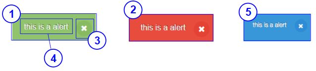

# NotifyPopup

## Overview


|Number|	Description|
| --- | --- |
|1|	Success popup|	
|2|	Error popup|
|3|Icon button for closing popup|	
|4|Title of popup|
|5|Information popup|

## Constructor

**Parameter**

| Name| Type| Required| Description |
| --- | --- | --- | --- |
|options|Object|No|The object contains params of constructor.|
|options.text|String|No|Displayed text on notify popup.|
|options.type|String|No|Type of notify popup:<ul><li> 'error' </li><li> 'success'</li><li> 'infor' </li></ul> Default value: 'error'|
|options.isDisabled|Boolean|No|The notify popup will be disabled. <br> Default value: 'false'|
|options.isVisible|Boolean|No|The notify popup will be visible. <br> Default value: 'true'|

<details class="tab-container" open>
<Summary>Sample</Summary>

**Javascript**
```javascript
var notifyPopup = new kintoneUIComponent.NotifyPopup({
    text: 'Submit sucessffully',
    type: 'success'
});
```
**React**
```javascript
import { NotifyPopup } from '@kintone/kintone-ui-component';
import React from 'react';
   
export default class Plugin extends React.Component {
    constructor(props){
        super(props);
        this.state = {isVisible: true};
    }

    render() {
        return (
            <NotifyPopup text='Submit successfully' type='success' isVisible={this.state.isVisible} onClose={()=>(this.setState({isVisible: false}))} />
        );
    }
}

```
</details>

## Methods
### render()
Get dom element of component.

**Parameter**

None

**Returns**

Dom element

<details class="tab-container" open>
<Summary>Sample</Summary>

**Javascript**
```javascript
var notifyPopup = new kintoneUIComponent.NotifyPopup({
    text: 'Submit sucessffully',
    type: 'success'
});
var body = document.getElementsByTagName("BODY")[0];
body.appendChild(notifyPopup.render());

```
**React**
```javascript
import { NotifyPopup } from '@kintone/kintone-ui-component';
import React from 'react';
   
export default class Plugin extends React.Component {
    constructor(props){
        super(props);
        this.state = {isVisible: true};
    }  

    render() {
        return (
            <NotifyPopup text='Submit successfully' type='success' isVisible={this.state.isVisible} onClose={()=>(this.setState({isVisible: false}))} />
        );
    }
}

```
</details>

### setStyle(style)
Set style of container dom element.

**Parameter**

| Name| Type| Required| Description |
| --- | --- | --- | --- |
|style|object|Yes|Set the style for container dom element. For Key of Style Object Properties, please read references: https://www.w3schools.com/jsref/dom_obj_style.asp |

**Returns**

None

<details class="tab-container" open>
<Summary>Sample</Summary>

**Javascript**
```javascript
var notifyPopup = new kintoneUIComponent.NotifyPopup({
    text: 'Submit sucessffully',
    type: 'success'
});
notifyPopup.setStyle({background:"blue",fontSize:'20px'});
var body = document.getElementsByTagName("BODY")[0];
body.appendChild(notifyPopup.render());
```

</details>


### setClassName(className)
Set className of container dom element.

**Parameter**

| Name| Type| Required| Description |
| --- | --- | --- | --- |
|className|string|Yes|Set className for container dom element. Add trailing space for multiple className|

**Returns**

None

<details class="tab-container" open>
<Summary>Sample</Summary>

**Javascript**
```javascript
var notifyPopup = new kintoneUIComponent.NotifyPopup({
    text: 'Submit sucessffully',
    type: 'success'
});
notifyPopup.setClassName("class1 class2");
var body = document.getElementsByTagName("BODY")[0];
body.appendChild(notifyPopup.render());
```

</details>

### setText(text)
Setting the displayed text on popup.

**Parameter**

| Name| Type| Required| Description |
| --- | --- | --- | --- |
|text|	String|	Yes|Displayed text on notify popup. <br> If text is undefined, null or true, The popup will be displayed blank.|

**Returns**

None

<details class="tab-container" open>
<Summary>Sample</Summary>

**Javascript**
```javascript
var notifyPopup = new kintoneUIComponent.NotifyPopup({
    text: 'Submit sucessffully',
    type: 'success'
});
var body = document.getElementsByTagName("BODY")[0];
body.appendChild(notifyPopup.render());

notifyPopup.setText('Submit failed');
```
**React**
```javascript
import { NotifyPopup } from '@kintone/kintone-ui-component';
import React from 'react';
   
export default class Plugin extends React.Component {
    constructor(props){
        super(props);
        this.state = {isVisible: true};
    }
    
    render() {
        return (
            <NotifyPopup text='Submit successfully' type='success' isVisible={this.state.isVisible} onClose={()=>(this.setState({isVisible: false}))} />
        );
    }
}

```
</details>

### setType(type)
Setting type for popup.

**Parameter**

| Name| Type| Required| Description |
| --- | --- | --- | --- |
|type|String|No|Type of notify popup:<ul><li> 'error' </li><li> 'success' </li><li> 'infor' </li></ul> Default value: 'error'|

**Returns**

None

<details class="tab-container" open>
<Summary>Sample</Summary>

**Javascript**
```javascript
var notifyPopup = new kintoneUIComponent.NotifyPopup({
    text: 'Submit sucessffully',
    type: 'success'
});
var body = document.getElementsByTagName("BODY")[0];
body.appendChild(notifyPopup.render());

notifyPopup.setType('success');
```
**React**
```javascript
import { NotifyPopup } from '@kintone/kintone-ui-component';
import React from 'react';
   
export default class Plugin extends React.Component {
    constructor(props){
        super(props);
        this.state = {isVisible: true};
    }
    
    render() {
        return (
            <NotifyPopup text='Submit successfully' type='success' isVisible={this.state.isVisible} onClose={()=>(this.setState({isVisible: false}))} />
        );
    }
}

```
</details>

### on(eventName, callback)
Register callback for click event

**Parameter**

| Name| Type| Required| Description |
| --- | --- | --- | --- |
|eventName|	String|	Yes|Name of event: <ul><li>'click'</li></ul>|
|callback|function |Yes|callback|

**Returns**

None

<details class="tab-container" open>
<Summary>Sample</Summary>

**Javascript**
```javascript
var notifyPopup = new kintoneUIComponent.NotifyPopup({
    text: 'Submit sucessffully',
    type: 'success'
});
var body = document.getElementsByTagName("BODY")[0];
body.appendChild(notifyPopup.render());

notifyPopup.on('click', function(event) {
    console.log('on click');
});
```
**React**
```javascript
import { NotifyPopup } from '@kintone/kintone-ui-component';
import React from 'react';
   
export default class Plugin extends React.Component {
    constructor(props){
        super(props);
        this.state = {isVisible: true};
    }
    
    render() {
        return (
            <NotifyPopup text='Submit successfully' type='success' isVisible={this.state.isVisible} onClose={()=>(this.setState({isVisible: false}))} onClick={this.handleClick} />
        );
    }
    handleClick(event) {
        console.log('on click');
    }
}

```
</details>

### show()
Display the notify popup.

**Parameter**

None

**Returns**

None

<details class="tab-container" open>
<Summary>Sample</Summary>

**Javascript**
```javascript
var notifyPopup = new kintoneUIComponent.NotifyPopup({
    text: 'Submit sucessffully',
    type: 'success'
});
var body = document.getElementsByTagName("BODY")[0];
body.appendChild(notifyPopup.render());

notifyPopup.show();
```
**React**
```javascript
import { NotifyPopup } from '@kintone/kintone-ui-component';
import React from 'react';
   
export default class Plugin extends React.Component {
    constructor(props){
        super(props);
        this.state = {isVisible: true};
    }
    
    render() {
        return (
            <NotifyPopup text='Submit successfully' type='success' isVisible={this.state.isVisible} onClose={()=>(this.setState({isVisible: false}))} />
        );
    }
}
```
</details>

### hide()
Hide the notify popup.

**Parameter**

None

**Returns**

None

<details class="tab-container" open>
<Summary>Sample</Summary>

**Javascript**
```javascript
var notifyPopup = new kintoneUIComponent.NotifyPopup({
    text: 'Submit sucessffully',
    type: 'success'
});
var body = document.getElementsByTagName("BODY")[0];
body.appendChild(notifyPopup.render());

notifyPopup.hide();
```
**React**
```javascript
import { NotifyPopup } from '@kintone/kintone-ui-component';
import React from 'react';
   
export default class Plugin extends React.Component {
    render() {
        return (
            <NotifyPopup text='Submit successfully' type='success' isVisible={false} />
        );
    }
}

```
</details>

### disable()
Disabled the notify popup.

**Parameter**

None


**Returns**

None

<details class="tab-container" open>
<Summary>Sample</Summary>

**Javascript**
```javascript
var notifyPopup = new kintoneUIComponent.NotifyPopup({
    text: 'Submit sucessffully',
    type: 'success'
});
var body = document.getElementsByTagName("BODY")[0];
body.appendChild(notifyPopup.render());

notifyPopup.disable();
```
**React**
```javascript
import { NotifyPopup } from '@kintone/kintone-ui-component';
import React from 'react';
   
export default class Plugin extends React.Component {
    constructor(props){
        super(props);
        this.state = {isVisible: true};
    }

    render() {
        return (
            <NotifyPopup text='Submit successfully' type='success' isVisible={this.state.isVisible} onClose={()=>(this.setState({isVisible: false}))} isDisabled={true} />
        );
    }
}

```
</details>

### enable()
Enabled the notify popup.

**Parameter**

None

**Returns**

None

<details class="tab-container" open>
<Summary>Sample</Summary>

**Javascript**
```javascript
var notifyPopup = new kintoneUIComponent.NotifyPopup({
    text: 'Submit sucessffully',
    type: 'success'
});
var body = document.getElementsByTagName("BODY")[0];
body.appendChild(notifyPopup.render());

notifyPopup.enable();
```
**React**
```javascript
import { NotifyPopup } from '@kintone/kintone-ui-component';
import React from 'react';
   
export default class Plugin extends React.Component {
    constructor(props){
        super(props);
        this.state = {isVisible: true};
    }

    render() {
        return (
            <NotifyPopup text='Submit successfully' type='success' isVisible={this.state.isVisible} onClose={()=>(this.setState({isVisible: false}))} isDisabled={false} />
        );
    }
}

```
</details>