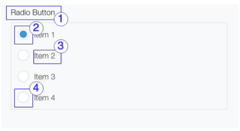

# RadioButton

## Overview



|Number|	Description|
| --- | --- |
|1|Title|	
|2|	Icon when item is selected|
|3|Value of item|	
|4|Icon when item isn't selected|

## Constructor

**Parameter**

| Name| Type| Required| Description |
| --- | --- | --- | --- |
|options|Object|No|The object contains params of constructor.|
|options.name|String|Yes|Name of radio button for submit.<br> If value isn't set, the error message will be displayed.|
|options.items|Array&lt;Object&gt;|No|List of item which displayed in radio button.|
|options.items[].value|String|Yes|The value of an item.If the value is duplicate, the error will be displayed|
|options.items[].label|String|No|Display string.|
|options.items[].isDisabled|Boolean|No|Indicate item will be disabled when display. Default value is false.|
|options.value|String|No|Default selected item.|
|options.isDisabled|Boolean|No|The radio button will be disabled. <br> Default value: 'false'|
|options.isVisible|Boolean|No|The radio button will be visible. <br> Default value: 'true'|

<details class="tab-container" open>
<Summary>Sample</Summary>

**Javascript**
```javascript
var radioBtn = new kintoneUIComponent.RadioButton({
     name: "fruit",
     items: [
            {
                label: 'Orange',
                value: 'Orange',
                isDisabled: false
            },
            {
                label: 'Banana',
                value: 'Banana',
                isDisabled: true
            },
            {
                label: 'Lemon',
                value: 'Lemon',
                isDisabled: true
            },
        ],
    value: 'Banana'
});
```
**React**
```javascript
import { RadioButton } from '@kintone/kintone-ui-component';
import React from 'react';
   
export default class Plugin extends React.Component {
    constructor(props) {
        super(props);
        const items = [
            {
                label: 'Orange',
                value: 'Orange',
                isDisabled: false
            },
            {
                label: 'Banana',
                value: 'Banana',
                isDisabled: true
            },
            {
                label: 'Lemon',
                value: 'Lemon',
                isDisabled: true
            },
        ];
        this.state = {items: items, value: 'Lemon'};
    }
    render() {
        return (
            <RadioButton name='radio' items={this.state.items} value={this.state.value} onChange={(value) => {this.setState({value})}} />
        );
    }
}
```
</details>

## Methods
### render()
Get dom element of component.

**Parameter**

None

**Returns**

Dom element

<details class="tab-container" open>
<Summary>Sample</Summary>

**Javascript**
```javascript
var radioBtn = new kintoneUIComponent.RadioButton({
     name: "fruit",
     items: [
            {
                label: 'Orange',
                value: 'Orange',
                isDisabled: false
            },
            {
                label: 'Banana',
                value: 'Banana',
                isDisabled: true
            },
            {
                label: 'Lemon',
                value: 'Lemon',
                isDisabled: true
            },
        ],
    value: 'Banana'
});

var body = document.getElementsByTagName("BODY")[0];
body.appendChild(radioBtn.render());
```
**React**
```javascript
import { RadioButton } from '@kintone/kintone-ui-component';
import React from 'react';
   
export default class Plugin extends React.Component {
    constructor(props) {
        super(props);
        const items = [
            {
                label: 'Orange',
                value: 'Orange',
                isDisabled: false
            },
            {
                label: 'Banana',
                value: 'Banana',
                isDisabled: true
            },
            {
                label: 'Lemon',
                value: 'Lemon',
                isDisabled: true
            },
        ];
        this.state = {items: items, value: 'Lemon'};
    }
    render() {
        return (
            <RadioButton name='radio' items={this.state.items} value={this.state.value} onChange={(value) => {this.setState({value})}} />
        );
    }
}
```
</details>

### addItem(item)
Add an item to end of the radio button list.

**Parameter**

| Name| Type| Required| Description |
| --- | --- | --- | --- |
|item|	Object|	Yes|The item object will be added.|
|item.value|String|Yes|The value of an item.|
|item.label|String|No|Display string.|
|item.isDisabled|Boolean|No|Indicate item will be disabled when display.<br>Default value: 'false'|

**Returns**

None

<details class="tab-container" open>
<Summary>Sample</Summary>

**Javascript**
```javascript
var radioBtn = new kintoneUIComponent.RadioButton({
     name: "fruit",
     items: [
            {
                label: 'Orange',
                value: 'Orange',
                isDisabled: false
            },
            {
                label: 'Banana',
                value: 'Banana',
                isDisabled: true
            }
        ],
    value: 'Banana'
});

var body = document.getElementsByTagName("BODY")[0];
body.appendChild(radioBtn.render());

radioBtn.addItem({label: 'Lemon', value: 'Lemon', isDisabled: true});
```
**React**
```javascript

import { RadioButton } from '@kintone/kintone-ui-component';
import React from 'react';
 
export default class Plugin extends React.Component {
    constructor(props) {
        super(props);
        this.state = {
            items: [],
            value: undefined
        };
    }
  
    render() {
        return (
         <div>
          <RadioButton name='radio' items={this.state.items} value={this.state.value} onChange={(value) => {this.setState({value})}} />
          <button onClick={this.handleClick}>Add Item</button>
         </div>
       );
    }
  
    handleClick = () => {
      const item = {
        label: 'Lemon',
        value: 'Lemon',
        isDisabled: false
      };
      this.setState(prevState => ({
        items: prevState.items ? prevState.items.concat([item]) : [item]
      }))
    }
}
```
</details>

### removeItem(index)
Remove item at specific index of radio button list.

**Parameter**

| Name| Type| Required| Description |
| --- | --- | --- | --- |
|index|Integer|	Yes|The index of remove item.|

**Returns**

None

<details class="tab-container" open>
<Summary>Sample</Summary>

**Javascript**
```javascript
var radioBtn = new kintoneUIComponent.RadioButton({
     name: "fruit",
     items: [
            {
                label: 'Orange',
                value: 'Orange',
                isDisabled: false
            },
            {
                label: 'Banana',
                value: 'Banana',
                isDisabled: true
            },
            {
                label: 'Lemon',
                value: 'Lemon',
                isDisabled: true
            },
        ],
    value: 'Banana'
});

var body = document.getElementsByTagName("BODY")[0];
body.appendChild(radioBtn.render());

radioBtn.removeItem(0);
```
**React**
```javascript
import { RadioButton } from '@kintone/kintone-ui-component';
import React from 'react';
 
export default class Plugin extends React.Component {
    constructor(props) {
        super(props);
        this.state = {
            items: [{
                label: 'Lemon',
                value: 'Lemon',
                isDisabled: true
            }]
        };
    }
  
    render() {
        return (
         <div>
          <RadioButton name='radio' items={this.state.items} value={this.state.value} onChange={(value) => {this.setState({value})}} />
          <button onClick={this.handleClick}>Remove Item</button>
         </div>
       );
    }
  
    handleClick = () => {
     this.setState(prevState => {
         if (prevState.items[0]) {
           if (this.state.value === prevState.items[0].value) {
             prevState.value = undefined;
           }
           prevState.items.splice(0, 1)
           return prevState;
         }
         return prevState;
     });
   };
}

```
</details>

### getItems()
Get all items in radio button list.

**Parameter**

None

**Returns**

The list contains all items of dropdown.

| Name| Type| Description |
| --- | --- | --- |
|items|List&lt;Object&gt;|List of items objects in dropdown.|
|items[].label|String|Display string.|
|items[].value|String|The value of an item.|
|items[].isDisabled|Boolean|Indicate item was disabled.|

<details class="tab-container" open>
<Summary>Sample</Summary>

**Javascript**
```javascript
var radioBtn = new kintoneUIComponent.RadioButton({
     name: "fruit",
     items: [
            {
                label: 'Orange',
                value: 'Orange',
                isDisabled: false
            },
            {
                label: 'Banana',
                value: 'Banana',
                isDisabled: true
            },
            {
                label: 'Lemon',
                value: 'Lemon',
                isDisabled: true
            },
        ],
    value: 'Banana'
});
 
var body = document.getElementsByTagName("BODY")[0];
body.appendChild(radioBtn.render());

var items = radioBtn.getItems();
items.forEach(function(item) {
    console.log(item);
});
```
**React**
```javascript
import { DropDown } from '@kintone/kintone-ui-component';
import React from 'react';
   
export default class Plugin extends React.Component {
    constructor(props) {
        super(props);
        const items = [
            {
                label: 'Orange',
                value: 'Orange',
                isDisabled: false
            },
            {
                label: 'Banana',
                value: 'Banana',
                isDisabled: true
            },
            {
                label: 'Lemon',
                value: 'Lemon',
                isDisabled: true
            },
        ];
        this.state = {items: items};
    }
   
    render() {
        return (
         <div>
          <RadioButton name='radio' items={this.state.items} value={this.state.value} onChange={(value) => {this.setState({value})}} />
          <button onClick={this.handleClick}>Get Items</button>
         </div>
       );
    }
  
    handleClick = () => {
        this.state.items.forEach(item => {
            console.log(item);
        });
    }
}

```
</details>

### getValue()
Get the selected item in radio button.

**Parameter**

None

**Returns**

|Name|Type|Description|
|---|---|---|
|value|	String	|The value of the selected item|


<details class="tab-container" open>
<Summary>Sample</Summary>

**Javascript**
```javascript
var radioBtn = new kintoneUIComponent.RadioButton({
     name: "fruit",
     items: [
            {
                label: 'Orange',
                value: 'Orange',
                isDisabled: false
            },
            {
                label: 'Banana',
                value: 'Banana',
                isDisabled: true
            },
            {
                label: 'Lemon',
                value: 'Lemon',
                isDisabled: true
            },
        ],
    value: 'Banana'
});

var body = document.getElementsByTagName("BODY")[0];
body.appendChild(radioBtn.render());

radioBtn.getValue();
```
**React**
```javascript

import { RadioButton } from '@kintone/kintone-ui-component';
import React from 'react';
 
export default class Plugin extends React.Component {
    constructor(props) {
        super(props);
        const items = [
            {
                label: 'Orange',
                value: 'Orange',
                isDisabled: false
            },
            {
                label: 'Banana',
                value: 'Banana',
                isDisabled: true
            },
            {
                label: 'Lemon',
                value: 'Lemon',
                isDisabled: true
            },
        ];
        this.state = {
            items: items,
            value: 'Banana'
        };
    }
 
    render() {
        return (
         <div>
          <RadioButton name='radio' items={this.state.items} value={this.state.value} onChange={(value) => {this.setState({value})}} />
          <button onClick={this.handleClick}>Get Value</button>
         </div>
       );
    }
  
    handleClick = () => {
        console.log(this.state.value);
    }
}

```
</details>

### setStyles(style)
Set style of container dom element.

**Parameter**

| Name| Type| Required| Description |
| --- | --- | --- | --- |
|style|object|Yes|Set the style for container dom element. For Key of Style Object Properties, please read references: https://www.w3schools.com/jsref/dom_obj_style.asp |

**Returns**

None

<details class="tab-container" open>
<Summary>Sample</Summary>

**Javascript**
```javascript
var radioBtn = new kintoneUIComponent.RadioButton({
     name: "fruit",
     items: [
            {
                label: 'Orange',
                value: 'Orange',
                isDisabled: false
            },
            {
                label: 'Banana',
                value: 'Banana',
                isDisabled: true
            },
            {
                label: 'Lemon',
                value: 'Lemon',
                isDisabled: true
            },
        ],
    value: 'Banana'
});
radioBtn.setStyles({background:"blue",fontSize:'20px'});
var body = document.getElementsByTagName("BODY")[0];
body.appendChild(radioBtn.render());
```
**React**
```javascript

import { RadioButton } from '@kintone/kintone-ui-component';
import React from 'react';
 
export default class Plugin extends React.Component {
    constructor(props) {
        super(props);
        const items = [
            {
                label: 'Orange',
                value: 'Orange',
                isDisabled: false
            },
            {
                label: 'Banana',
                value: 'Banana',
                isDisabled: true
            },
            {
                label: 'Lemon',
                value: 'Lemon',
                isDisabled: true
            },
        ];
        this.state = {
            items: items,
            value: 'Banana'
        };
    }
 
    render() {
        return (
         <div>
          <RadioButton style={{background:"blue", fontSize:'20px'}} name='radio' items={this.state.items} value={this.state.value} onChange={(value) => {this.setState({value})}} />
         </div>
       );
    }
}

```
</details>


### setClassName(className)
Set className of container dom element.

**Parameter**

| Name| Type| Required| Description |
| --- | --- | --- | --- |
|className|string|Yes|Set className for container dom element. Add trailing space for multiple className|

**Returns**

None

<details class="tab-container" open>
<Summary>Sample</Summary>

**Javascript**
```javascript
var radioBtn = new kintoneUIComponent.RadioButton({
     name: "fruit",
     items: [
            {
                label: 'Orange',
                value: 'Orange',
                isDisabled: false
            },
            {
                label: 'Banana',
                value: 'Banana',
                isDisabled: true
            },
            {
                label: 'Lemon',
                value: 'Lemon',
                isDisabled: true
            },
        ],
    value: 'Banana'
});
radioBtn.setClassName("class1 class2");
var body = document.getElementsByTagName("BODY")[0];
body.appendChild(radioBtn.render());
```
**React**
```javascript

import { RadioButton } from '@kintone/kintone-ui-component';
import React from 'react';
 
export default class Plugin extends React.Component {
    constructor(props) {
        super(props);
        const items = [
            {
                label: 'Orange',
                value: 'Orange',
                isDisabled: false
            },
            {
                label: 'Banana',
                value: 'Banana',
                isDisabled: true
            },
            {
                label: 'Lemon',
                value: 'Lemon',
                isDisabled: true
            },
        ];
        this.state = {
            items: items,
            value: 'Banana'
        };
    }
 
    render() {
        return (
         <div>
          <RadioButton className="class1 class2" name='radio' items={this.state.items} value={this.state.value} onChange={(value) => {this.setState({value})}} />
         </div>
       );
    }
}

```
</details>


### setValue(value)
Set the selected item for radio button.

**Parameter**

| Name| Type| Required| Description |
| --- | --- | --- | --- |
|value|String|	Yes|Selected value in radio button.|

**Returns**

None

<details class="tab-container" open>
<Summary>Sample</Summary>

**Javascript**
```javascript
var radioBtn = new kintoneUIComponent.RadioButton({
     name: "fruit",
     items: [
            {
                label: 'Orange',
                value: 'Orange',
                isDisabled: false
            },
            {
                label: 'Banana',
                value: 'Banana',
                isDisabled: true
            },
            {
                label: 'Lemon',
                value: 'Lemon',
                isDisabled: true
            },
        ],
    value: 'Banana'
});

var body = document.getElementsByTagName("BODY")[0];
body.appendChild(radioBtn.render());

radioBtn.setValue('Lemon');
```
**React**
```javascript
import { RadioButton } from '@kintone/kintone-ui-component';
import React from 'react';
 
export default class Plugin extends React.Component {
    constructor(props) {
        super(props);
        const items = [
            {
                label: 'Orange',
                value: 'Orange',
                isDisabled: false
            },
            {
                label: 'Banana',
                value: 'Banana',
                isDisabled: true
            },
            {
                label: 'Lemon',
                value: 'Lemon',
                isDisabled: true
            },
        ];
        this.state = {
            items: items,
            value: 'Banana'
        };
    }
 
    render() {
        return (
         <div>
          <RadioButton name='radio' items={this.state.items} value={this.state.value} onChange={(value) => {this.setState({value})}} />
          <button onClick={this.handleClick}>Set Value</button>
         </div>
       );
    }
  
    handleClick = () => {
        this.setState({value: 'Orange'});
    }
}

```
</details>

### disableItem(value)
Set the disabled item for the radio button.

**Parameter**

| Name| Type| Required| Description |
| --- | --- | --- | --- |
|value|String|	Yes|The value of an item in radio button.|

**Returns**

None

<details class="tab-container" open>
<Summary>Sample</Summary>

**Javascript**

```javascript
var radioBtn = new kintoneUIComponent.RadioButton({
     name: "fruit",
     items: [
            {
                label: 'Orange',
                value: 'Orange',
                isDisabled: false
            },
            {
                label: 'Banana',
                value: 'Banana',
                isDisabled: true
            },
            {
                label: 'Lemon',
                value: 'Lemon',
                isDisabled: true
            },
        ],
    value: 'Banana'
});

var body = document.getElementsByTagName("BODY")[0];
body.appendChild(radioBtn.render());

radioBtn.disableItem('Orange');
```
**React**

```javascript
import { RadioButton } from '@kintone/kintone-ui-component';
import React from 'react';
 
export default class Plugin extends React.Component {
    constructor(props) {
        super(props);
        const items = [
            {
                label: 'Orange',
                value: 'Orange',
                isDisabled: false
            },
            {
                label: 'Banana',
                value: 'Banana',
                isDisabled: true
            },
            {
                label: 'Lemon',
                value: 'Lemon',
                isDisabled: true
            },
        ];
        this.state = {
            items: items,
            value: 'Banana'
        };
    }
 
   render() {
        return (
         <div>
          <RadioButton name='radio' items={this.state.items} value={this.state.value} onChange={(value) => {this.setState({value})}} />
          <button onClick={this.handleClick}>Disabled Item</button>
         </div>
       );
    }
  
    handleClick = () => {
        const items = [...this.state.items];
        items[0].isDisabled = true;
 
        this.setState({ items: items });
    }
}
```
</details>

### enableItem(value)
Set the enabled item for radio button.

**Parameter**

| Name| Type| Required| Description |
| --- | --- | --- | --- |
|value|String|	Yes|Selected value in radio button.|

**Returns**

None

<details class="tab-container" open>
<Summary>Sample</Summary>

**Javascript**
```javascript
var radioBtn = new kintoneUIComponent.RadioButton({
     name: "fruit",
     items: [
            {
                label: 'Orange',
                value: 'Orange',
                isDisabled: false
            },
            {
                label: 'Banana',
                value: 'Banana',
                isDisabled: true
            },
            {
                label: 'Lemon',
                value: 'Lemon',
                isDisabled: true
            },
        ],
    value: 'Banana'
});
 
var body = document.getElementsByTagName("BODY")[0];
body.appendChild(radioBtn.render());

radioBtn.enableItem('Banana');
```
**React**
```javascript
import { RadioButton } from '@kintone/kintone-ui-component';
import React from 'react';
 
export default class Plugin extends React.Component {
    constructor(props) {
        super(props);
        const items = [
            {
                label: 'Orange',
                value: 'Orange',
                isDisabled: false
            },
            {
                label: 'Banana',
                value: 'Banana',
                isDisabled: true
            },
            {
                label: 'Lemon',
                value: 'Lemon',
                isDisabled: true
            },
        ];
        this.state = {
            items: items,
            value: 'Banana'
        };
    }
 
    render() {
        return (
         <div>
          <RadioButton name='radio' items={this.state.items} value={this.state.value} onChange={(value) => {this.setState({value})}} />
          <button onClick={this.handleClick}>Enabled Item</button>
         </div>
       );
    }
  
    handleClick = () => {
        const items = [...this.state.items];
        items[1].isDisabled = false;
 
        this.setState({ items: items });
    }
}

```
</details>


### on(eventName, callBack)
Register callback for change event

**Parameter**

| Name| Type| Required| Description |
| --- | --- | --- | --- |
|eventName|	String|	Yes|Name of event: <ul><li>'change'</li></ul>|
|callback|function |Yes|callback|

**Returns**

None

<details class="tab-container" open>
<Summary>Sample</Summary>

**Javascript**
```javascript
var radioBtn = new kintoneUIComponent.RadioButton({
     name: "fruit",
     items: [
            {
                label: 'Orange',
                value: 'Orange',
                isDisabled: false
            },
            {
                label: 'Banana',
                value: 'Banana',
                isDisabled: true
            },
            {
                label: 'Lemon',
                value: 'Lemon',
                isDisabled: true
            },
        ],
    value: 'Banana'
});

var body = document.getElementsByTagName("BODY")[0];
body.appendChild(radioBtn.render());

radioBtn.on('change', function(value) {
    console.log('on change');
});
```
**React**
```javascript
import { RadioButton } from '@kintone/kintone-ui-component';
import React from 'react';
 
export default class Plugin extends React.Component {
    constructor(props) {
        super(props);
        const items = [
            {
                label: 'Orange',
                value: 'Orange',
                isDisabled: false
            },
            {
                label: 'Banana',
                value: 'Banana',
                isDisabled: true
            },
            {
                label: 'Lemon',
                value: 'Lemon',
                isDisabled: true
            },
        ];
        this.state = {
            items: items,
            value: 'Banana'
        };
    }
 
    render() {
        return (
            <RadioButton name='radio' items={this.state.items} value={this.state.value} onChange={this.handleChange } />
        );
    }
        handleChange = (value) => {
            this.setState({value});
            console.log('value: ' + value);
        }
    }


```
</details>

### show()
Display the radio button.

**Parameter**

None

**Returns**

None

<details class="tab-container" open>
<Summary>Sample</Summary>

**Javascript**
```javascript
var radioBtn = new kintoneUIComponent.RadioButton({
     name: "fruit",
     items: [
            {
                label: 'Orange',
                value: 'Orange',
                isDisabled: false
            },
            {
                label: 'Banana',
                value: 'Banana',
                isDisabled: true
            },
            {
                label: 'Lemon',
                value: 'Lemon',
                isDisabled: true
            },
        ],
    value: 'Banana'
});
 
var body = document.getElementsByTagName("BODY")[0];
body.appendChild(radioBtn.render());

radioBtn.show();
```
**React**
```javascript
import { RadioButton } from '@kintone/kintone-ui-component';
import React from 'react';
 
export default class Plugin extends React.Component {
    constructor(props) {
        super(props);
        const items = [
            {
                label: 'Orange',
                value: 'Orange',
                isDisabled: false
            },
            {
                label: 'Banana',
                value: 'Banana',
                isDisabled: true
            },
            {
                label: 'Lemon',
                value: 'Lemon',
                isDisabled: true
            },
        ];
        this.state = {
            items: items,
            value: 'Banana'
        };
    }
 
    render() {
        return (
            <RadioButton name='radio' items={this.state.items} value={this.state.value} onChange={(value) => {this.setState({value});}} isVisible={true} />
        );
    }
}

```
</details>

### hide()
Hide the radio button.

**Parameter**

None

**Returns**

None

<details class="tab-container" open>
<Summary>Sample</Summary>

**Javascript**
```javascript
var radioBtn = new kintoneUIComponent.RadioButton({
     name: "fruit",
     items: [
            {
                label: 'Orange',
                value: 'Orange',
                isDisabled: false
            },
            {
                label: 'Banana',
                value: 'Banana',
                isDisabled: true
            },
            {
                label: 'Lemon',
                value: 'Lemon',
                isDisabled: true
            },
        ],
    value: 'Banana'
});

var body = document.getElementsByTagName("BODY")[0];
body.appendChild(radioBtn.render());

radioBtn.hide();
```
**React**
```javascript
import { RadioButton } from '@kintone/kintone-ui-component';
import React from 'react';
 
export default class Plugin extends React.Component {
    constructor(props) {
        super(props);
        const items = [
            {
                label: 'Orange',
                value: 'Orange',
                isDisabled: false
            },
            {
                label: 'Banana',
                value: 'Banana',
                isDisabled: true
            },
            {
                label: 'Lemon',
                value: 'Lemon',
                isDisabled: true
            },
        ];
        this.state = {
            items: items,
            value: 'Banana'
        };
    }
 
    render() {
        return (
            <RadioButton name='radio' items={this.state.items} value={this.state.value} onChange={() => {this.setState({value});}}  isVisible={false} />
        );
    }
}

```
</details>

### disable()
Disabled the radio button.

**Parameter**

None

**Returns**

None

<details class="tab-container" open>
<Summary>Sample</Summary>

**Javascript**
```javascript
var radioBtn = new kintoneUIComponent.RadioButton({
     name: "fruit",
     items: [
            {
                label: 'Orange',
                value: 'Orange',
                isDisabled: false
            },
            {
                label: 'Banana',
                value: 'Banana',
                isDisabled: true
            },
            {
                label: 'Lemon',
                value: 'Lemon',
                isDisabled: true
            },
        ],
    value: 'Banana'
});
 
var body = document.getElementsByTagName("BODY")[0];
body.appendChild(radioBtn.render());

radioBtn.disable();
```
**React**
```javascript

import { RadioButton } from '@kintone/kintone-ui-component';
import React from 'react';
 
export default class Plugin extends React.Component {
    constructor(props) {
        super(props);
        const items = [
            {
                label: 'Orange',
                value: 'Orange',
                isDisabled: false
            },
            {
                label: 'Banana',
                value: 'Banana',
                isDisabled: true
            },
            {
                label: 'Lemon',
                value: 'Lemon',
                isDisabled: true
            },
        ];
        this.state = {
            items: items,
            value: 'Banana'
        };
    }
 
    render() {
        return (
            <RadioButton name='radio' items={this.state.items} value={this.state.value} onChange={this.handleChange.bind(this)}  isDisabled={true} />
        );
    }
    handleChange = (value) => {
            this.setState({value});
        }
}

```
</details>

### enable()
Enabled the radio button.

**Parameter**

None

**Returns**

None

<details class="tab-container" open>
<Summary>Sample</Summary>

**Javascript**
```javascript
var radioBtn = new kintoneUIComponent.RadioButton({
     name: "fruit",
     items: [
            {
                label: 'Orange',
                value: 'Orange',
                isDisabled: false
            },
            {
                label: 'Banana',
                value: 'Banana',
                isDisabled: true
            },
            {
                label: 'Lemon',
                value: 'Lemon',
                isDisabled: true
            },
        ],
    value: 'Banana'
});

var body = document.getElementsByTagName("BODY")[0];
body.appendChild(radioBtn.render());

radioBtn.enable();
```
**React**
```javascript

import { RadioButton } from '@kintone/kintone-ui-component';
import React from 'react';
 
export default class Plugin extends React.Component {
    constructor(props) {
        super(props);
        const items = [
            {
                label: 'Orange',
                value: 'Orange',
                isDisabled: false
            },
            {
                label: 'Banana',
                value: 'Banana',
                isDisabled: true
            },
            {
                label: 'Lemon',
                value: 'Lemon',
                isDisabled: true
            },
        ];
        this.state = {
            items: items,
            value: 'Banana'
        };
    }
 
    render() {
        return (
            <RadioButton name='radio' items={this.state.items} value={this.state.value} onChange={this.handleChange.bind(this)}  isDisabled={false} />
        );
    }
    handleChange = (value) => {
            this.setState({value});
        }
}

```
</details>
