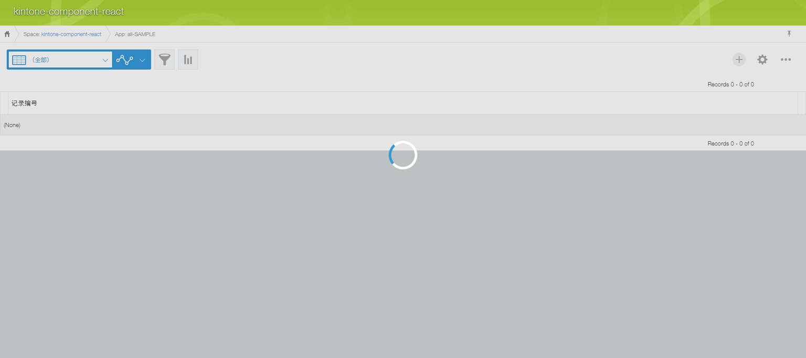

# Spinner

## Overview


## Constructor

**Parameter**

| Name| Type| Required| Description |
| --- | --- | --- | --- |
|options|Object|No|The object contains parameters of constructor.|
|options.isVisible|Boolean|No|The spinner will be visible. <br> Default value: **false**|

<details class="tab-container" open>
<Summary>Sample</Summary>

**Javascript**
```javascript
var spinner = new kintoneUIComponent.Spinner({isVisible: true});
```
**React**
```javascript
import { Spinner } from '@kintone/kintone-ui-component';
import React from 'react';
   
export default class Plugin extends React.Component {
    render() {
        return (
            <Spinner isVisible={true}/>
        );
    };
};

```
</details>

## Methods
### render()
Get DOM element of Spinner component.

**Parameter**

None

**Returns**

DOM element

<details class="tab-container" open>
<Summary>Sample</Summary>

**Javascript**
```javascript
var spinner = new kintoneUIComponent.Spinner({isVisible: true});
var body = document.getElementsByTagName("BODY")[0];
body.appendChild(spinner.render());
```
**React**
```javascript
import { Spinner } from '@kintone/kintone-ui-component';
import React from 'react';
import ReactDOM from 'react-dom';

export default class Plugin extends React.Component {
    render() {
        return (
            <Spinner isVisible={true}/>
        );
    };
};

ReactDOM.render(<Plugin />, document.getElementById('root'));
```
</details>

### show()
Display Spinner component.

**Parameter**

None

**Returns**

None

<details class="tab-container" open>
<Summary>Sample</Summary>

**Javascript**
```javascript
var spinner = new kintoneUIComponent.Spinner();
var btn =  document.createElement('button'); 
btn.textContent = 'Open spinner';
btn.onclick = function() {
    spinner.show();
};
var body = document.getElementsByTagName("BODY")[0];
body.appendChild(spinner.render());
body.appendChild(btn);
```
**React**
```javascript
import {Spinner} from '@kintone/kintone-ui-component';
import React from 'react';
import ReactDOM from 'react-dom';

export default class Plugin extends React.Component {
    constructor(props) {
        super(props);
        this.state = { isVisible: false };
    };

    show = () => {
        this.setState({ isVisible: true });
    };

    render() {
        return (
            <div>
                <Spinner isVisible={this.state.isVisible} />
                <button onClick={this.show}>Open spinner</button>
            </div>
        );
    };
};
ReactDOM.render(<Plugin />, document.getElementById('root'));
```
</details>

### hide()
Hide Spinner component.

**Parameter**

None

**Returns**

None

<details class="tab-container" open>
<Summary>Sample</Summary>

**Javascript**
```javascript
var spinner = new kintoneUIComponent.Spinner({ isVisible: true });
setTimeout(() => {
    spinner.hide();
}, 3000);
var body = document.getElementsByTagName("BODY")[0];
body.appendChild(spinner.render());
```
**React**
```javascript
import {Spinner} from '@kintone/kintone-ui-component';
import React from 'react';
import ReactDOM from 'react-dom';
   
export default class Plugin extends React.Component {
    constructor(props) {
        super(props);
        this.state = { isVisible: true };
    };
    hide = () => {
        this.setState({ isVisible: false });
    };
    componentDidMount() {
        setTimeout(() => {
            this.hide();
        }, 3000);
    };

    render() {
        return (
            <Spinner isVisible={this.state.isVisible} />
        );
    };
};
ReactDOM.render(<Plugin />, document.getElementById('root'));
```
</details>