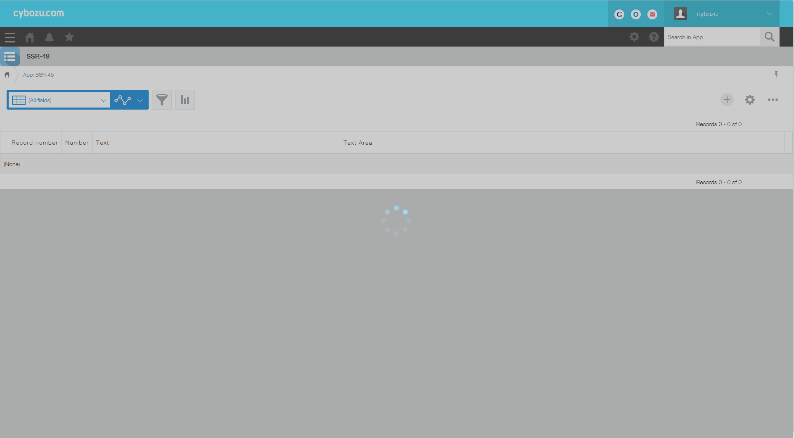

# Spinner

## Overview


## Constructor

**Parameter**

None

<details class="tab-container" open>
<Summary>Sample</Summary>

**Javascript**
```
var spinner = new kintoneUIComponent.Spinner();
```
**React**
```
import { Spinner } from 'kintone-ui-component';
import React from 'react';
   
export default class Plugin extends React.Component {
    render() {
        return (
            <Spinner isVisible={true}/>
        );
    }
}

```
</details>

## Methods
### render()
Get dom element of component.

**Parameter**

None

**Returns**

Dom element

<details class="tab-container" open>
<Summary>Sample</Summary>

**Javascript**
```
var spinner = new kintoneUIComponent.Spinner();
var body = document.getElementsByTagName("BODY")[0];
body.appendChild(spinner.render());
```
**React**
```
import { Spinner } from 'kintone-ui-component';
import React from 'react';
   
export default class Plugin extends React.Component {
    render() {
        return (
            <Spinner isVisible={true}/>
        );
    }
}
```
</details>

### show()
Display the spinner.

**Parameter**

None

**Returns**

None

<details class="tab-container" open>
<Summary>Sample</Summary>

**Javascript**
```
var spinner = new kintoneUIComponent.Spinner();
var body = document.getElementsByTagName("BODY")[0];
body.appendChild(spinner.render());
spinner.show();
```
**React**
```
import { Spinner } from 'kintone-ui-component';
import React from 'react';
   
export default class Plugin extends React.Component {
    render() {
        return (
            <Spinner isVisible={true}/>
        );
    }
}

```
</details>

### hide()
Hide the spinner.

**Parameter**

None

**Returns**

None

<details class="tab-container" open>
<Summary>Sample</Summary>

**Javascript**
```
var spinner = new kintoneUIComponent.Spinner();
var body = document.getElementsByTagName("BODY")[0];
body.appendChild(spinner.render());
spinner.hide();
```
**React**
```
import { Spinner } from 'kintone-ui-component';
import React from 'react';
   
export default class Plugin extends React.Component {
    render() {
        return (
            <Spinner isVisible={false}/>
        );
    }
}

```
</details>