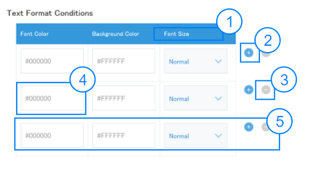

# Table

## Overview


|Number|	Description|
| --- | --- |
|1|Header of column|	
|2|Icon button for insert row|
|3|Icon button for remove row|	
|4|Child control component|
|5|Sample row|

!!! note
    Below is the list components that table supports:
    <ul><li>custom DOM element</li>
    <li>Text</li>
    <li>Dropdown</li>
    <li>CheckBox</li>
    <li>MultipleChoice</li>
    <li>RadioButton</li>
    <li>Label</li>
    <li>IconButton</li>
    <li>Alert</li></ul>

## Constructor

**Parameter**

| Name| Type| Required| Description |
| --- | - | --- | ----- |
|options|Object|Yes|The object contains the params of constructor.|
|options.actionButtonsShown|Boolean|No|Show the action buttons when this parameter is True. <br>Default: True|
|options.columns|Array&lt;Object&gt;|Yes|The row template.|
|options.columns[x].cell|Function|Yes|Returns cell template object. Cell template object must implement init and update functions <br> - init: to return DOM element for initializing cell's DOM <br> - update: to update DOM of the cell based on the data returned|
|options.columns[x].header|String|Yes|Header of column.|
|options.data|Array&lt;Object&gt;|Yes|The value of table. <br> Refer to the [getValue()](#getvalue) and [setValue(value)](#setvaluevalue) for more information |
|options.defaultRowData|Object|Yes|The default value of new row.|
|options.onCellChange|Callback|No|Handler for cell change event. <br>Return row data object to overwrite default row data object.|
|options.onRowAdd|Callback|No|Handler for row add event|
|options.onRowRemove|Callback|No|Handler for row remove event|

<details class="tab-container" open>
<Summary>Sample</Summary>

**Javascript**
```
(function(){
  // custom cell containing 2 text fields
  var customCell = function() {
    return {
      init: function({rowData, updateRowData}) {
        var span = document.createElement('span');
        var textfield1 = new kintoneUIComponent.Text({value: rowData.text1.value});
        var textfield2 = new kintoneUIComponent.Text({value: rowData.text2.value});
        span.appendChild(textfield1.render());
        span.appendChild(textfield2.render());
        textfield1.on('change', function(newValue){
          updateRowData({text1: {value: newValue}}, false);
        });
        textfield2.on('change', function(newValue){
          updateRowData({text2: {value: newValue}}, false);
        });
        this.textfield1 = textfield1;
        this.textfield2 = textfield2;
        return span;
      },
      update: function({ rowData }) {
        var text1val = rowData.text1;
        var text2val = rowData.text2;
        if (text1val && this.textfield1._reactObject) {
          this.textfield1.setValue(text1val.value);
        }
        if (text2val && this.textfield2._reactObject) {
          this.textfield2.setValue(text2val.value);
        }
      }
    }
  };

  // initial data of a table
  var initialData = [
    {
      text: { value: 'text field' },
      text1: { value: 'text field 1' },
      text2: { value: 'text field 2' },
      fruit: {
        name: 'fruit',
        items: [
             {
                 label: 'Orange',
                 value: 'Orange',
                 isDisabled: false
             },
             {
                 label: 'Banana',
                 value: 'Banana',
                 isDisabled: true
             },
             {
                 label: 'Lemon',
                 value: 'Lemon',
                 isDisabled: true
             },
         ],
        value: 'Banana'
      },
      colors: {
        items: [
             {
                 label: 'Red',
                 value: 'red',
                 isDisabled: false
             },
             {
                 label: 'Green',
                 value: 'green',
                 isDisabled: true
             },
             {
                 label: 'Blue',
                 value: 'blue',
                 isDisabled: true
             },
         ],
        value: ['red']
      },
      vegetables: {
        items: [
             {
                 label: 'Potato',
                 value: 'potato',
                 isDisabled: false
             },
             {
                 label: 'Celery',
                 value: 'celery',
                 isDisabled: false
             },
             {
                 label: 'Carrot',
                 value: 'carrot',
                 isDisabled: true
             },
         ],
        value: ['potato', 'celery']
      },
      toys: {
        items: [
             {
                 label: 'Cars',
                 value: 'cars',
                 isDisabled: false
             },
             {
                 label: 'Robots',
                 value: 'robots',
                 isDisabled: false
             },
             {
                 label: 'Animals',
                 value: 'animals',
                 isDisabled: true
             },
         ],
        value: 'cars'
      },
      label: {
        text: 'Name',
        textColor: '#e74c3c',
        backgroundColor: 'yellow',
        isRequired: true
      },
      iconBtn: {
        type: 'insert',
        color:'blue',
        size: 'small'
      },
      alert: {
        text: 'Network error',
        type: 'error'
      }
    },
  ];

  // default row data of a table, this data will be used to create new row
  var defaultRowData = {
    text: { value: 'text field' },
    text1: { value: 'text field 1' },
    text2: { value: 'text field 2' },
    fruit: {
      name: 'fruit',
      items: [
           {
               label: 'Orange',
               value: 'Orange',
               isDisabled: false
           },
           {
               label: 'Banana',
               value: 'Banana',
               isDisabled: true
           },
           {
               label: 'Lemon',
               value: 'Lemon',
               isDisabled: true
           },
       ],
      value: 'Banana'
    },
    colors: {
      items: [
           {
               label: 'Red',
               value: 'red',
               isDisabled: false
           },
           {
               label: 'Green',
               value: 'green',
               isDisabled: true
           },
           {
               label: 'Blue',
               value: 'blue',
               isDisabled: true
           },
       ],
      value: ['red']
    },
    vegetables: {
      items: [
           {
               label: 'Potato',
               value: 'potato',
               isDisabled: false
           },
           {
               label: 'Celery',
               value: 'celery',
               isDisabled: true
           },
           {
               label: 'Carrot',
               value: 'carrot',
               isDisabled: true
           },
       ],
      value: ['potato', 'celery']
    },
    toys: {
      items: [
           {
               label: 'Cars',
               value: 'cars',
               isDisabled: false
           },
           {
               label: 'Robots',
               value: 'robots',
               isDisabled: false
           },
           {
               label: 'Animals',
               value: 'animals',
               isDisabled: true
           },
       ],
      value: 'cars'
    },
    label: {
      text: 'Name',
      textColor: '#e74c3c',
      backgroundColor: 'yellow',
      isRequired: true
    },
    iconBtn: {
      type: 'insert',
      color:'blue',
      size: 'small'
    },
    alert: {
      text: 'Network error',
      type: 'error'
    }
  };

  // return this data to override default row data onRowAdd
  var overriddenRowData = {
    text: {value: 'overwritten field value'},
    text1: { value: 'overwritten field1 value' },
    text2: { value: 'overwritten field2 value' },
    fruit: {
      name: 'fruit',
      items: [
           {
               label: 'Orange',
               value: 'Orange',
               isDisabled: true
           },
           {
               label: 'Banana',
               value: 'Banana',
               isDisabled: false
           },
           {
               label: 'Lemon',
               value: 'Lemon',
               isDisabled: false
           },
       ],
      value: 'Banana'
    },
    colors: {
      items: [
           {
               label: 'Red',
               value: 'red',
               isDisabled: false
           },
           {
               label: 'Green',
               value: 'green',
               isDisabled: true
           },
           {
               label: 'Blue',
               value: 'blue',
               isDisabled: true
           },
       ],
      value: ['red']
    },
    vegetables: {
      items: [
           {
               label: 'Potato',
               value: 'potato',
               isDisabled: false
           },
           {
               label: 'Celery',
               value: 'celery',
               isDisabled: true
           },
           {
               label: 'Carrot',
               value: 'carrot',
               isDisabled: false
           },
       ],
      value: ['potato', 'celery']
    },
    toys: {
      items: [
           {
               label: 'Cars',
               value: 'cars',
               isDisabled: false
           },
           {
               label: 'Robots',
               value: 'robots',
               isDisabled: false
           },
           {
               label: 'Animals',
               value: 'animals',
               isDisabled: true
           },
       ],
      value: 'cars'
    },
    label: {
      text: 'Name',
      textColor: '#e74c3c',
      backgroundColor: 'yellow',
      isRequired: true
    },
    iconBtn: {
      type: 'insert',
      color:'blue',
      size: 'small'
    },
    alert: {
      text: 'Network error',
      type: 'error'
    }
  };

  var table = new kintoneUIComponent.Table({
    // initial table data
    data: initialData,
    // default row data on row add
    defaultRowData: defaultRowData,
    onRowAdd: function(e) {
      console.log('table.onAdd', e);
      // if onRowAdd does not return anything, defaultRowData will be used to create new table row
      // if below row data is returned, it will override defaultRowData to be used to create new table row
      return JSON.parse(JSON.stringify(overriddenRowData));
    },
    columns: [
      {
        header: 'Text',
        cell: function() { return kintoneUIComponent.createTableCell('text', 'text') }
      },
      {
        header: 'Radio',
        cell: function() { return kintoneUIComponent.createTableCell('radio', 'fruit') }
      },
      {
        header: 'Multichoice',
        cell: function() { return kintoneUIComponent.createTableCell('multichoice', 'colors') }
      },
      {
        header: 'Checkbox',
        cell: function() { return kintoneUIComponent.createTableCell('checkbox', 'vegetables') }
      },
      {
        header: 'Dropdown',
        cell: function() { return kintoneUIComponent.createTableCell('dropdown', 'toys') }
      },
      {
        header: 'Label',
        cell: function() { return kintoneUIComponent.createTableCell('label', 'label') }
      },
      {
        header: 'Icon Button',
        cell: function() { return kintoneUIComponent.createTableCell('icon', 'iconBtn', {onClick:function(event){
          alert('icon button clicked')
        }}) }
      },
      {
        header: 'Alert',
        cell: function() { return kintoneUIComponent.createTableCell('alert', 'alert') }
      },
      {
        header: 'Custom cell contains 2 textfields',
        cell: function() { return customCell() }
      },
    ]
  });
  kintone.app.getHeaderSpaceElement().appendChild(table.render());
})();
```
**React**
```
import React from 'react';
import { Table, Text} from '@kintone/kintone-ui-component';

export default class Plugin extends React.Component {
  constructor(props) {
    super(props);
    this.state = {
      tableData: [
        {text: 'this is a text field'}
      ],
      // default row data on row add
      defaultRowData: {text: 'default text field value'}
    }
  }

  handleRowAdd = ({data}) => {
    this.setState({ tableData: data })
    console.log('data: ', data);
  }

  handleRowRemove = ({data}) => {
    this.setState({ tableData: data })
    console.log('data: ', data);
  }

  handleCellChange = ({data}) => {
    this.setState({ tableData: data })
    console.log('data: ', data);
  }

  render() {
    const {tableData, defaultRowData} = this.state;
    const columns = [
      {
        header: 'Text',
        cell: ({ rowIndex, onCellChange }) => {
          return (
            <Text
              value={tableData[rowIndex].text}
              onChange={newValue => onCellChange(newValue, tableData, rowIndex, 'text')}
            />
          )
        }
      },
    ];
    return (
      <Table
        columns={columns}
        data={this.state.tableData}
        defaultRowData={defaultRowData}
        onRowAdd={this.handleRowAdd}
        onRowRemove={this.handleRowRemove}
        onCellChange={this.handleCellChange}
      />
    );
  }
}
```
</details>

## Methods
### render()
Get dom element of component.

**Parameter**

None

**Returns**

Dom element

<details class="tab-container" open>
<Summary>Sample</Summary>

**Javascript**
```
var table = new kintoneUIComponent.Table({
  // inital table data
  data: [
    {text: { value: 'this is a text field' }}
  ],
  // default row data on row add
  defaultRowData: {text: { value: 'default text field value' }},
  columns: [
    {
      header: 'Text',
      cell: function() { return kintoneUIComponent.createTableCell('text', 'text') }
    },
  ]
});
var body = document.getElementsByTagName("BODY")[0];
body.appendChild(table.render());
```
**React**
```
import React from 'react';
import {render} from 'react-dom';
import { Table, Text} from '@kintone/kintone-ui-component';

export default class Plugin extends React.Component {
  constructor(props) {
    super(props);
    this.state = {
      tableData: [
        {text: 'this is a text field'}
      ],
      // default row data on row add
      defaultRowData: {text: 'default text field value'}
    }
  }

  handleRowAdd = ({data}) => {
    this.setState({ tableData: data })
    console.log('data: ', data);
  }

  handleRowRemove = ({data}) => {
    this.setState({ tableData: data })
    console.log('data: ', data);
  }

  handleCellChange = ({data}) => {
    this.setState({ tableData: data })
    console.log('data: ', data);
  }

  render() {
    const {tableData, defaultRowData} = this.state;
    const columns = [
      {
        header: 'Text',
        cell: ({ rowIndex, onCellChange }) => {
          return (
            <Text
              value={tableData[rowIndex].text}
              onChange={newValue => onCellChange(newValue, tableData, rowIndex, 'text')}
            />
          )
        }
      },
    ];
    return (
      <Table
        columns={columns}
        data={this.state.tableData}
        defaultRowData={defaultRowData}
        onRowAdd={this.handleRowAdd}
        onRowRemove={this.handleRowRemove}
        onCellChange={this.handleCellChange}
      />
    );
  }
}
render(<Plugin />, kintone.app.getHeaderSpaceElement());
```
</details>

### getValue()
Get value of all rows in the table.

**Parameter**

None

**Returns**

|Name|Type|Description|
| --- | --- | --- |
|value|	Array&lt;Object&gt;|Value of all rows in the table |

<details class="tab-container" open>
<Summary>Sample</Summary>

**Javascript**
```
var table = new kintoneUIComponent.Table({
  // inital table data
  data: [
    {text: { value: 'this is a text field' }}
  ],
  // default row data on row add
  defaultRowData: {text: { value: 'default text field value' }},
  columns: [
    {
      header: 'Text',
      cell: function() { return kintoneUIComponent.createTableCell('text', 'text') }
    },
  ]
});
var body = document.getElementsByTagName("BODY")[0];
body.appendChild(table.render());
var value = table.getValue();
value.forEach(function(rowData) {
  console.log(rowData)
});
```
**React**
```
import React from 'react';
import {render} from 'react-dom';
import { Table, Text, Button} from '@kintone/kintone-ui-component';

export default class Plugin extends React.Component {
  constructor(props) {
    super(props);
    this.state = {
      tableData: [
        {text: 'this is a text field'}
      ],
      // default row data on row add
      defaultRowData: {text: 'default text field value'}
    }
  }

  handleRowAdd = ({data}) => {
    this.setState({ tableData: data })
    console.log('data: ', data);
  }
  
  handleRowRemove = ({data}) => {
    this.setState({ tableData: data })
    console.log('data: ', data);
  }

  handleCellChange = ({data}) => {
    this.setState({ tableData: data })
    console.log('data: ', data);
  }

  render() {
    const {tableData, defaultRowData} = this.state;
    const columns = [
      {
        header: 'Text',
        cell: ({ rowIndex, onCellChange }) => {
          return (
            <Text
              value={tableData[rowIndex].text}
              onChange={newValue => onCellChange(newValue, tableData, rowIndex, 'text')}
            />
          )
        }
      },
    ];
    return (
      <div>
        <Table 
          columns={columns}
          data={this.state.tableData} 
          defaultRowData={defaultRowData}
          onRowAdd={this.handleRowAdd}
          onRowRemove={this.handleRowRemove}
          onCellChange={this.handleCellChange}
          actionButtonsShown={true}
          isVisible={true}
        />
        <Button text="Get table value" onClick={() => {
            console.log(this.state.tableData)
          }}
        />
      </div>
    );
  }
}
render(<Plugin />, kintone.app.getHeaderSpaceElement());
```
</details>

### setValue(value)
Set data for every row in table. The number of rows in table's dependent on the length on this parameters. 

**Parameter**

|Name|Type|Required|Description|
| --- | --- | --- |--- |
|value	|Array&lt;Object&gt;	|Yes|	Value for every row in table|

**Returns**

None

<details class="tab-container" open>
<Summary>Sample</Summary>

**Javascript**
```
var table = new kintoneUIComponent.Table({
  // inital table data
  data: [
    {text: { value: 'this is a text field' }}
  ],
  // default row data on row add
  defaultRowData: {text: { value: 'default text field value' }},
  columns: [
    {
      header: 'Text',
      cell: function() { return kintoneUIComponent.createTableCell('text', 'text') }
    },
  ]
});
var body = document.getElementsByTagName("BODY")[0];
body.appendChild(table.render());
 
table.setValue([
  {text: { value: 'first row' }},
  {text: { value: 'second row' }},
  {text: { value: 'third row' }}
]);
```
**React**
```
import React from 'react';
import {render} from 'react-dom';
import { Table, Text, Button} from '@kintone/kintone-ui-component';

export default class Plugin extends React.Component {
  constructor(props) {
    super(props);
    this.state = {
      tableData: [
        {text: 'this is a text field'}
      ],
      // default row data on row add
      defaultRowData: {text: 'default text field value'}
    }
  }

  handleRowAdd = ({data}) => {
    this.setState({ tableData: data })
    console.log('data: ', data);
  }
  
  handleRowRemove = ({data}) => {
    this.setState({ tableData: data })
    console.log('data: ', data);
  }

  handleCellChange = ({data}) => {
    this.setState({ tableData: data })
    console.log('data: ', data);
  }

  render() {
    const {tableData, defaultRowData} = this.state;
    const columns = [
      {
        header: 'Text',
        cell: ({ rowIndex, onCellChange }) => {
          return (
            <Text
              value={tableData[rowIndex].text}
              onChange={newValue => onCellChange(newValue, tableData, rowIndex, 'text')}
            />
          )
        }
      },
    ];
    return (
      <div>
        <Table 
          columns={columns}
          data={this.state.tableData} 
          defaultRowData={defaultRowData}
          onRowAdd={this.handleRowAdd}
          onRowRemove={this.handleRowRemove}
          onCellChange={this.handleCellChange}
          actionButtonsShown={true}
          isVisible={true}
        />
        <Button text="Set table value" onClick={() => {
            const tableData = [
              {text: 'first row'},
              {text: 'second row'},
              {text: 'third row'}
            ]
            this.setState({tableData})
          }}
        />
      </div>
    );
  }
}
render(<Plugin />, kintone.app.getHeaderSpaceElement());
```
</details>

### on(eventName, callBack)
Register callback for an event

**Parameter**

| Name| Type| Required| Description |
| --- | --- | --- | --- |
|eventName|	String|	Yes|Name of events: <ul><li>'rowAdd' <ul><li>The 'rowAdd' event occurs when adding a new row in the table </li></ul> </li><li>'rowRemove'<ul><li>The 'rowRemove' event occurs when removing a row in the table</li></ul> </li> <li>'cellChange'<ul><li>The 'cellChange' event occurs when the value of an element bellow has been changed:<ul><li>Text</li><li>Drodown</li><li>RadioButton</li><li>MultipleChoice</li><li>CheckBox</li></ul> </li> </ul></li></ul>|
|callback|function |Yes|callback|

**Returns**
<br>None
<br><br><b>Callback data</b>

|Event| Name| Type| Description |
| --- | --- | --- | --- |
|rowAdd|	event |	Object |Callback data|
||event.data |Array&lt;Object&gt;|Current values of the table|
||event.rowIndex|	Interger|	Position of the new row in the table|
|rowRemove |event|	object|	Callback data|
||event.data |Array&lt;Object&gt;|Current values of the table|
||event.rowIndex|	Interger|	Position of the removed row in the table|
| cellChange| event|	object|	Callback data|
||event.data |Array&lt;Object&gt;|Values of the table|
||data.rowIndex|	Interger|	Position of the changed row in the table|
||data.fieldName|	String|	name of the data property which changed |

<details class="tab-container" open>
<Summary>Sample</Summary>

**Javascript**
```
var table = new kintoneUIComponent.Table({
  // inital table data
  data: [
    {text: { value: 'this is a text field' }}
  ],
  // default row data on row add
  defaultRowData: {text: { value: 'default text field value' }},
  columns: [
    {
      header: 'Text',
      cell: function() { return kintoneUIComponent.createTableCell('text', 'text') }
    },
  ]
});
var body = document.getElementsByTagName("BODY")[0];
body.appendChild(table.render());

table.on('rowAdd', function(event) {
  console.log(event);
});
table.on('rowRemove', function(event) {
  console.log(event);
});
table.on('cellChange', function(event) {
  console.log(event);
});
```
**React**
```
import React from 'react';
import {render} from 'react-dom';
import { Table, Text, Button} from '@kintone/kintone-ui-component';

export default class Plugin extends React.Component {
  constructor(props) {
    super(props);
    this.state = {
      tableData: [
        {text: 'this is a text field'}
      ],
      // default row data on row add
      defaultRowData: {text: 'default text field value'}
    }
  }

  handleRowAdd = ({data}) => {
    this.setState({ tableData: data })
    console.log('data: ', data);
  }
  
  handleRowRemove = ({data}) => {
    this.setState({ tableData: data })
    console.log('data: ', data);
  }

  handleCellChange = ({data}) => {
    this.setState({ tableData: data })
    console.log('data: ', data);
  }

  render() {
    const {tableData, defaultRowData} = this.state;
    const columns = [
      {
        header: 'Text',
        cell: ({ rowIndex, onCellChange }) => {
          return (
            <Text
              value={tableData[rowIndex].text}
              onChange={newValue => onCellChange(newValue, tableData, rowIndex, 'text')}
            />
          )
        }
      },
    ];
    return (
      <Table
        columns={columns}
        data={this.state.tableData}
        defaultRowData={defaultRowData}
        onRowAdd={this.handleRowAdd}
        onRowRemove={this.handleRowRemove}
        onCellChange={this.handleCellChange}
        actionButtonsShown={true}
        isVisible={true}
      />
    );
  }
}
render(<Plugin />, kintone.app.getHeaderSpaceElement());
```
</details>

### show()
Display the table

**Parameter**

None

**Returns**

None

<details class="tab-container" open>
<Summary>Sample</Summary>

**Javascript**
```
var table = new kintoneUIComponent.Table({
  // inital table data
  data: [
    {text: { value: 'this is a text field' }}
  ],
  // default row data on row add
  defaultRowData: {text: { value: 'default text field value' }},
  columns: [
    {
      header: 'Text',
      cell: function() { return kintoneUIComponent.createTableCell('text', 'text') }
    },
  ]
});
var body = document.getElementsByTagName("BODY")[0];
body.appendChild(table.render());
table.show();
```
**React**
```
import React from 'react';
import {render} from 'react-dom';
import { Table, Text, Button} from '@kintone/kintone-ui-component';

export default class Plugin extends React.Component {
  constructor(props) {
    super(props);
    this.state = {
      tableData: [
        {text: 'this is a text field'}
      ],
      // default row data on row add
      defaultRowData: {text: 'default text field value'},
      isVisible: false
    }
  }

  handleRowAdd = ({data}) => {
    this.setState({ tableData: data })
    console.log('data: ', data);
  }
  
  handleRowRemove = ({data}) => {
    this.setState({ tableData: data })
    console.log('data: ', data);
  }

  handleCellChange = ({data}) => {
    this.setState({ tableData: data })
    console.log('data: ', data);
  }

  render() {
    const {tableData, isVisible, defaultRowData} = this.state;
    const columns = [
      {
        header: 'Text',
        cell: ({ rowIndex, onCellChange }) => {
          return (
            <Text
              value={tableData[rowIndex].text}
              onChange={newValue => onCellChange(newValue, tableData, rowIndex, 'text')}
            />
          )
        }
      },
    ];
    return (
      <div>
        <Table
          columns={columns}
          data={this.state.tableData}
          defaultRowData={defaultRowData}
          onRowAdd={this.handleRowAdd}
          onRowRemove={this.handleRowRemove}
          onCellChange={this.handleCellChange}
          actionButtonsShown={true}
          isVisible={isVisible}
        />
        <Button text="Show table" onClick={() => {
            this.setState({isVisible: true})
          }}
        />
      </div>
    );
  }
}
render(<App />, kintone.app.getHeaderSpaceElement());
```
</details>

### hide()
Hide the table

**Parameter**

None

**Returns**

None

<details class="tab-container" open>
<Summary>Sample</Summary>

**Javascript**
```
var table = new kintoneUIComponent.Table({
  // inital table data
  data: [
    {text: { value: 'this is a text field' }}
  ],
  // default row data on row add
  defaultRowData: {text: { value: 'default text field value' }},
  columns: [
    {
      header: 'Text',
      cell: function() { return kintoneUIComponent.createTableCell('text', 'text') }
    },
  ]
});
var body = document.getElementsByTagName("BODY")[0];
body.appendChild(table.render());
table.hide();
```
**React**
```
import React from 'react';
import {render} from 'react-dom';
import { Table, Text, Button} from '@kintone/kintone-ui-component';

export default class Plugin extends React.Component {
  constructor(props) {
    super(props);
    this.state = {
      tableData: [
        {text: 'this is a text field'}
      ],
      // default row data on row add
      defaultRowData: {text: 'default text field value'},
      isVisible: true
    }
  }

  handleRowAdd = ({data}) => {
    this.setState({ tableData: data })
    console.log('data: ', data);
  }
  
  handleRowRemove = ({data}) => {
    this.setState({ tableData: data })
    console.log('data: ', data);
  }

  handleCellChange = ({data}) => {
    this.setState({ tableData: data })
    console.log('data: ', data);
  }

  render() {
    const {tableData, isVisible, defaultRowData} = this.state;
    const columns = [
      {
        header: 'Text',
        cell: ({ rowIndex, onCellChange }) => {
          return (
            <Text
              value={tableData[rowIndex].text}
              onChange={newValue => onCellChange(newValue, tableData, rowIndex, 'text')}
            />
          )
        }
      },
    ];
    return (
      <div>
        <Table
          columns={columns}
          data={this.state.tableData}
          defaultRowData={defaultRowData}
          onRowAdd={this.handleRowAdd}
          onRowRemove={this.handleRowRemove}
          onCellChange={this.handleCellChange}
          actionButtonsShown={true}
          isVisible={isVisible}
        />
        <Button text="Hide table" onClick={() => {
            this.setState({isVisible: false})
          }}
        />
      </div>
    );
  }
}
render(<Plugin />, kintone.app.getHeaderSpaceElement());
```
</details>

### showActionButtons()
Display table action buttons

**Parameter**

None

**Returns**

None

<details class="tab-container" open>
<Summary>Sample</Summary>

**Javascript**
```
var table = new kintoneUIComponent.Table({
  // inital table data
  data: [
    {text: { value: 'this is a text field' }}
  ],
  // default row data on row add
  defaultRowData: {text: { value: 'default text field value' }},
  columns: [
    {
      header: 'Text',
      cell: function() { return kintoneUIComponent.createTableCell('text', 'text') }
    },
  ],
  actionButtonsShown: false,
});
var body = document.getElementsByTagName("BODY")[0];
body.appendChild(table.render());
table.showActionButtons();
```
**React**
```
import React from 'react';
import {render} from 'react-dom';
import { Table, Text, Button} from '@kintone/kintone-ui-component';

export default class Plugin extends React.Component {
  constructor(props) {
    super(props);
    this.state = {
      tableData: [
        {text: 'this is a text field'}
      ],
      // default row data on row add
      defaultRowData: {text: 'default text field value'},
      actionButtonsShown: false
    }
  }

  handleRowAdd = ({data}) => {
    this.setState({ tableData: data })
    console.log('data: ', data);
  }
  
  handleRowRemove = ({data}) => {
    this.setState({ tableData: data })
    console.log('data: ', data);
  }

  handleCellChange = ({data}) => {
    this.setState({ tableData: data })
    console.log('data: ', data);
  }

  render() {
    const {tableData, actionButtonsShown, defaultRowData} = this.state;
    const columns = [
      {
        header: 'Text',
        cell: ({ rowIndex, onCellChange }) => {
          return (
            <Text
              value={tableData[rowIndex].text}
              onChange={newValue => onCellChange(newValue, tableData, rowIndex, 'text')}
            />
          )
        }
      },
    ];
    return (
      <div>
        <Table
          columns={columns}
          data={this.state.tableData}
          defaultRowData={defaultRowData}
          onRowAdd={this.handleRowAdd}
          onRowRemove={this.handleRowRemove}
          onCellChange={this.handleCellChange}
          actionButtonsShown={actionButtonsShown}
        />
        <Button text="Show action buttons" onClick={() => {
            this.setState({actionButtonsShown: true})
          }}
        />
      </div>
    );
  }
}
render(<Plugin />, kintone.app.getHeaderSpaceElement());
```
</details>

### hideActionButtons()
Hide table action buttons

**Parameter**

None

**Returns**

None

<details class="tab-container" open>
<Summary>Sample</Summary>

**Javascript**
```
var table = new kintoneUIComponent.Table({
  // inital table data
  data: [
    {text: { value: 'this is a text field' }}
  ],
  // default row data on row add
  defaultRowData: {text: { value: 'default text field value' }},
  columns: [
    {
      header: 'Text',
      cell: function() { return kintoneUIComponent.createTableCell('text', 'text') }
    },
  ],
  actionButtonsShown: true,
});
var body = document.getElementsByTagName("BODY")[0];
body.appendChild(table.render());
table.hideActionButtons();
```
**React**
```
import React from 'react';
import {render} from 'react-dom';
import { Table, Text, Button} from '@kintone/kintone-ui-component';

export default class Plugin extends React.Component {
  constructor(props) {
    super(props);
    this.state = {
      tableData: [
        {text: 'this is a text field'}
      ],
      // default row data on row add
      defaultRowData: {text: 'default text field value'},
      actionButtonsShown: true
    }
  }

  handleRowAdd = ({data}) => {
    this.setState({ tableData: data })
    console.log('data: ', data);
  }
  
  handleRowRemove = ({data}) => {
    this.setState({ tableData: data })
    console.log('data: ', data);
  }

  handleCellChange = ({data}) => {
    this.setState({ tableData: data })
    console.log('data: ', data);
  }

  render() {
    const {tableData, actionButtonsShown, defaultRowData} = this.state;
    const columns = [
      {
        header: 'Text',
        cell: ({ rowIndex, onCellChange }) => {
          return (
            <Text
              value={tableData[rowIndex].text}
              onChange={newValue => onCellChange(newValue, tableData, rowIndex, 'text')}
            />
          )
        }
      },
    ];
    return (
      <div>
        <Table
          columns={columns}
          data={this.state.tableData}
          defaultRowData={defaultRowData}
          onRowAdd={this.handleRowAdd}
          onRowRemove={this.handleRowRemove}
          onCellChange={this.handleCellChange}
          actionButtonsShown={actionButtonsShown}
        />
        <Button text="Hide action buttons" onClick={() => {
            this.setState({actionButtonsShown: false})
          }}
        />
      </div>
    );
  }
}
render(<Plugin />, kintone.app.getHeaderSpaceElement());
```
</details>

### updateRowData(rowIndex, data, rerender, trigger)
update data of row at rowIndex with new data

**Parameter**

| Name| Type| Required| Description |
| --- | --- | --- | --- |
|rowIndex|	Integer|	Yes|  Position of the row which will be updated in the table.|
|data|	Object|	Yes|  Data object for the row.|
|rerender|	Boolean|	No|  If <b>true</b>, will re-render table cells according to new data. <br> Default: <b>true</b>|
|trigger|	Boolean|	No|  If <b>true</b>, will trigger <b>onCellChange</b> event. <br> Default: <b>true</b>|

**Returns**
<br>None

<details class="tab-container" open>
<Summary>Sample</Summary>

**Javascript**
```
var table = new kintoneUIComponent.Table({
  // inital table data
  data: [
    {
      text: { value: 'this is a text field' },
      checkbox: {
        items: [
          {label: 'Orange', value: 'Orange', isDisabled: false},
          {label: 'Banana', value: 'Banana', isDisabled: true},
          {label: 'Lemon', value: 'Lemon', isDisabled: true},
        ],
        value: ['Orange', 'Banana']
      },
    }
  ],
  // default row data on row add
  defaultRowData: {
    text: { value: 'default text field value' },
    checkbox: {
      items: [
        {label: 'Orange', value: 'Orange', isDisabled: false},
        {label: 'Banana', value: 'Banana', isDisabled: true},
        {label: 'Lemon', value: 'Lemon', isDisabled: true},
      ],
      value: ['Orange', 'Banana']
    },
  },
  columns: [
    {
      header: 'Text',
      cell: function() { return kintoneUIComponent.createTableCell('text', 'text', {onChange: function({data, rowIndex}){ 
        data[rowIndex].checkbox.value = ['Lemon'];
          table.updateRowData(rowIndex, data[rowIndex]);
      }}) }
    },
    {
      header: 'Checkbox',
      cell: function () { return kintoneUIComponent.createTableCell('checkbox', 'checkbox') }
    },
  ]
});
var body = document.getElementsByTagName("BODY")[0];
body.appendChild(table.render());
```
**React**
```
import React from 'react';
import {render} from 'react-dom';
import { Table, Text, Button} from '@kintone/kintone-ui-component';

export default class Plugin extends Component {
  constructor(props) {
    super(props);
    this.state = {
      tableData: [
        {text: 'this is a text field'}
      ],
      // default row data on row add
      defaultRowData: {text: 'default text field value'}
    }
  }

  handleRowAdd = ({data}) => {
    this.setState({ tableData: data })
    console.log('data: ', data);
  }
  
  handleRowRemove = ({data}) => {
    this.setState({ tableData: data })
    console.log('data: ', data);
  }

  handleCellChange = ({data}) => {
    this.setState({ tableData: data })
    console.log('data: ', data);
  }

  render() {
    const {tableData, defaultRowData} = this.state;
    const columns = [
      {
        header: 'Text',
        cell: ({ rowIndex, onCellChange }) => {
          return (
            <Text
              value={tableData[rowIndex].text}
              onChange={newValue => onCellChange(newValue, tableData, rowIndex, 'text')}
            />
          )
        }
      },
    ];
    return (
      <div>
        <Table
          columns={columns}
          data={this.state.tableData}
          defaultRowData={defaultRowData}
          onRowAdd={this.handleRowAdd}
          onRowRemove={this.handleRowRemove}
          onCellChange={this.handleCellChange}
          actionButtonsShown={true}
          isVisible={true}
        />
        <Button text="Update row data" onClick={() => {
            const {tableData} = this.state
            tableData[0].text = 'Updated text field value'
            this.setState({tableData})
          }}
        />
      </div>
    );
  }
}
render(<Plugin />, kintone.app.getHeaderSpaceElement());
```
</details>

### createTableCell(type, dataFieldName, props)
create a table cell with 1 of the built-in supported components

!!! note
    Below is the list components that can be created with createTableCell:
    <ul><li>Text</li>
    <li>Dropdown</li>
    <li>CheckBox</li>
    <li>MultipleChoice</li>
    <li>RadioButton</li>
    <li>Label</li>
    <li>IconButton</li>
    <li>Alert</li></ul>

**Parameter**

| Name| Type| Required| Description |
| --- | --- | --- | --- |
|type|	String|	Yes|  Type of built-in cell. <br>Can be one of the following types: <br><ul><li>'text'</li><li>'dropdown'</li><li>'checkbox'</li><li>'multichoice'</li><li>'radio'</li><li>'label'</li><li>'icon'</li><li>'alert'</li></ul>|
|dataFieldName|	String|	Yes|  Name of the data field associated with the table cell.|
|props|	Object|	No|  Additional props to pass to component. <br>Can be used to define custom event handler for component.|

**Returns**
<br>[TableCell](#tablecell)

<details class="tab-container" open>
<Summary>Sample</Summary>

**Javascript**
```
var table = new kintoneUIComponent.Table({
  // inital table data
  data: [
    {text: { value: 'this is a text field' }}
  ],
  // default row data on row add
  defaultRowData: {text: { value: 'default text field value' }},
  columns: [
    {
      header: 'Text',
      cell: function() { return kintoneUIComponent.createTableCell('text', 'text') }
    },
  ]
});
var body = document.getElementsByTagName("BODY")[0];
body.appendChild(table.render());
```
**React**
```
import React from 'react';
import {render} from 'react-dom';
import { Table, Text, Button} from '@kintone/kintone-ui-component';

export default class Plugin extends React.Component {
  constructor(props) {
    super(props);
    this.state = {
      tableData: [
        {text: 'this is a text field'}
      ],
      // default row data on row add
      defaultRowData: {text: 'default text field value'}
    }
  }

  handleRowAdd = ({data}) => {
    this.setState({ tableData: data })
    console.log('data: ', data);
  }
  
  handleRowRemove = ({data}) => {
    this.setState({ tableData: data })
    console.log('data: ', data);
  }

  handleCellChange = ({data}) => {
    this.setState({ tableData: data })
    console.log('data: ', data);
  }

  render() {
    const {tableData, defaultRowData} = this.state;
    const columns = [
      {
        header: 'Text',
        cell: ({ rowIndex, onCellChange }) => {
          return (
            <Text
              value={tableData[rowIndex].text}
              onChange={newValue => onCellChange(newValue, tableData, rowIndex, 'text')}
            />
          )
        }
      },
    ];
    return (
      <Table
        columns={columns}
        data={this.state.tableData}
        defaultRowData={defaultRowData}
        onRowAdd={this.handleRowAdd}
        onRowRemove={this.handleRowRemove}
        onCellChange={this.handleCellChange}
        actionButtonsShown={true}
        isVisible={true}
      />
    );
  }
}
render(<Plugin />, kintone.app.getHeaderSpaceElement());
```
</details>

### TableCell

**Constructor**

| Name| Type| Required| Description |
| --- | - | --- | ----- |
|options|Object|Yes|The object contains the params of constructor.|
|options.init|Function|Yes|Cell initialization callback.<br>Used to initialize DOM of a cell|
|options.update|Function|Yes|Cell update callback.<br>Used to update DOM of a cell.|
