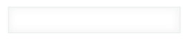

# Text

## Overview


## Constructor

**Parameter**

| Name| Type| Required| Description |
| --- | --- | --- | --- |
|options|Object|No|The object contains params of constructor.|
|options.value|String|No|The value of text field.|
|options.isDisabled|Boolean|No|The text field will be disabled. <br> Default value: 'false'|
|options.isVisible|Boolean|No|The text field will be visible. <br> Default value: 'true'|

<details class="tab-container" open>
<Summary>Sample</Summary>

**Javascript**
```
var text= new kintoneUIComponent.Text({value: '12345'});
```
**React**
```
import {Text} from 'kintone-ui-component';
import React from 'react';
 
export default class Plugin extends React.Component {
    state = { value: ''}
    render() {
        return (
            <Text value={this.state.value} onChange={(value) => {this.setState({value})}} />
        );
    }
}

```
</details>

## Methods
### render()
Get dom element of component.

**Parameter**

None

**Returns**

Dom element

<details class="tab-container" open>
<Summary>Sample</Summary>

**Javascript**
```
var text = new kintoneUIComponent.Text({value: 'input text'});
var body = document.getElementsByTagName("BODY")[0];
body.appendChild(text.render());
```
**React**
```
import {Text} from 'kintone-ui-component';
import React from 'react';
 
export default class Plugin extends React.Component {
    state = { value: ''}
    render() {
        return (
            <Text value={this.state.value} onChange={(value) => {this.setState({value})}} />
        );
    }
}

```
</details>

### setValue(value)
Set the value of text field.

**Parameter**

| Name| Type| Required| Description |
| --- | --- | --- | --- |
|text|	String|	Yes|	The value of text field.|

**Returns**

None

<details class="tab-container" open>
<Summary>Sample</Summary>

**Javascript**
```
var text = new kintoneUIComponent.Text({value: 'input text'});
var body = document.getElementsByTagName("BODY")[0];
body.appendChild(text.render());

text.setValue('input text');
```
**React**
```
import { Text} from 'kintone-ui-component';
import React from 'react';
 
export default class Plugin extends React.Component {
    state = { value: '1'}
 
    render() {
        return (
        <div>
          <Text value={this.state.value} onChange={(value) => {this.setState({value})}} />
          <button onClick={this.handleClick}>Click</button>
        </div>
      );
    }
    handleClick= () => {
        this.setState({
            value: 'samp 1'
        });
    };
}

```
</details>

### getValue()
Get the value of text field.

**Parameter**

None

**Returns**

|Name|Type|Description|
|---|---|---|
|value|	String|	The value of text field.|


<details class="tab-container" open>
<Summary>Sample</Summary>

**Javascript**
```
var text = new kintoneUIComponent.Text({value: 'input text'});
var body = document.getElementsByTagName("BODY")[0];
body.appendChild(text.render());

text.getValue();
```
**React**
```
import { Text} from 'kintone-ui-component';
import React from 'react';
 
export default class Plugin extends React.Component {
    state = { value: '1'}
 
    render() {
        return (
        <div>
          <Text value={this.state.value} onChange={(value) => {this.setState({value})}} />
          <button onClick={this.handleClick}>Click</button>
        </div>
      );
    }
    handleClick= () => {
        console.log(this.state.value);
    };
}

```
</details>

### on(eventName, callBack)
Register callback for a event of component

**Parameter**

| Name| Type| Required| Description |
| --- | --- | --- | --- |
|eventName |String |Yes|Name of event: <ul><li>'click'</li><li>'change'</li></ul>|
|callback|function |Yes|callback|

**Returns**

None

<details class="tab-container" open>
<Summary>Sample</Summary>

**Javascript**
```
var text = new kintoneUIComponent.Text({value: 'input text'});
var body = document.getElementsByTagName("BODY")[0];
body.appendChild(text.render());

text.on('click', function(event) {
    console.log('on click');
});
```
**React**
```
import { Text} from 'kintone-ui-component';
import React from 'react';
 
export default class Plugin extends React.Component {
    state = { value: '1'}
    render() {
        return (
            <Text value={this.state.value} onChange={this.handleChange.bind(this)} onClick={() => {console.log('click')}} />
        );
    }
    handleChange(value) {
            this.setState({value});
            console.log('value: ' + value);
        }
}

```
</details>

### show()
Display the Text field.

**Parameter**

None

**Returns**

None

<details class="tab-container" open>
<Summary>Sample</Summary>

**Javascript**
```
var text = new kintoneUIComponent.Text({value: 'input text'});
var body = document.getElementsByTagName("BODY")[0];
body.appendChild(text.render());

text.show();
```
**React**
```
import { Text} from 'kintone-ui-component';
import React from 'react';
 
export default class Plugin extends React.Component {
    state = { value: '1'}
    render() {
        return (
            <Text value={this.state.value} onChange={this.handleChange.bind(this)} isVisible={true} />
        );
    }
    handleChange(value) {
        this.setState({value});
        console.log('value: ' + value);
    }
}

```
</details>

### hide()
Hide the Text field.

**Parameter**

None

**Returns**

None

<details class="tab-container" open>
<Summary>Sample</Summary>

**Javascript**
```
var text = new kintoneUIComponent.Text({value: 'input text'});
var body = document.getElementsByTagName("BODY")[0];
body.appendChild(text.render());

text.hide();
```
**React**
```
import { Text} from 'kintone-ui-component';
import React from 'react';
 
export default class Plugin extends React.Component {
    state = { value: '1'}
    render() {
        return (
            <Text value={this.state.value} onChange={this.handleChange.bind(this)} isVisible={false} />
        );
    }
    handleChange(value) {
        this.setState({value});
        console.log('value: ' + value);
    }
}

```
</details>

### disable()
Disabled the Text field.

**Parameter**

None

**Returns**

None

<details class="tab-container" open>
<Summary>Sample</Summary>

**Javascript**
```
var text = new kintoneUIComponent.Text({value: 'input text'});
var body = document.getElementsByTagName("BODY")[0];
body.appendChild(text.render());

text.disable();
```
**React**
```
import { Text} from 'kintone-ui-component';
import React from 'react';
 
export default class Plugin extends React.Component {
    state = { value: '1'}
    render() {
        return (
            <Text value={this.state.value} onChange={this.handleChange.bind(this)} isDisabled={true} />
        );
    }
    handleChange(value) {
        this.setState({value});
        console.log('value: ' + value);
    }
}

```
</details>

### enable()
Enabled the Text field.

**Parameter**

None

**Returns**

None

<details class="tab-container" open>
<Summary>Sample</Summary>

**Javascript**
```
var text = new kintoneUIComponent.Text({value: 'input text'});
var body = document.getElementsByTagName("BODY")[0];
body.appendChild(text.render());

text.enable();
```
**React**
```
import { Text} from 'kintone-ui-component';
import React from 'react';
 
export default class Plugin extends React.Component {
    state = { value: '1'}
    render() {
        return (
            <Text value={this.state.value} onChange={this.handleChange.bind(this)} isDisabled={false} />
        );
    }
    handleChange(value) {
        this.setState({value});
        console.log('value: ' + value);
    }
}

```
</details>
